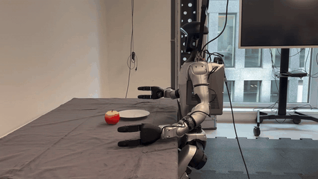
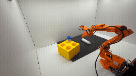
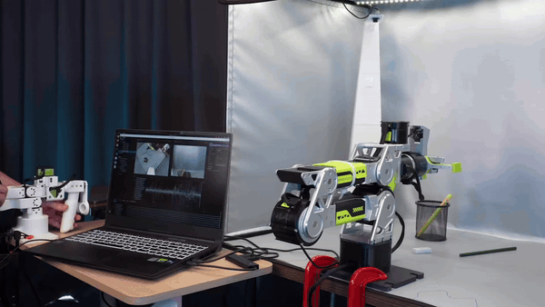
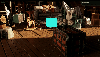
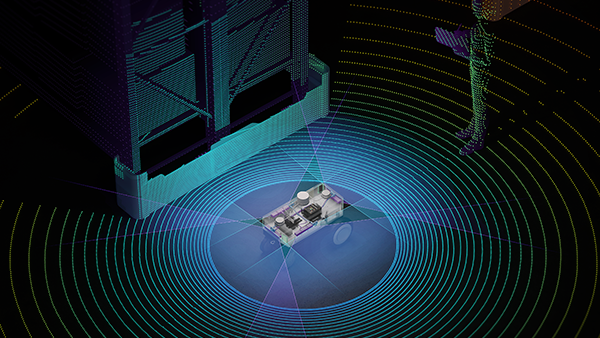
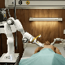
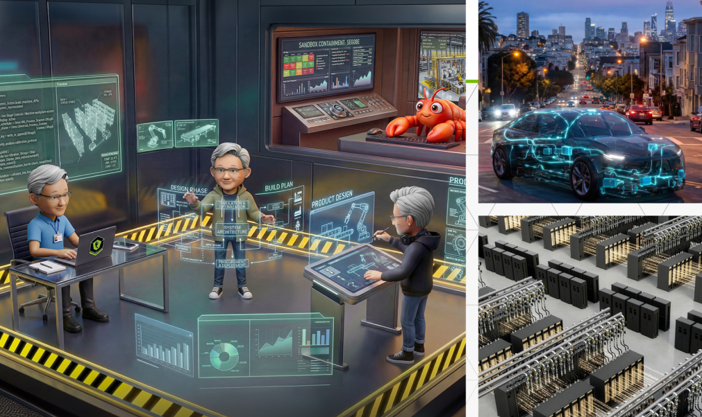
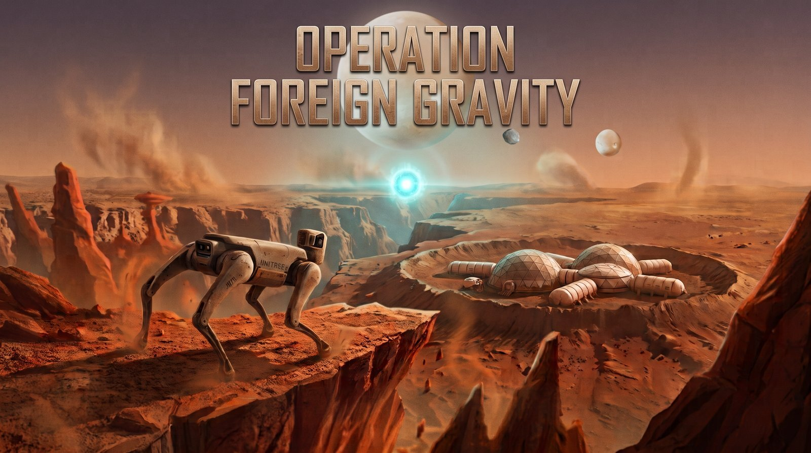

# 피지컬 AI 학습[#](#physical-ai-learning "Link to this heading")

https://docs.nvidia.com/learning/physical-ai/#

NVIDIA의 무료 자율 학습 과정을 통해 자율 로봇, 디지털 트윈 및 AI 기반 시스템 구축을 시작하세요.

아래에서 코스를 선택하여 피지컬 AI 여정을 시작하세요.

피지컬 AI란 무엇인가요?

피지컬 AI는 로봇, 카메라, 자율 주행 기계 및 스마트 공간을 포함하여 물리적 세계를 인식하고, 추론하며, 행동하는 시스템에 AI를 도입합니다. 이러한 코스들은 OpenUSD 데이터 워크플로우, Omniverse 디지털 트윈, Isaac Sim 시뮬레이션, Isaac Lab 정책 학습, Isaac ROS 배포, 그리고 sim-to-real 로보틱스에 이르는 기술 스택을 구축합니다.

[NVIDIA의 피지컬 AI 개요 읽기](https://www.nvidia.com/en-us/glossary/generative-physical-ai/)

코스 탐색기

## 다음 코스 찾기

## 코스 목록[#](#courses "Link to this heading")

 

---
## NVIDIA Isaac GR00T 및 Unitree G1을 활용한 엔드투엔드 휴머노이드 로봇 개발 및 배포
---

이 코스는 Unitree G1 휴머노이드 로봇을 위한 검증되고 개방적이며 재현 가능한 시뮬레이션 우선 배포 워크플로우인 GR00T 레퍼런스 워크플로우를 소개합니다.

**난이도:** 중급  
**소요 시간:** 4-12시간  
**주요 기술:** NVIDIA Isaac GR00T, Isaac Lab-Arena, Isaac Teleop, Isaac ROS, Jetson Thor, Unitree G1

[학습 시작하기](https://docs.nvidia.com/learning/physical-ai/gr00t-e2e-workflow/latest/index.html)

 

---

 

## NVIDIA Isaac을 활용한 SO-101 로봇의 Sim-to-Real 학습

SO-101 암과 직접 구축할 수 있는 저렴한 물리적 작업 공간을 활용하여 완전한 sim-to-real 워크플로우를 탐구합니다. 로봇을 설정 및 교정한 다음, 원심분리기 바이알 Pick-and-Place 작업을 위한 GR00T 정책을 사후 학습시키기 위한 시연을 수행합니다. Isaac Lab으로 평가하고 실제 하드웨어에 배포하며, sim-to-real 격차를 줄이는 데 도움이 되는 4가지 전략을 적용합니다.

**난이도:** 중급  
**소요 시간:** 6-10시간  
**주요 기술:** NVIDIA Isaac Lab, NVIDIA GR00T, LeRobot by Hugging Face, Cosmos, sim-to-real 전이 원리

[학습 시작하기](https://docs.nvidia.com/learning/physical-ai/sim-to-real-so-101/latest/index.html)

 

---

 

## 피지컬 AI 학습: Seeed reBot Arm 및 NVIDIA Isaac을 활용한 Sim-to-Real VLA 파이프라인 (파트너 콘텐츠)

피지컬 AI를 위한 엔드투엔드 실습 커리큘럼으로, Hugging Face LeRobot을 이용한 reBot 로봇 암 원격 제어, NVIDIA Isaac Sim 디지털 트윈 에뮬레이션, Cosmos Transfer 장면 증강, Isaac GR00T VLA 미세 조정, 실시간 NVIDIA Jetson 엣지 배포에 이르기까지 개발자를 안내합니다.

**난이도:** 중급  
**소요 시간:** 20시간 이상  
**주요 기술:** NVIDIA Isaac GR00T, Isaac Sim, LeRobot by Hugging Face, Seeed reBot Arm, Jetson Thor

[학습 시작하기](https://www.seeedstudio.com/sim-to-real-with-seeed-rebot-and-nvidia-isaac)

 

---

 

## Omniverse 및 OpenUSD를 활용한 디지털 트윈 조립

공장 및 창고를 위한 NVIDIA Omniverse 및 OpenUSD 표준을 사용하여 복잡한 산업 씬을 조립하는 방법을 배웁니다. 씬 구성, 자산 조직화 및 협업 워크플로우를 적용합니다.

**난이도:** 중급  
**소요 시간:** 3-4시간  
**주요 기술:** OpenUSD, 씬 구성, 자산 조직화, 파이프라인 개발

[학습 시작하기](https://docs.nvidia.com/learning/physical-ai/assembling-digital-twins/latest/index.html)

 

---

 

## 피지컬 AI 에이전트 부트캠프

실용적인 피지컬 AI 워크플로우를 한 단계씩 구축합니다. Patterned Prompt Method를 사용하여 실제 NVIDIA SDK 및 Omniverse 라이브러리에 대해 AI 코딩 에이전트를 지시하여 OpenUSD 씬을 렌더링하고, SimReady 자산을 검증하며, 실시간 물리 시뮬레이션을 실행합니다.

**난이도:** 입문  
**소요 시간:** 자율 학습  
**주요 기술:** AI 에이전트 워크플로우, OpenUSD, RTX 렌더링, Omniverse Kit 라이브러리, SimReady 물리

[학습 시작하기](https://docs.nvidia.com/learning/physical-ai/physical-ai-agent-bootcamp/latest/index.html)

 

---

 

## Isaac Sim 시작하기

NVIDIA Isaac Sim 인터페이스를 탐색합니다. 처음부터 로봇을 조립하고, 물리 특성을 설정하며, 센서를 추가하고 첫 번째 시뮬레이션을 실행합니다.

**난이도:** 입문  
**소요 시간:** 2-3시간  
**주요 기술:** 물리 시뮬레이션, 센서 통합, 환경 설정

[학습 시작하기](https://docs.nvidia.com/learning/physical-ai/getting-started-with-isaac-sim/latest/index.html)

 

---

 

## Isaac Lab 시작하기

강화 학습 및 GPU 가속 학습을 집중적으로 배웁니다. NVIDIA Isaac Lab이 수천 대의 로봇을 병렬로 학습시켜 수일이 걸리던 수렴을 단 몇 시간 만에 달성하는 방법을 이해합니다.

**난이도:** 중급  
**소요 시간:** 3-4시간  
**주요 기술:** 강화 학습, GPU 가속, 정책 학습

[학습 시작하기](https://docs.nvidia.com/learning/physical-ai/getting-started-with-isaac-lab/latest/index.html)

 

---

 

## Isaac ROS 시작하기

프로덕션 급 인지 및 내비게이션 시스템을 위한 NVIDIA Isaac ROS GEM 및 NITROS를 사용하여 ROS 2 개발을 가속화합니다. 실시간 제약 조건 하에서 실제 하드웨어에 AI 정책을 배포합니다.

**난이도:** 중급  
**소요 시간:** 2-3시간  
**주요 기술:** ROS 2, NITROS 가속, 프로덕션 로보틱스

[학습 시작하기](https://docs.nvidia.com/learning/physical-ai/getting-started-with-isaac-ros/latest/index.html)

 

---

 

## 로보틱스 심화 과정

OpenUSD 상호운용성 기술을 개발합니다. URDF를 USD로 변환하고, 로봇 자산을 최적화하며, 복잡한 다중 로봇 시스템으로 확장되는 엔터프라이즈급 디지털 트윈을 구축합니다.

**난이도:** 고급  
**소요 시간:** 4-5시간  
**주요 기술:** USD 상호운용성, 자산 최적화, 엔터프라이즈 배포

[학습 시작하기](https://docs.nvidia.com/learning/physical-ai/going-further-with-robotics/latest/index.html)

 

---

 

## 헬스케어용 Isaac 시작하기

헬스케어 환경에서의 로보틱스 응용 분야를 탐색합니다. 안전 필수 시스템 설계, 규제 고려 사항, 헬스케어 특화 센서 통합 접근법을 배웁니다.

**난이도:** 중급  
**소요 시간:** 3-4시간  
**주요 기술:** 헬스케어 특화 로보틱스, 안전 프로토콜, 도메인 적응

[학습 시작하기](https://docs.nvidia.com/learning/physical-ai/getting-started-with-isaac-for-healthcare/latest/index.html)

 

---

 

## OpenUSD 배우기

복잡한 3D 워크플로우를 위한 Universal Scene Description(USD)을 탐구합니다. 이 무료 커리큘럼은 자산 구조, 구성 아크(composition arcs), 파이프라인 개발을 다루며 [OpenUSD 자격증](https://www.nvidia.com/en-us/learn/certification/openusd-development-professional/) 취득을 준비할 수 있도록 지원합니다.

**난이도:** 입문 ~ 고급  
**형식:** 자율 학습, 오픈소스  
**주요 기술:** USD 기초, 자산 모듈화, 데이터 교환

[학습 시작하기](https://docs.nvidia.com/learn-openusd/latest/index.html)

 

---

 

## 이벤트[#](#events "Link to this heading")

**NVIDIA GTC Berlin 2026**

10월 20~22일에 열리는 산업을 형성할 3일간의 AI 이벤트에 참여하여 개발자, 연구원, 스타트업 및 비즈니스 리더가 이상적인 AI 전략을 구축할 수 있도록 지원을 받으세요.

**일시:** 2026년 10월 20일~22일  
**장소:** 독일 베를린

[등록하기](https://www.nvidia.com/en-eu/gtc/training/)

파트너 콘텐츠

 

---

 

**CoreWeave: Operation Foreign Gravity: Let’s Get Physical With AI — 시뮬레이션에서 로봇에게 새로운 기술 가르치기**

강화 학습을 통해 로봇 행동 정책을 적응시키는 전체 워크플로우를 경험해 보세요. 학습 전략을 구성하고, CoreWeave 인프라에서 실행하며, 시뮬레이션에서 결과 정책을 테스트하고, Weights & Biases를 사용하여 성능을 이해하고 개선합니다. 경진대회 형식으로 구성되어 있으며, 성공 기준에 가장 가까운 팀이 승리합니다.

**일시:** 2026년 10월 1일  
**장소:** Moscone Center (CoreWeave Fully Connected 2026 컨퍼런스의 일환)  
**프로모션 코드:** physai000

[등록하기](https://www.coreweave.com/fully-connected-2026)

---

NVIDIA Brev로 컴퓨팅 자원 이용하기

로컬 GPU가 없으신가요? NVIDIA Isaac Sim™, Omniverse™, 피지컬 AI 워크플로우에 맞게 사전 구성된 클라우드 기반 개발 환경인 Brev를 통해 즉시 시작할 수 있습니다.

**[Kit App Template Launchable](https://brev.nvidia.com/org/org-2xPtAHe7sr2KjqYj6Wu64nmkZG8/launchables)**  
Build custom Omniverse applications using Kit libraries and APIs.

**[Isaac Launchable](https://brev.nvidia.com/launchable/deploy/now?launchableID=env-35JP2ywERLgqtD0b0MIeK1HnF46)**  
로컬 설치 없이 클라우드에서 Isaac™ Lab 및 Isaac Sim을 실행하세요.

자격증 취득하기

[**NVIDIA OpenUSD Development Professional 자격증**](https://www.nvidia.com/en-us/learn/certification/openusd-development-professional/)을 준비하여 기술을 검증하고 업계에서 두각을 나타내세요.

---

## 자주 묻는 질문 (FAQs)[#](#faqs "Link to this heading")

AI나 로보틱스에 대한 배경지식이 없으면 어떻게 하나요?

이 코스들은 다양한 수준의 학습자를 위해 설계되었습니다. [Isaac Sim에서 첫 번째 로봇 구축하기](https://docs.nvidia.com/learning/physical-ai/getting-started-with-isaac-sim/latest/index.html)부터 시작해 보세요 — 사전 경험이 필요 없으며 기초 개념부터 구축해 나갑니다.

모든 코스에 OpenUSD가 필수인가요?

OpenUSD는 디지털 트윈 및 산업 자동화 프로젝트에 필수적입니다. 다른 코스의 경우 도움이 되지만 엄격히 필요하지는 않습니다. 그러나 현대 3D 워크플로우의 기반이 되는 표준을 이해하기 위해 [Learn OpenUSD](https://docs.nvidia.com/learn-openusd/latest/index.html)를 둘러보시는 것을 권장합니다.
