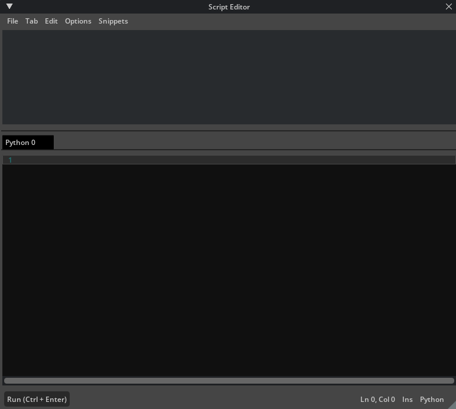
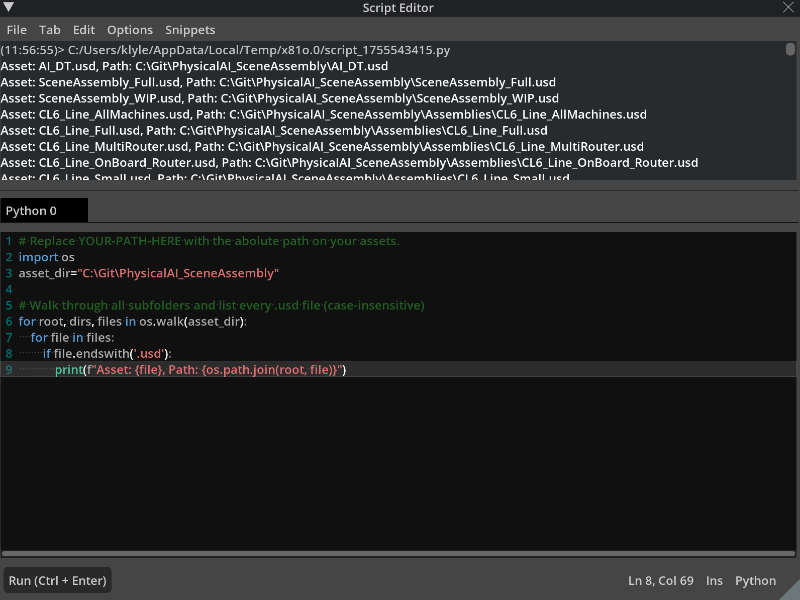

# Navigating the Provided Asset Library[#](#navigating-the-provided-asset-library "Link to this heading")

In this section, let’s review the assets for this project. Our asset library, in this project, is organized into two main groups: machine assets and the factory environment. Understanding this structure is an important part of preparing for digital twin scene assembly, as it helps us efficiently locate, reuse, and manage components throughout our workflow.

We will use the **Script Editor** extension in Omniverse to automate and streamline some asset management tasks with Python. The Script Editor lets us run code to inventory assets, validate structures, and customize our workflow.

To open the Script Editor:

1. Navigate to **Developer > Script Editor** in the main menu.

   - In the Script Editor window, you can paste and modify Python scripts as needed.



Note

Replace the folder path in `YOUR-PATH-HERE` for your project folder.

```
1# Replace YOUR-PATH-HERE with the abolute path on your assets.
2import os
3asset\_dir="C:/YOUR-PATH-HERE"
4
5# Walk through all subfolders and list every .usd file (case-insensitive)
6for root, dirs, files in os.walk(asset\_dir):
7 for file in files:
8 if file.endswith('.usd'):
9 print(f"Asset: {file}, Path: {os.path.join(root, file)}")
```



Note

After running the script, we receive a list of machine assets in the following format:

`Asset: N_03_Feeder\Source\SCARA\Material\right_handler.usd`
`Asset: N_03_Feeder\Source\SCARA\source\right_handler.usd`  
`Asset: N_04_PCB_Assembly\right_handler.usd`

This output shows each `.usd` file that is ready to use in the project.

All machine assets are already in the `.usd` format. We do not need to convert or process these further, they are ready for direct use inside Omniverse. This saves us significant time and lets us begin focusing immediately on organizing, preparing, and assembling our digital twin content.

---

## Our Goal[#](#our-goal "Link to this heading")

In this course, we’ll prepare these machine assets for reuse and flexible placement in multiple production line configurations. Using non-destructive methods allows us to experiment, iterate, and safely use these assets in a variety of digital twin scenarios.

On this page
