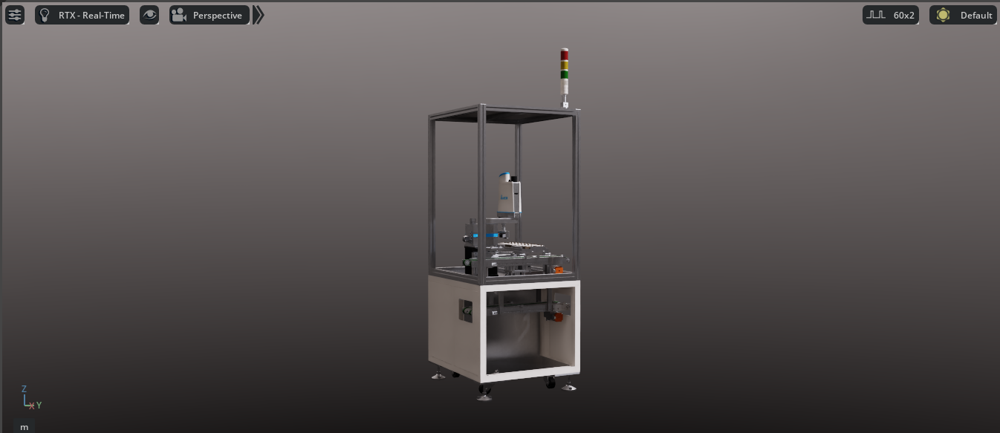
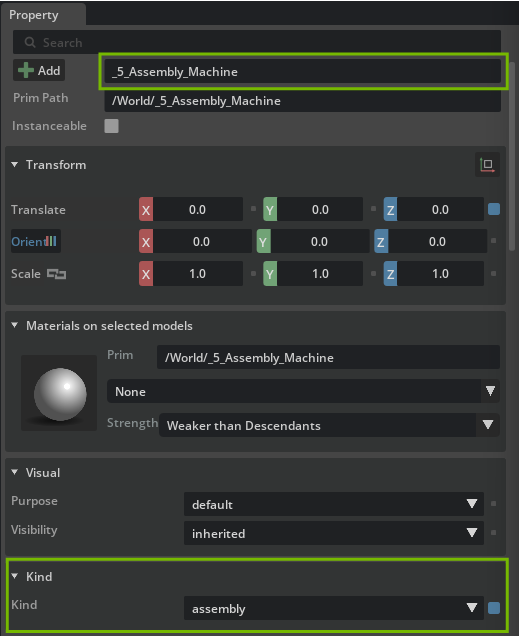
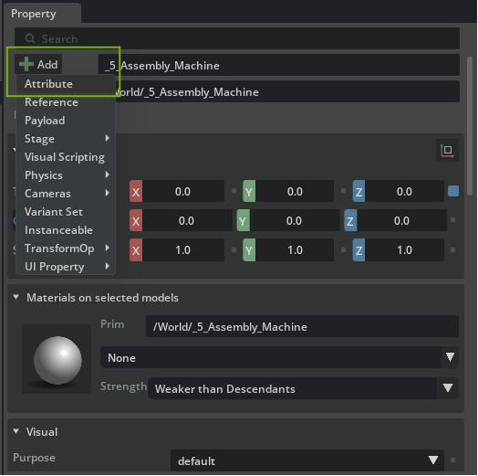
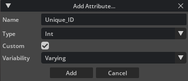
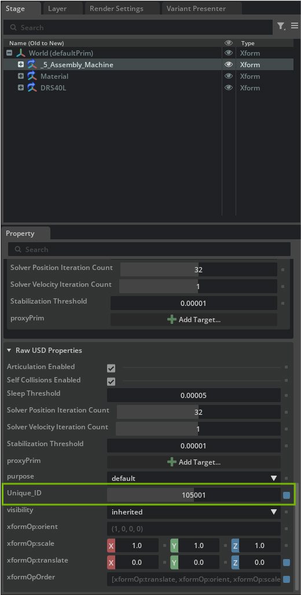

# Reviewing Asset Metadata and Structure[#](#reviewing-asset-metadata-and-structure "Link to this heading")

With our environment set up and an introduction to why OpenUSD is critical for efficient, flexible scene assembly in Omniverse, let’s get started by exploring, organizing, and working with our ready-made digital factory assets. By following best practices in project setup and asset management, we’re prepared to build a scalable, modular digital twin scene that’s easy to navigate and optimize as our needs evolve.

## Machines, Props, and Factory Shells[#](#machines-props-and-factory-shells "Link to this heading")

When working with pre-built USD assets in Omniverse and OpenUSD, understanding asset metadata is key to effective scene management and downstream automation. Let’s use the “N\_05\_Assembly” machine asset as a practical example.  
Our digital twin project uses modular USD assets for machines, props, and factory shells. This modularity allows us to assemble flexible production lines and environments, adapting to evolving needs.

**Exploring Asset Metadata**

1. Navigate to **Assets > Machine\_USD > N\_05\_Assembly**
2. Open **N\_05\_Assembly.usd**

With the asset prim selected, the **Property** panel at the right reveals multiple metadata fields.

**Two important built-in metadata fields you’ll see are**

- **Name** The identifier for the prim in the scene graph.

Here, a name starting with “5” indicates this machine represents the 5th cell in the sequence for this specific assembly line.

- **Kind** For this asset, you’ll see Kind set to assembly.

## What is “Kind” in OpenUSD?[#](#what-is-kind-in-openusd "Link to this heading")

The kind attribute is a standard USD metadata keyword used to specify the functional role of a prim within a hierarchy. It helps tools and pipelines interpret how to use different parts of a scene, whether a prim is a component (like a robot, conveyor, or small prop), an assembly (representing a group of components, such as an entire production cell), or other logical groupings.

- **Example Kinds**

  - **Component** An individual machine, robot, or transport that can be reused and moved.
  - **Assembly** A collection or grouping of components, such as a full assembly line or workstation.

---

### Why does it matter?[#](#why-does-it-matter "Link to this heading")

Setting the correct kind allows downstream scripts or applications to:

- Identify and group related assets.
- Run validation and optimizations correctly (e.g., treat “assembly” prims as logical aggregates).
- Improve project maintainability and scalability.

**Adding a Custom Attribute** Unique\_ID

You can further customize asset metadata by adding custom attributes. Let’s add a custom integer attribute called **Unique\_ID**.

1. In the Properties panel, click **Add > Attribute**.

2. Name it **Unique\_ID**.
3. Set the **Type** to **int**.
4. Select **Add**.
5. Scroll down in the **Properties** panel to find the new **Unique\_ID** attribute.
6. Choose a value that is unique for this prim (e.g., 105001).

## Why add an Attribute like Unique\_ID?[#](#why-add-an-attribute-like-unique-id "Link to this heading")

A **Unique\_ID** can help with:

- Automated tracking or searching in large scenes.
- Linking digital twins with real-world inventory or PLM systems.
- Making referencing and scripting more robust.

Note

When you add a custom attribute directly on a prim, it exists only for that prim instance, not for all assets or prims globally. To define and enforce global or project-wide attributes (“schema definitions”), you can use USD schemas or more advanced approaches, see the [Learn OpenUSD learning path](https://learn.nvidia.com/courses/course-detail?course_id=course-v1:DLI+S-OV-19+V1) for a deeper dive.

On this page
