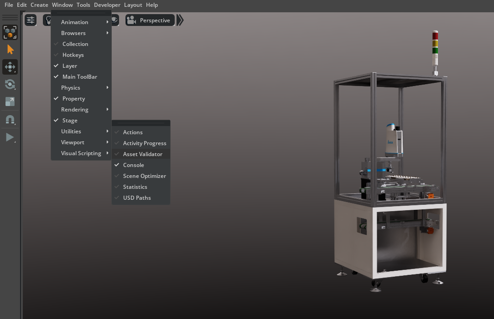
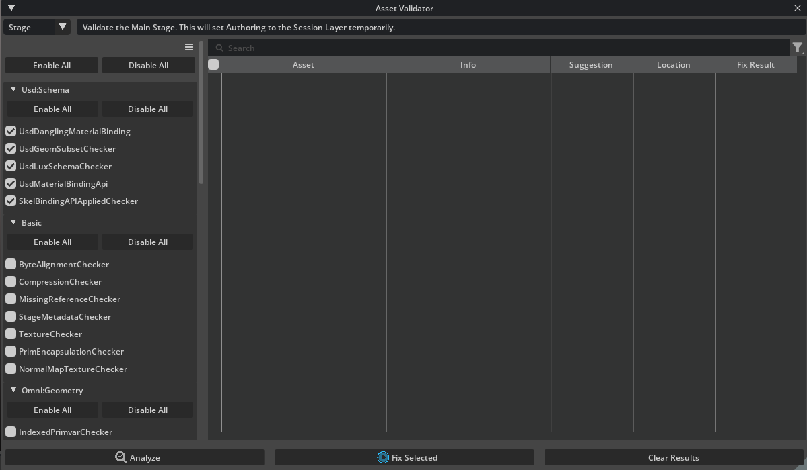
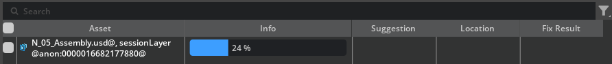
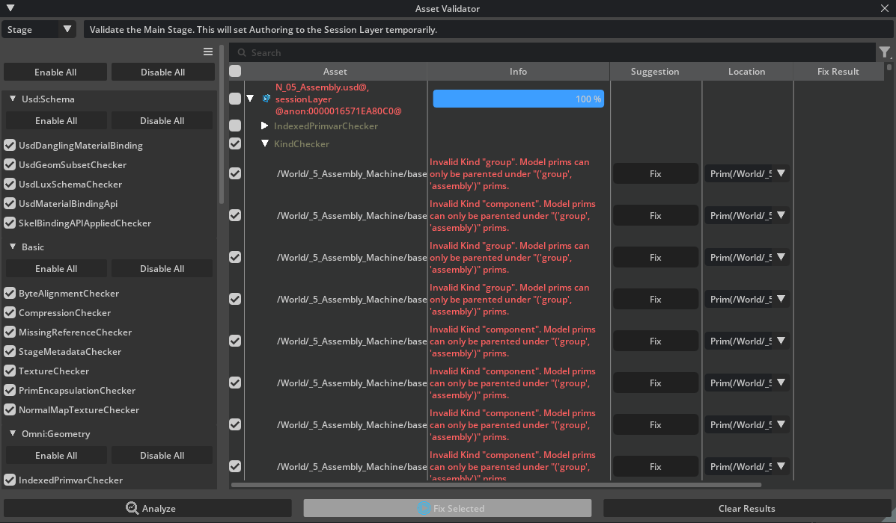
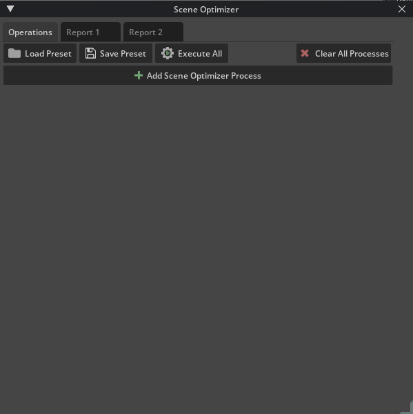

# Troubleshooting with Asset Validator[#](#troubleshooting-with-asset-validator "Link to this heading")

Now that you’ve loaded a machine asset into the stage and everything appears visually correct, it’s important to verify the internal structure and quality using the **Asset Validator**. The Asset Validator is a powerful tool designed to catch issues that may disrupt downstream assembly, cause rendering problems, or break collaborative workflows, before your scene grows in complexity.

**Opening the Asset Validator**

1. Go to **Window > Utilities > Asset Validator**



In the Asset Validator window, you can select whether to analyze the current stage, a particular file path (URI), or a subset of assets.

2. For most scene assembly tasks, leaving the default Stage setting is sufficient to check all loaded content.



## How the Validator Works[#](#how-the-validator-works "Link to this heading")

- The Asset Validator runs a suite of automated checks (“validators”) over your selection

  - These tests look for missing metadata, structural issues, geometry errors, misplaced materials, and more.
- You can choose Enable All from the validator list to run the full set of validation checks, or select individual rules as needed.

3. Click **Analyze** to start the review process.



### Interpreting Results[#](#interpreting-results "Link to this heading")

- After analysis, the tool will report **errors (red), warnings (yellow),** or a **clean pass (green)**.
- Each error or warning is listed with the affected prim, a description, and sometimes a suggested fix.

---

### Fixing Kinds[#](#fixing-kinds "Link to this heading")

After analyzing the machine, we are getting a lot of Kind errors. The error is:

```
1Invalid Kind "group". Model prims can only be parented under "('group', 'assembly')" prims.
```



This is telling us that in USD, model prims must follow a hierarchy: model (component, subcomponent, assembly) prims are only allowed to be direct children of “group” or “assembly” prims. If you have a model prim directly under a kind that isn’t “group” or “assembly,” you’ll get this error.

To fix it, ensure that every model prim is parented under a prim whose kind is set to “group” or “assembly,” maintaining a valid and predictable USD model hierarchy.

**To fix automatically**

1. Select the **checkbox** next to **KindChecker.**
2. And press **Fix Selected**

The Asset Validator will work its way through the hierarchy to ensure all prims have the correct Kind set.

---

## Common Issues and Easy Fixes[#](#common-issues-and-easy-fixes "Link to this heading")

While some errors may require deeper asset work, many common warnings can be resolved quickly. Here are typical issues you may encounter and tips for addressing them:

| Warning/Error | What it means | How to fix |
| --- | --- | --- |
| Missing default prim | The USD file lacks a designated entry point | Set a default prim for the asset in USD Composer |
| Invalid kind metadata | Asset hierarchy is missing ‘kind’ tags | Assign component, assembly, or correct kind in the Properties panel |
| No or invalid up axis/units | Stage doesn’t specify the correct axis/units | Set the scene’s up axis and units in Layer Properties |
| Unassigned materials | Meshes are missing materials | Assign materials using the Materials tab |
| Duplicate or co-located geometry | Overlapping meshes or merged geometry | Use Scene Optimizer: Merge Vertices operation |
| Unused topology/primvars | Extra attributes or mesh data that’s not needed | Remove unused attributes in Properties or re-export asset |

### Automatic and Guided Fixes[#](#automatic-and-guided-fixes "Link to this heading")

- Some issues, such as fixing duplicate vertices or zero-area faces, can be addressed right from within Omniverse using the **Scene Optimizer** extension, no need to go back to the original source.



- For structural or metadata issues, corrections can often be made directly in the **Properties** panel by editing the asset properties.
- For fundamentally broken or missing source data (e.g., absent geometry), you may need to re-export or update the original asset.

## Best Practices[#](#best-practices "Link to this heading")

- Don’t panic if you see many errors! Use the validator as a triage tool: focus first on errors that block usage (e.g., missing prims or invalid units) and note minor warnings for cleanup later.
- For learning and rapid prototyping, prioritize structural corrections (kind, prim, units) and material assignments. Performance or advanced warnings (e.g., dense meshes, instancing) become more critical as your project grows.
- Run the Asset Validator frequently as you assemble and modify your scene, it’s easier to maintain quality than to fix a deeply broken asset hierarchy later.

On this page
