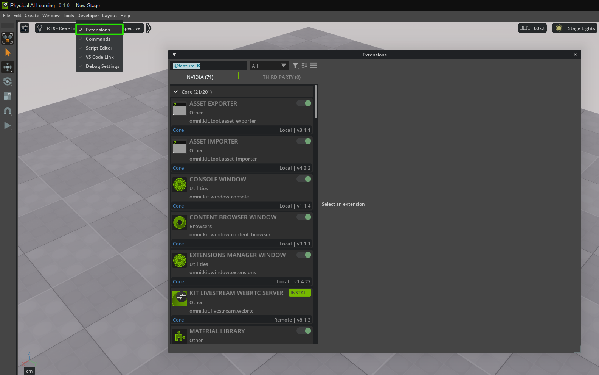
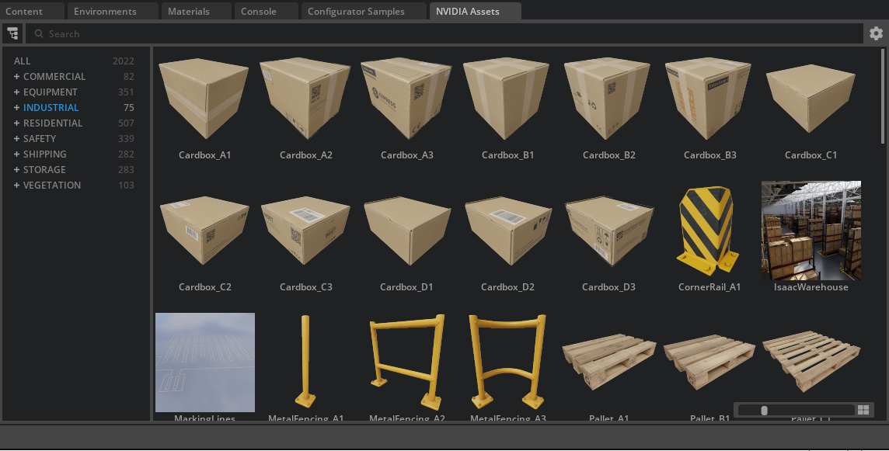
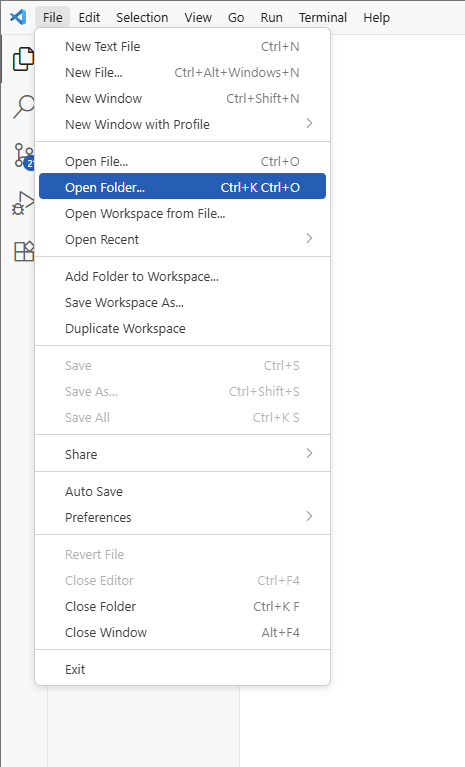
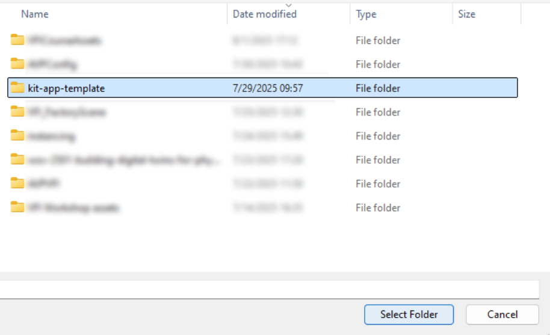
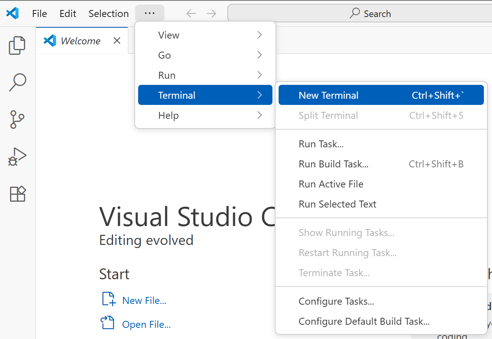
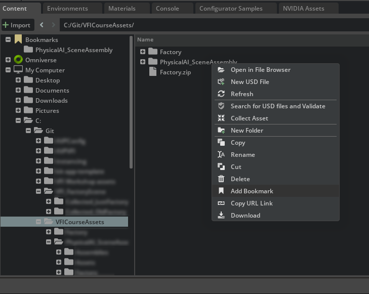
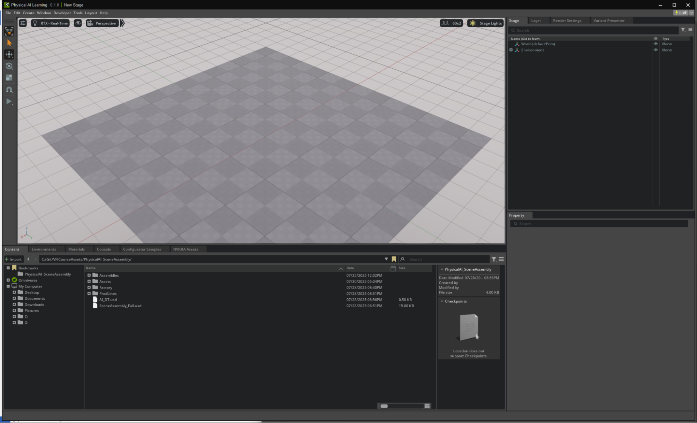

# Accessing the Course Assets[#](#accessing-the-course-assets "Link to this heading")

Before we begin building our digital twin, we need to set up the application and workspace that we’ll use throughout this course. We’ll be working with a customized Kit App Template that has been pre-configured with the necessary extensions and settings to ensure a consistent learning experience.

## Download the Course Assets[#](#download-the-course-assets "Link to this heading")

You can follow this course using your own factory assets or the provided files. The concepts and workflows apply to any USD project, but this course was written for the provided files.

Tip

We recommend using the provided assets for your first time through the course.

To download:

1. Navigate to [Asset Download Link](https://developer.nvidia.com/downloads/Omniverse/learning/Courses/PhysicalAI_SceneAssembly.zip)

Warning

This download file is over 700mb. It contains all of the USD assets of the machines and the factory.

## Course Application Options[#](#course-application-options "Link to this heading")

You have two options for following along with this course. We’ll be using Visual Studio Code in this course.

### Option 1: Use the Provided Pre-configured Application (Recommended)[#](#option-1-use-the-provided-pre-configured-application-recommended "Link to this heading")

We’ve prepared a Kit App Template specifically for this course that includes all necessary extensions and workspace settings. This ensures you’ll have the same experience as demonstrated in the course materials.

Warning

The `repo.sh` script included in the package has known errors when run on Linux. If you’re using Linux, you will need to clone the Kit App Template repository directly and set it up manually.

### Option 2: Use Your Own Kit Installation[#](#option-2-use-your-own-kit-installation "Link to this heading")

If you prefer to use your existing Omniverse or Kit setup, you can follow along, but you’ll need to manually configure the settings outlined below to match the course environment.

## Downloading the PhysicalAI\_SceneAssembly\_KAT.zip[#](#downloading-the-physicalai-sceneassembly-kat-zip "Link to this heading")

If you choose to use the provided pre-configured application:

1. Navigate to the [Download Link](https://developer.nvidia.com/downloads/Omniverse/learning/Courses/PhysicalAI_SceneAssembly_KAT.zip)
2. Extract the files to your desired working directory
3. Make note of the extraction location as you’ll need this path for building and launching

Note

The provided application is the standard Kit App Template with a few key extensions enabled and workspace preferences configured for this course.

---

### Pre-configured Settings (For Reference)[#](#pre-configured-settings-for-reference "Link to this heading")

#### Extensions[#](#extensions "Link to this heading")

1. View the available extensions from the top toolbar under **Developer > Extensions**.



#### Extensions to Enable:[#](#extensions-to-enable "Link to this heading")

- **Asset Validator (Core) version 0.16.2** - Essential for validating USD assets and ensuring quality standards throughout our workflow.
- **NVIDIA Assets Extensions** (omni.assets.plugins) - Enables the NVIDIA Assets tab accessible through the top Toolbar.

Note

To Enable the NVIDIA Assets tab:

1. Navigate to **Windows > Browsers > Assets**.

This provides access to NVIDIA’s curated asset library that we’ll use later in the course.



#### Workspace Preferences[#](#workspace-preferences "Link to this heading")

The following preferences have been set to standardize our working environment:

- **Up Axis: Z-Up** - Ensures consistent orientation across all assets and scenes.
- **Meters Per Unit: 0.001** - This standardizes our stage to work in millimeters, matching the scale of the provided machine assets.
- **Default Reference Behavior** - When dragging assets into the stage, the application defaults to creating references rather than payloads, giving us access to all prims within referenced files.

---

## Why These Settings Matter[#](#why-these-settings-matter "Link to this heading")

**Z-Up Axis:** Manufacturing and CAD assets typically use Z-up orientation, so this setting ensures proper alignment when working with industrial assets.

**Milimeter Units:** The machine assets provided in this course were authored in millimeters. By setting our stage to millimeters (0.001 meters per unit), we ensure proper scaling and avoid unit conversion issues.

**Reference Defaults:** Using references instead of payloads allows us to immediately access and work with all components within our machine assets, which is essential for the assembly workflows we’ll be learning.

## Setting Up Your Own Installation[#](#setting-up-your-own-installation "Link to this heading")

If you choose to use your existing Kit installation, you’ll need to manually configure these settings:

1. Install the **Asset Validator (Core)** extension version 0.16.2
2. Set your stage preferences to **Z-Up axis**
3. Configure **meters per unit** to **0.001** (millimeters)
4. Change the default behavior to **create references** when dragging assets

Note

We’ll walk through how to verify and adjust these settings as needed during the course, so don’t worry if you’re not familiar with these configurations yet.

With your application downloaded and ready, we’ll move on to the next module where we’ll build and launch the Kit App Template, open our first project, and begin exploring the course assets.

## Launching USD Composer[#](#launching-usd-composer "Link to this heading")

In this module, we will use the Kit App Template to set up and launch the Kit application that we will use throughout this course.

### Open the Project Folder in Visual Studio Code[#](#open-the-project-folder-in-visual-studio-code "Link to this heading")

1. Open **Visual Studio Code**.
2. From the **top menu bar**, select **File > Open Folder**.



3. Navigate to the location you **downloaded** the application to.
4. Select the folder, then choose **Select Folder** to open it.



Tip

Keeping your project folder open makes it easy to access scripts, configuration files, and any code snippets used in later modules.

### Build and Launch the Application[#](#build-and-launch-the-application "Link to this heading")

Next, we need to build and run the Kit App Template:

5. Open a **new terminal window** in Visual Studio Code.



6. Run the following command to build the application:

```
Windows:
.\repo.bat build
Linux:
./repo.sh build
```

*This compiles all files and gets the Kit App Template ready to launch. If this is your first time building, it may take some time to collect all the needed dependencies to install.*

7. Once the build process is complete, run:

```
Windows:
.\repo.bat launch
Linux:
./repo.sh launch
```

*This starts the custom Kit application.*

### Add Your Project Folder to Bookmarks[#](#add-your-project-folder-to-bookmarks "Link to this heading")

To make navigation easier as we work:

8. In the running Kit App, locate your project folder in the left navigation panel.
9. **Right-click** the project folder and select **Add Bookmark**.



Note

Your folder structure and asset names may differ from the screenshots shown throughout this course. You should work with your own project assets and folder organization.

10. Confirm that the folder is now listed in your Bookmarks for quick access.

---

By completing these steps, we ensure our working environment is consistent and ready. From here, we can confidently move on to exploring and organizing our digital assets, knowing that all tools are properly set up.



On this page
