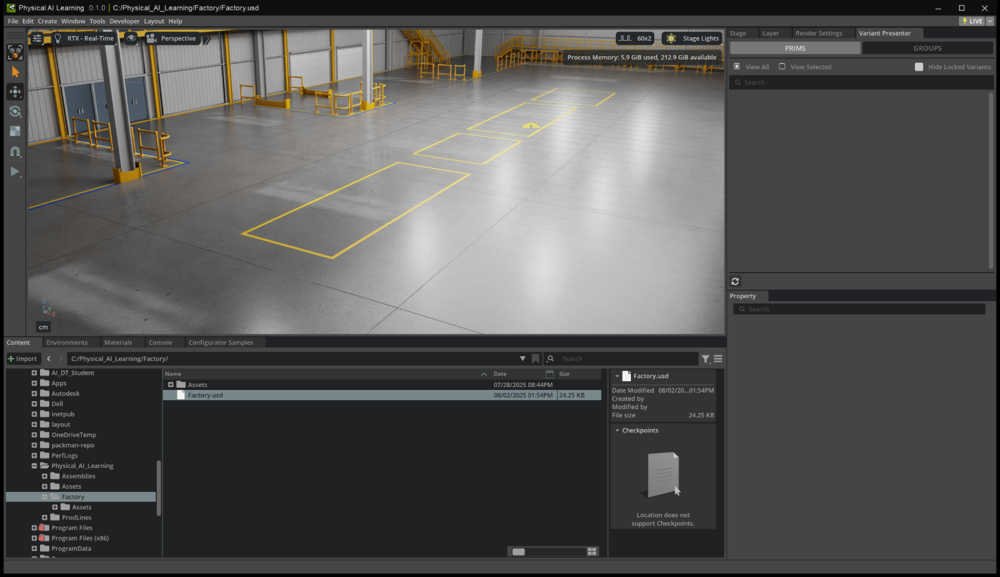
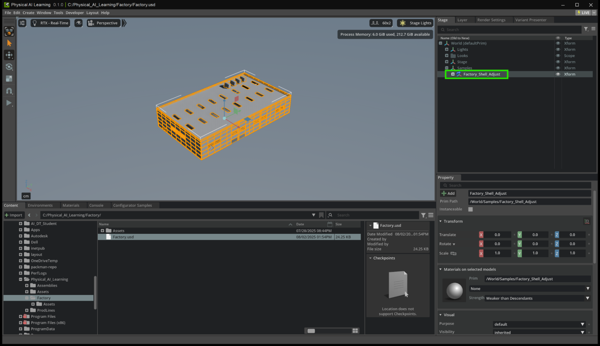
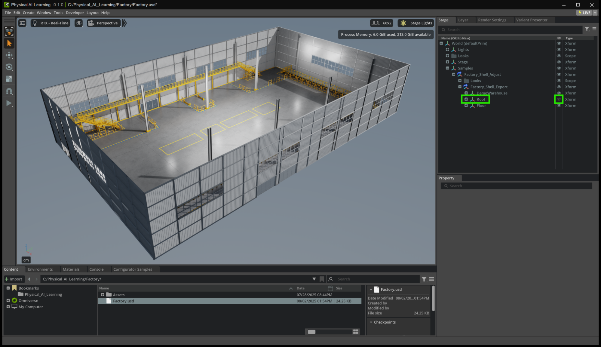
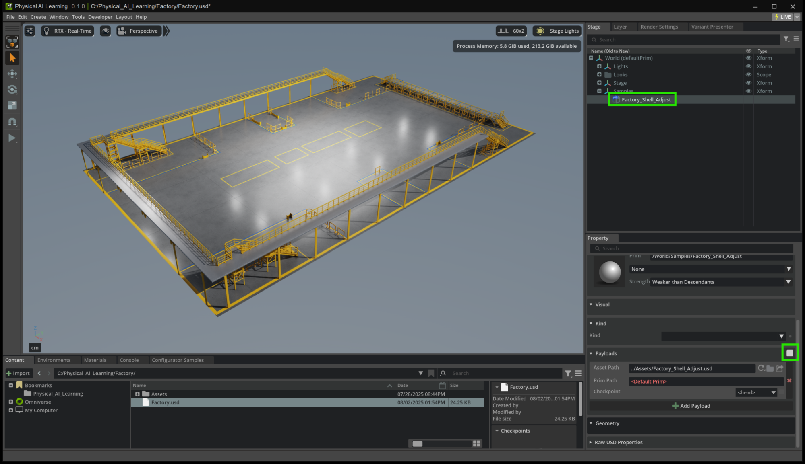

# Open the Factory Environment[#](#open-the-factory-environment "Link to this heading")

Let’s explore the environment where our machines will be placed:

1. Open the file: **Factory > Factory.usd**

When we open this stage, we will see an empty factory environment with several identified locations on the floor. These are our assembly points. Over the next modules, we will prepare, validate, and assemble our machine assets for placement at these locations and build a functional, modular layout for our digital twin scene.

Now let’s move the Perspective camera backwards to see the entire Factory. This can be done by using the mouse scroll wheel to zoom in and out.

Another way to do this is a zoom extents for a USD Primitive.

2. In the Stage Panel, select the **Payload “Factory\_Shell\_Adjust”**
3. Press the **F key**. The viewport should look something like this.

Tip

You can use the mouse scroll wheel to zoom (scrolling) and pan (mouse scroll wheel click and drag). This will help you center the Factory in the viewport.

Next, let’s investigate the Factory Payload and hide the roof.

4. In the Stage, expand the dropdown for the **Xform “Samples”**
5. Keep expanding dropdowns until you find the **Xform “Roof”**
6. **Click the eye icon** to hide the roof in the viewport.

Another technique is to unload a Payload.

7. Select the **Payload “Factory\_Shell\_Adjust”**
8. In the **Property Panel,** scroll down to the section titled Payload.
9. Click on the **checkbox on the right** to unload the Payload.

---

## How is this useful?[#](#how-is-this-useful "Link to this heading")

This process of unloading a Payload is unique in that it will **temporarily remove its contents** from the Stage.

Unloading a Payload has many advantages as it will temporarily:

- Remove data from the USD Stage
- Maintain the asset path for quick reload
- Automatically load when reopening the scene
- Only visible to the specific user session of USD Composer
- Unload data from the GPU memory
- Improve the performance of USD Composition ARC

On this page
