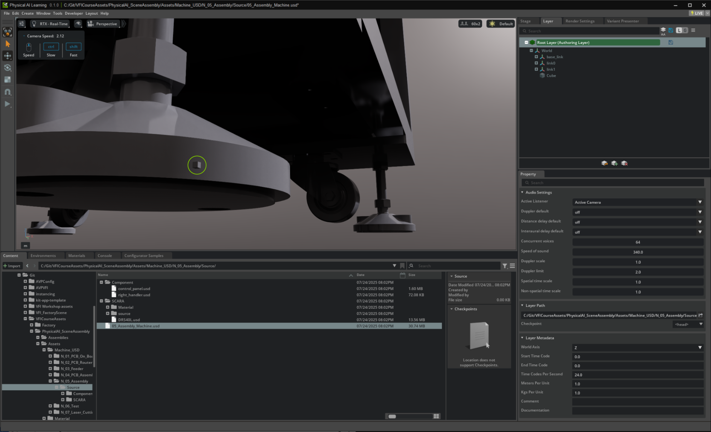
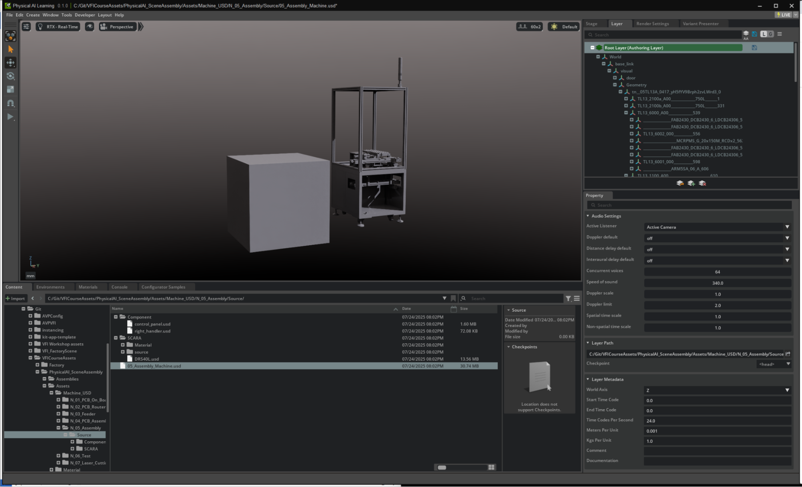
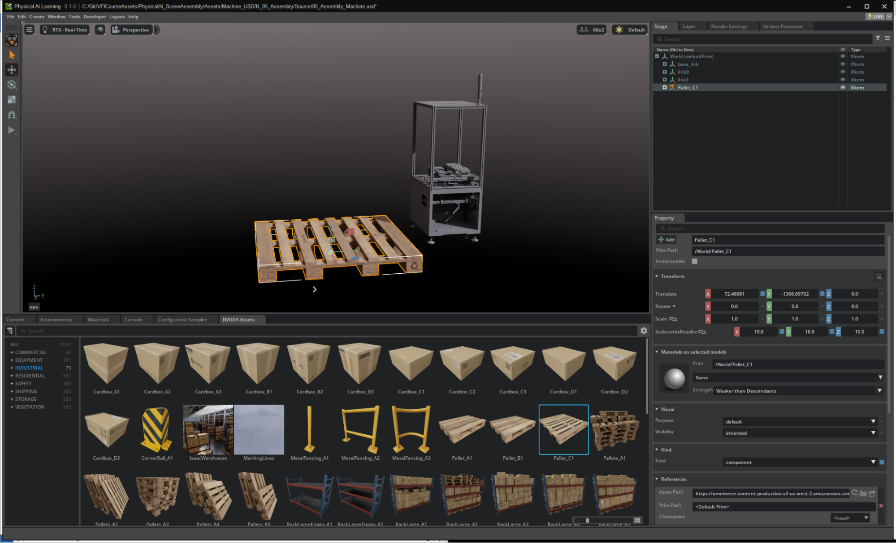
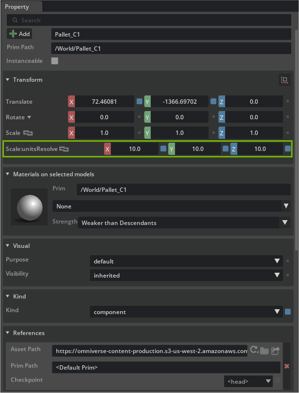

# Workspace Preferences for Assembly[#](#workspace-preferences-for-assembly "Link to this heading")

Many common problems in scene assembly trace back to unit mismatches, especially when assets come from different authoring environments. In this project, all provided assets were created using millimeters (mm) as the working unit. To ensure a consistent and reliable assembly experience, we need to align our scene’s units, snapping, and axis preferences with your source assets.

## **Axis, Units, and Reference Defaults**[#](#axis-units-and-reference-defaults "Link to this heading")

1. Create a cube by **right-clicking** in the viewport or Stage window and selecting **Create > Mesh > Cube**.

Note

A cube is 1 unit of the scene units, for example: A usd scene with Meters Per Unit set to 1 is a cube 1 meter in x,y,x dimensions. If the project layer’s units are set incorrectly, the newly created cube will appear extremely small next to a machine asset.

2. Open the **Layers** panel.
3. Locate and select the current **Authoring Layer**.
4. Scroll to the bottom of the **Layers** panel.
5. Expand the **Layer Metadata** section to find the **Meters Per Unit**.

- By default, this is usually set to **1**, which means the scene interprets **1 unit as 1 meter**.

6. To match assets authored in millimeters, change the **Meters Per Unit** value from 1 to 0.001.

- This tells the scene that 1 scene unit = 0.001 meters = 1 millimeter.

7. Delete the **original small cube** you created before changing the units.
8. Create a **new Cube**

- It should now appear at the intended scale, matching the imported machine assets’ dimensions

Now, any new assets or references you add will match or automatically modify the units so both prims match.

- This will prevent situations where, for example, a generic cube appears a thousand times smaller than your machine geometry.

From the **NVIDIA Assets** tab, we can drag in a new asset. This Pallet for example, and see that the Scale of the prim has been automatically resolved by adding a **Scale:unitsResove** with a value of 10.

Note

The **Scale:unitsResolve** transform is applied automatically by the Metrics Assembler extension (omni.usd.metrics.assembler).

This extension detects when assets with different scene units are being added to a stage and automatically applies corrective transforms to ensure proper scaling. This keeps the visual appearance correct while maintaining the integrity of the original asset files.

---

### **Why This Matters**[#](#why-this-matters "Link to this heading")

- Consistency in units is essential for proper alignment, physics, and render scale for your digital twin scenes.
- Setting Meters Per Unit at the Authoring Layer ensures every referenced file is interpreted with correct real-world measurements.

### **Standards Reference**[#](#standards-reference "Link to this heading")

- Always use the project’s native working units for Meters Per Unit.
- Double-check the up-axis.

  - Default is Y-up but we’ll be working with Z-up.
- Verify these points for your workflow.

On this page
