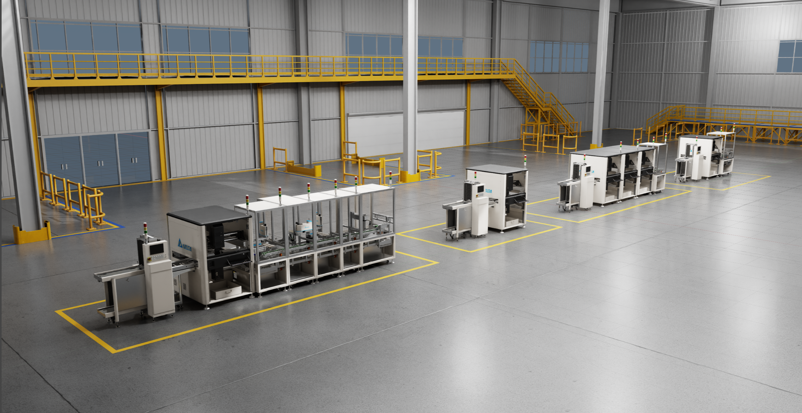

# Welcome to Assembling Digital Twins With Omniverse and OpenUSD[#](#welcome-to-assembling-digital-twins-with-omniverse-and-openusd "Link to this heading")

Build practical skills in creating digital twins for industrial facilities using NVIDIA Omniverse and OpenUSD.

This learning path guides you through the essential workflows for assembling and managing digital twins of manufacturing environments. Learn how to organize USD assets, validate scene data, optimize performance, and implement best practices for facility-scale virtual environments.

## Who Should Take This Path[#](#who-should-take-this-path "Link to this heading")

This learning path is designed for engineers, facility planners, developers, and technical artists working on industrial digital twin projects. No prior USD or Omniverse experience is required, though familiarity with 3D concepts and basic Python is helpful.

---

**Ready to start building?** Begin with the foundational course to establish your digital twin workflow skills.

On this page
