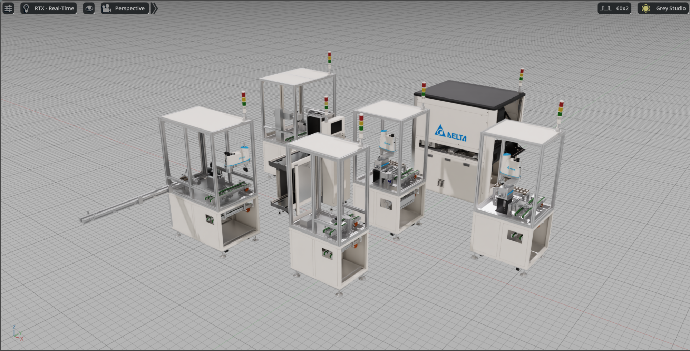
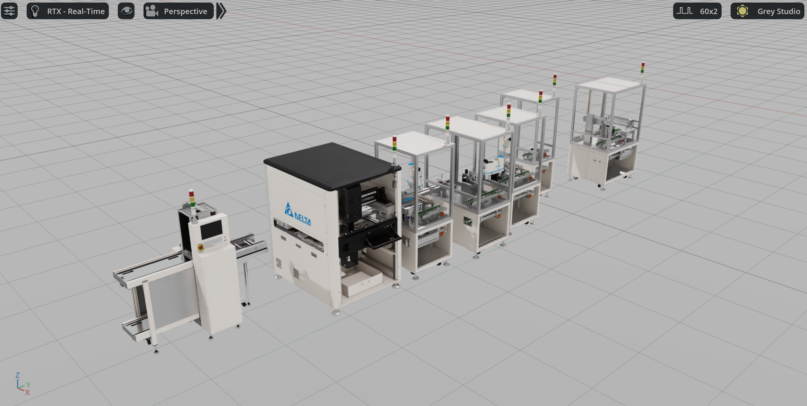
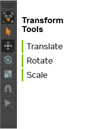
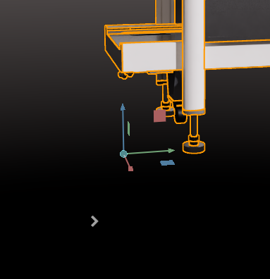

# Assembling a Basic Production Line[#](#assembling-a-basic-production-line "Link to this heading")

Welcome to the exciting part of our digital twin workflow, building our first production line! Throughout this course, we’ve been carefully preparing for this moment by organizing assets, validating quality, and establishing consistent materials. Now we’ll bring everything together in a structured, efficient assembly process.

---

Let’s get started!

First, let’s create our new production line file:

1. Create a New USD file by going to **File > New From Stage Template > Empty**
2. Turn on **Grey Studio** lighting for better visibility during assembly

Note

Make sure the units here are set to cm so we are aligning with our other files.

5. Name it **CL6\_Line\_Full.usd** and save it in your **Assemblies** folder

## **Adding Machine Assets to the Stage**[#](#adding-machine-assets-to-the-stage "Link to this heading")

Now we’ll assemble our production line using the metadata-driven sequence approach:

6. In the Content Browser, locate your **Assets > Machine\_USD** folder
7. Look for machines with names starting with sequence numbers (N\_01\_, N\_02\_, etc.)

   - As discussed in a previous module, these numbers indicate the intended order in the CL6 production line
8. Drag and drop **N\_00\_[Machine\_Name].usd** onto the World prim in the Stage panel

   - This creates a reference, not a copy, maintaining efficiency and allowing updates from the source file

Note

In an earlier module, we changed the settings to create a reference instead of a Payload when adding a new asset to a scene. This change can be done inside of the Omniverse Settings.

---

### **Using References and Payloads**[#](#using-references-and-payloads "Link to this heading")

Why Use References?

- **Efficiency** One source file supports multiple assembly instances
- **Automatic Updates** Changes to source machines propagate to all assemblies that reference them
- **Non-Destructive** Positioning and modifications don’t alter the original asset files

Tip

```
\*\*When to Use Payloads\*\* For large scenes, use payloads to enable deferred loading so stages open quickly with content unloaded, then selectively load only what is needed to manage memory and improve interactivity. This lets assemblies reference many assets while keeping working sets small by loading and unloading payload content on demand.
```

## **Building the Complete Line**[#](#building-the-complete-line "Link to this heading")

9. Add the remaining machines in numerical order:

   - N\_02\_PCB\_Router.usd
   - N\_03\_Feeder.usd
   - N\_04\_PCB\_Assembly.usd
   - N\_05\_Assembly.usd
   - And so forth, following the sequence
10. In the Stage panel, confirm each machine shows an orange arrow icon (indicating references) rather than blue arrows (which indicate payloads)

### **Positioning and Orientation**[#](#positioning-and-orientation "Link to this heading")

**With all machines added to the stage**



11. Use the **Transform tools** to position each machine

- Align machines along a consistent axis for a layout



## Transform Tools Overview[#](#transform-tools-overview "Link to this heading")

The Transform tools in Omniverse allow you to manipulate objects in 3D space by controlling their position, rotation, and scale. You can access these tools from the main toolbar or use keyboard shortcuts:



- **Translate** - Moves objects along X, Y, and Z axes
- **Rotate** - Rotates objects around their center point
- **Scale** - Adjusts object size uniformly or along specific axes



The Transform tools appear as colored handles **(red=X, green=Y, blue=Z)** when you select an object, making it easy to control movement along specific directions.

Warning

Those colors assume that you have set **Z to Up** in your world settings as we did in the beginning of this course.

On this page
