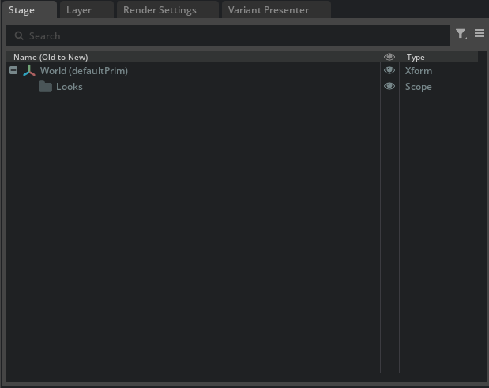
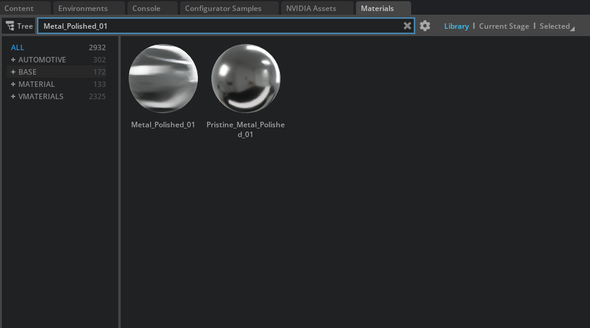
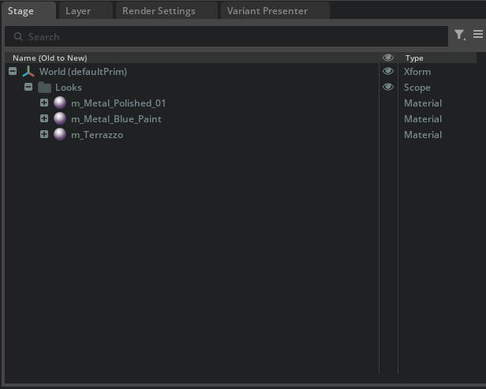
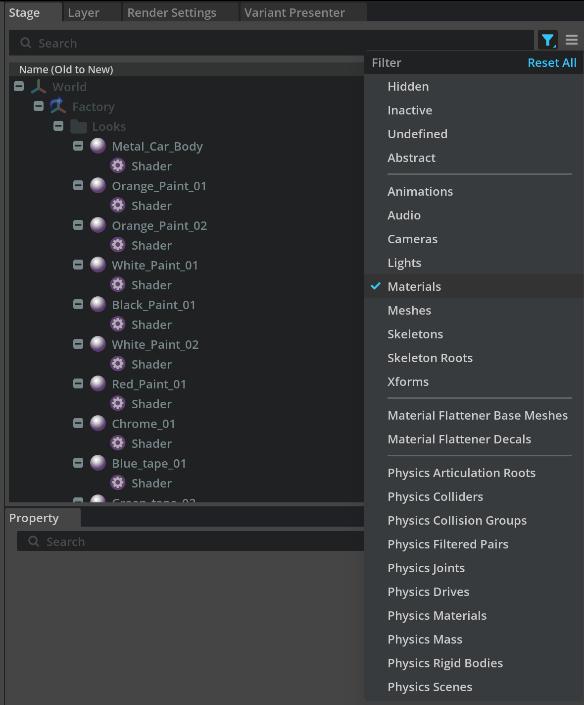

# Using a Centralized Materials Library[#](#using-a-centralized-materials-library "Link to this heading")

Before we begin adding materials to individual machine assets, let’s establish a centralized materials library. Creating a dedicated materials library USD file serves several critical purposes in digital twin workflows:

- **Consistency Across Assets:** A centralized library ensures all machines in your production line, in this example, use the same material definitions, creating visual consistency across your entire digital twin scene.
- **Efficient Collaboration**: When multiple team members work on different aspects of the project, a shared materials library prevents duplicate materials and conflicting definitions.
- **Easy Global Updates:** When you need to change a material property (like making metal surfaces more reflective), updating it in one central location propagates the change to all assets that reference it.
- **Scalability:** As your digital twin grows to include more production lines, cells, and factory areas, a centralized system makes it easy to maintain and expand your material palette.
- **Non-Destructive Workflow:** By keeping materials separate from individual assets, we can experiment with different looks without permanently altering our machine USD files.

---

Let’s create this central library and populate it with production-ready materials.

1. Go to **File > New From Stage Template > Empty**
2. Save this file as MaterialLibrary.usd in your project’s **Assets > Material** folder

We’ll be adding a **m\_** prefix as a naming convention that helps organize our materials for easy identification and automated workflows. Using consistent prefixes like **m\_** for materials, **a\_** for assets, or **l\_** for lights makes it easier to:

- **Sort and filter** files in the Content Browser
- **Write Python scripts** that automatically find and process specific types of content
- **Maintain clean project organization** as your digital twin scales up
- **Quickly identify material files** when troubleshooting or updating

Set up the material library structure:

3. Select the **World** prim
4. Right-click and **Create > Scope**, name it **Looks**
5. This creates the standard USD structure for materials: `/World/Looks/`

## Add a new material[#](#add-a-new-material "Link to this heading")

6. Locate and add **Metal\_Polished\_01** (or try a different one or create your own material)

7. Double-click or drag and drop the material to add it to your **Looks** Scope

   - The material will appear under /World/Looks/Metal\_Polished\_01
8. Rename the material with our naming convention:
9. In the **Stage panel**, right-click on the material prim
10. Select Rename and change it to **m\_PolishedSteel**

    - This creates a consistent, descriptive name that follows our **m\_** prefix convention
11. Add a few more materials in the Looks scope that we can use on the Machines.

    - Your digital twins will have many more than these few here.

12. Save the **MaterialLibrary.usd** file.

---

## Alternative to Naming Conventions[#](#alternative-to-naming-conventions "Link to this heading")

**Stage Panel Filters**
While using the `m_` prefix for materials, `l_` for lights, and `a_` for assets provides excellent organization and scripting benefits, Omniverse also offers built-in filtering capabilities through the Stage panel that can accomplish similar organizational goals without requiring specific naming conventions.

The choice between systematic naming conventions and relying on built-in filtering often depends on your project’s scale, team size, and automation requirements. Both approaches can coexist, you might use naming conventions for your core material library while relying on Stage panel filters for quick scene navigation during interactive work sessions.

On this page
