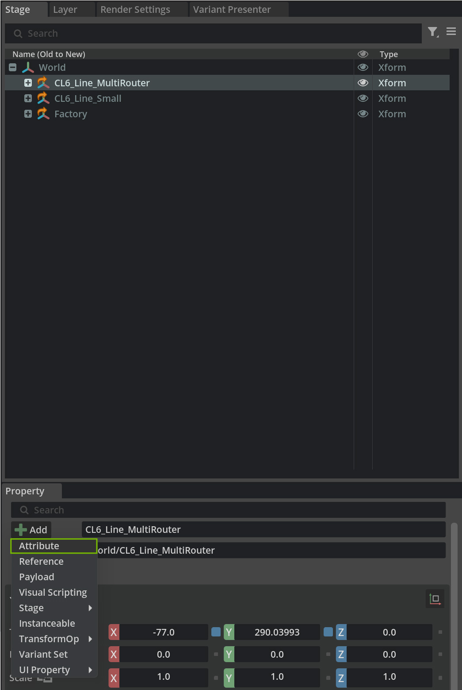
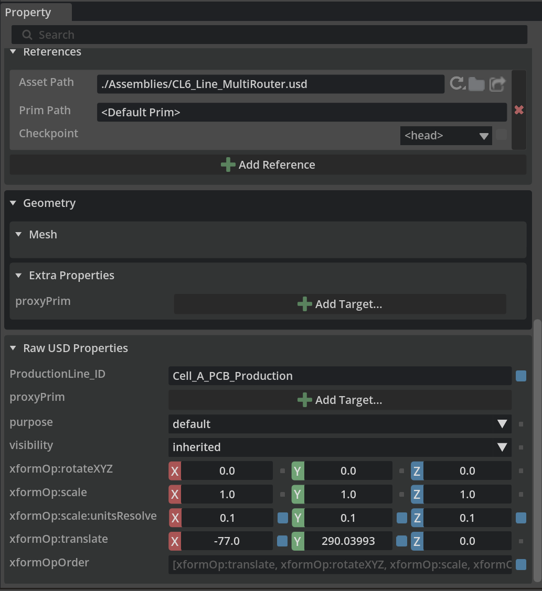
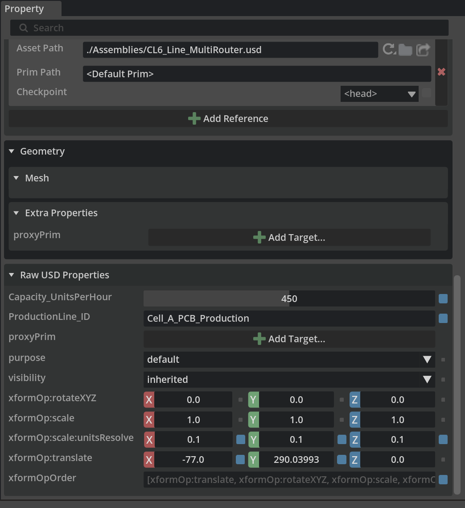
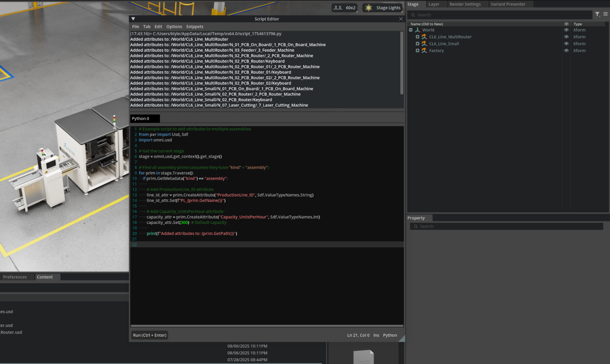

# Configuring Custom Attributes[#](#configuring-custom-attributes "Link to this heading")

Now that we have assembled our production line from individual machine assets, let’s enhance our organization system by adding custom attributes. Custom attributes can serve as digital “tags” that make our assemblies easier to search, organize, and automate workflows around. This becomes especially valuable as our digital twin projects scale to include multiple production lines, cells, and factory areas.

## **Two Example Attributes for Production Line Organization**[#](#two-example-attributes-for-production-line-organization "Link to this heading")

Your team will want to add Attributes that align to your catalog and workflow. Let’s make two here.

**ProductionLine\_ID (String Attribute)**

What it is: A unique identifier that categorizes each assembly into a specific production line or manufacturing cell.

1. Select your **production line** assembly in the Stage panel
2. In the Properties panel, click **+ Add > Attribute**



3. Set Name to **ProductionLine\_ID**
4. Set Type to **string**
5. Enter a meaningful value like **PL\_001\_ElectronicsAssembly** or **Cell\_A\_PCB\_Production**



**Why This is Advantageous**

- Scripts can quickly find all assets belonging to a specific production line
- When reorganizing factory layouts, you can instantly identify which machines belong together

**Capacity\_UnitsPerHour (Integer Attribute)**

What it is: The theoretical or actual production capacity of the assembly in units per hour.  
How to Add:

1. With your assembly selected, click + **Add Attribute**
2. Set Name to **Capacity\_UnitsPerHour**
3. Set Type to **int**
4. Enter the **production capacity** value (e.g., 450 for 450 units per hour)



---

**Why This is Advantageous**

- Quickly identify which production lines are capacity constraints
- Calculate ROI for additional equipment based on current capacity data
- Feed real capacity data into production scheduling simulations
- Compare actual throughput against theoretical capacity

---

## **Implementing the Attributes with Python**[#](#implementing-the-attributes-with-python "Link to this heading")



For larger projects with many assemblies, you can automate attribute creation using Python scripts:

```
1# Example script to add attributes to multiple assemblies
2from pxr import Usd, Sdf
3import omni.usd
4
5# Get the current stage
6stage = omni.usd.get\_context().get\_stage()
7
8# Find all assembly prims (assumes they have "kind" = "assembly")
9for prim in stage.Traverse():
10 if prim.GetMetadata("kind") == "assembly":
11
12 # Add ProductionLine\_ID attribute
13 line\_id\_attr = prim.CreateAttribute("ProductionLine\_ID", Sdf.ValueTypeNames.String)
14 line\_id\_attr.Set(f"PL\_{prim.GetName()}")
15
16 # Add Capacity\_UnitsPerHour attribute
17 capacity\_attr = prim.CreateAttribute("Capacity\_UnitsPerHour", Sdf.ValueTypeNames.Int)
18 capacity\_attr.Set(300)# Default capacity
19
20 print(f"Added attributes to: {prim.GetPath()}")
21
22
```

## **Advanced Use Cases Examples**[#](#advanced-use-cases-examples "Link to this heading")

These attributes enable powerful downstream workflows:  
**Automated Reporting**

- Generate capacity reports by querying all assemblies with Capacity\_UnitsPerHour
- Create production line dashboards grouped by ProductionLine\_ID

**Facility Optimization**

- Scripts can calculate total facility capacity by summing individual line capacities
- Identify underutilized lines for rebalancing workloads

**Integration with Manufacturing Systems**

- PLM systems can reference these IDs to link digital twins with real production data
- MES systems can use capacity data for intelligent work order routing

**Collaborative Workflows**

- Teams can filter views to show only their assigned production lines
- Maintenance schedules can be organized by production line groupings

---

## **Best Practices for Custom Attributes**[#](#best-practices-for-custom-attributes "Link to this heading")

- **Use consistent naming conventions** (e.g., ProductionLine\_ID, instead prodline\_id)
- **Choose appropriate data types** (string for IDs, integers for counts, floats for measurements)
- **Document attribute meanings** in project README files
- **Validate attribute values** to ensure data quality
- **Consider future scalability** when designing attribute schemas

By implementing these attributes systematically across our digital twin assemblies, we create a foundation for intelligent automation, better organization, and seamless integration with broader manufacturing systems. As our virtual factory grows, these metadata investments will pay dividends in operational efficiency and data-driven decision making.

On this page
