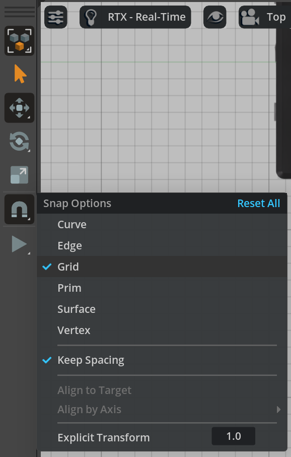
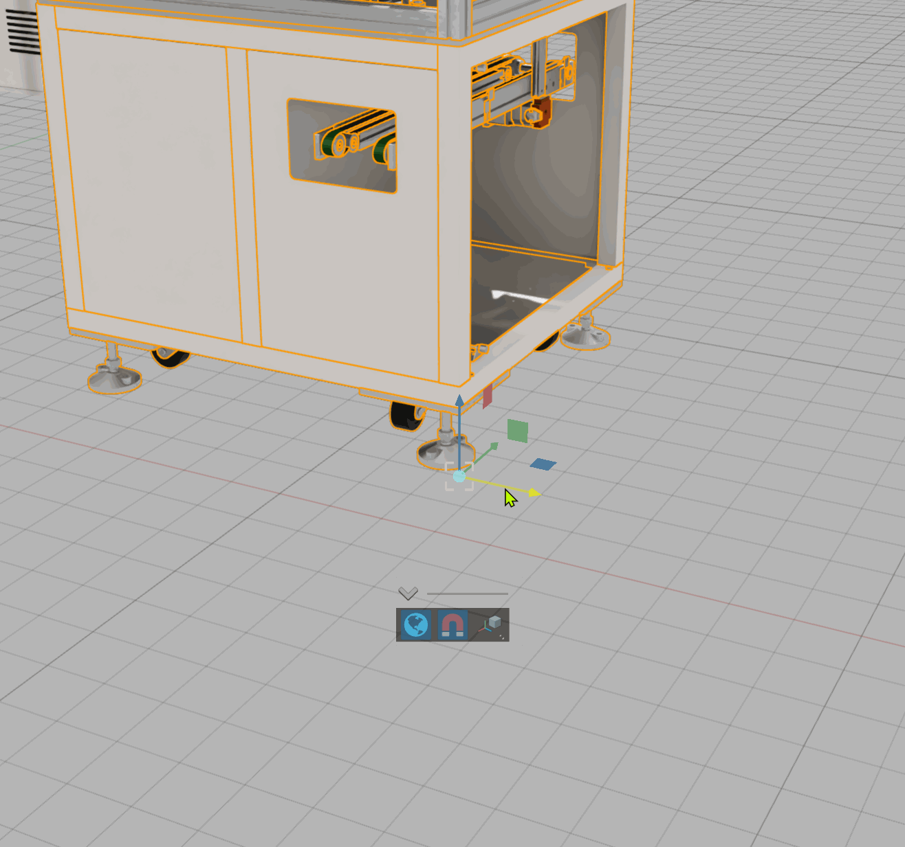
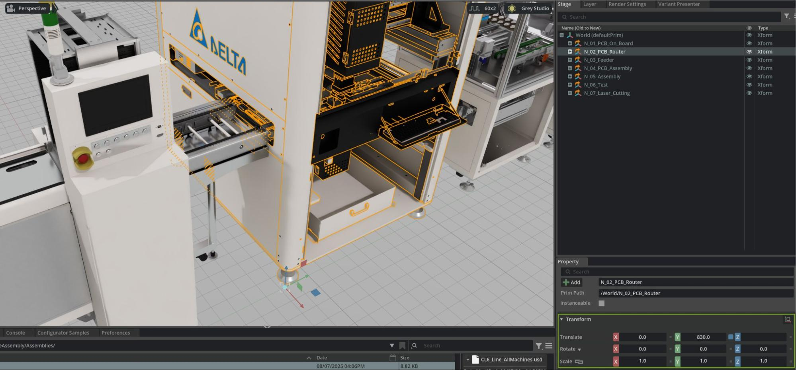
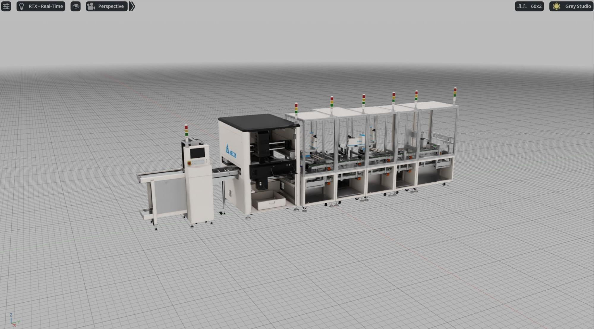

# Using Precision Tools for Accurate Machine Placement[#](#using-precision-tools-for-accurate-machine-placement "Link to this heading")

When assembling a production line in Omniverse, precise placement and orientation of machine assets are crucial for creating a functional and realistic virtual factory. Omniverse provides several built-in tools to help us achieve exact alignment, spacing, and orientation as we lay out each component.

## **Grid Snapping**[#](#grid-snapping "Link to this heading")

**Enable Grid Snapping** to ensure that each machine or asset “snaps” to the grid lines in the viewport as you move or rotate them.

1. To activate, locate the snapping controls and right-click **Grid in the Snap Options**

- This feature helps maintain uniform spacing and prevents accidental misalignment, especially when placing assets in a row or grid pattern.

### **Transform Widget**[#](#transform-widget "Link to this heading")

- The **Transform Widget** is an on-screen control that appears when an object is selected.

  - Use the **arrows** to move the asset along a specific axis.
  - The **rotation rings** allow for precise angular adjustments.
  - **Scaling handles** are available if you need to adjust asset size, but for production line assembly, scaling is rarely necessary since assets should have been validated at real-world scale.
- Drag the arrows or rings to interactively position or rotate machines, snapping automatically to grid intervals if snapping is enabled.

## **Property Panel for Direct Entry**[#](#property-panel-for-direct-entry "Link to this heading")

- For maximum precision, you can input exact position and rotation values directly in the **Properties panel**:

  - Select the asset (prim) in the **Stage** panel.
  - In the **Property** panel, find the **Transform** section.
  - Enter specific values for **Translate (X, Y, Z)** to move the asset to an exact coordinate.
  - Use **Rotate (X, Y, Z)** fields to orient machines at precise angles (such as 0°, 90°, 180°, or custom rotations needed for your production flow).
- This approach is essential when following facility layout blueprints, recreating real-world spacing, or aligning machines relative to known coordinates or reference points.

---

## **Combining Tools for Efficiency**[#](#combining-tools-for-efficiency "Link to this heading")

- Use a combination of grid snapping and the transform widget for fast, visual placement.
- Refine critical placements using the Property panel to enter or adjust coordinates for exact alignment.
- Remember to verify machine spacing and orientation in both top-down and 3D views to catch any placement errors.

## **Why Precision Matters**[#](#why-precision-matters "Link to this heading")

- Precise placement ensures:

  - Machines are properly aligned for simulated material flow (e.g., conveyors, robots).
  - Maintenance access and safety zones are respected.
  - Digital twins match the intended real-world layout, enabling accurate measurements, simulations, or downstream automation.

Tip

Toggle snapping, transform widgets, and manual entry as needed throughout the assembly process for a balance of speed and accuracy, you can always make incremental adjustments as you refine your digital factory scene.

---

## **The Benefits of The Systematic Approach**[#](#the-benefits-of-the-systematic-approach "Link to this heading")

This assembly process demonstrates the power of the systematic preparation we’ve done:

- **Scalable** This production line can be duplicated or modified for different factory configurations
- **Maintainable** Updates to individual machines automatically flow through to assembly scenes
- **Collaborative** Multiple team members can work on different aspects simultaneously

On this page
