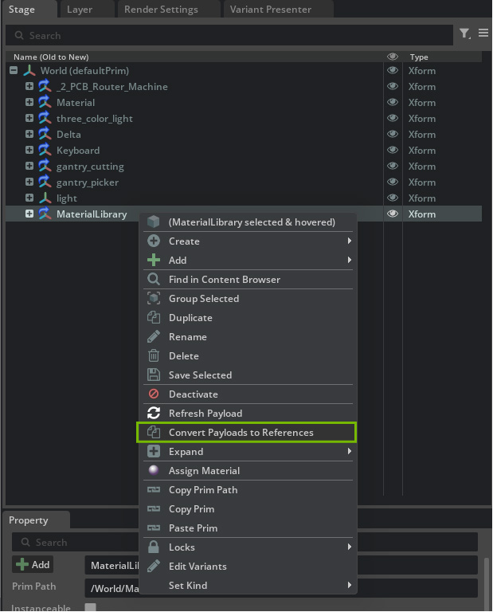
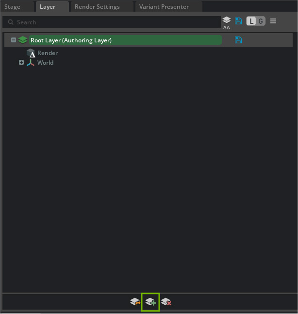
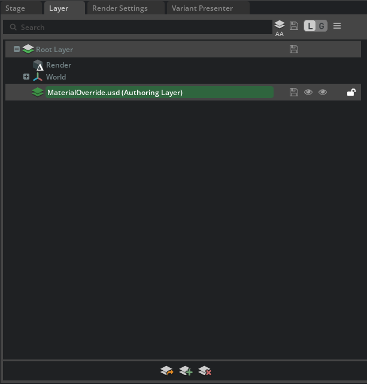
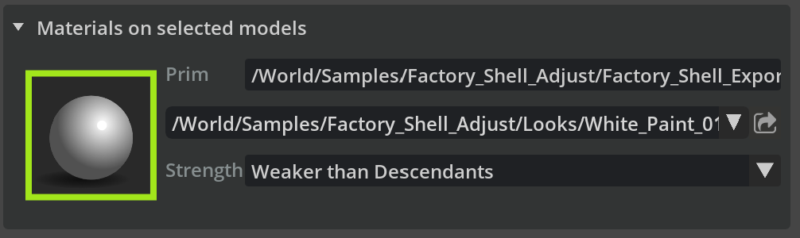
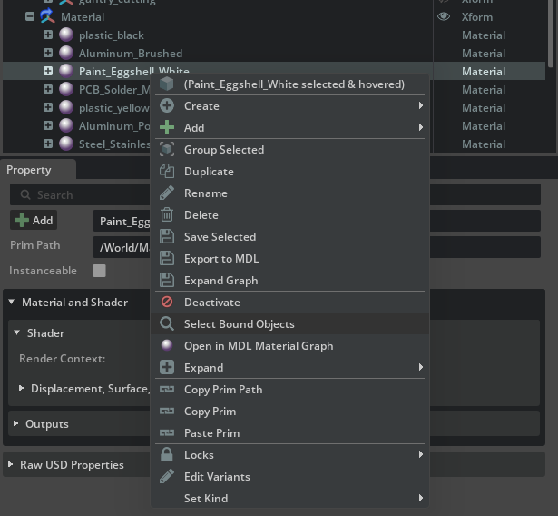
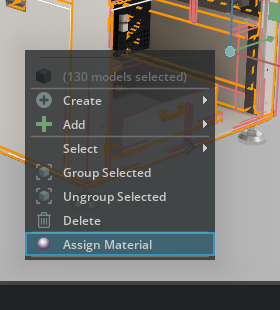
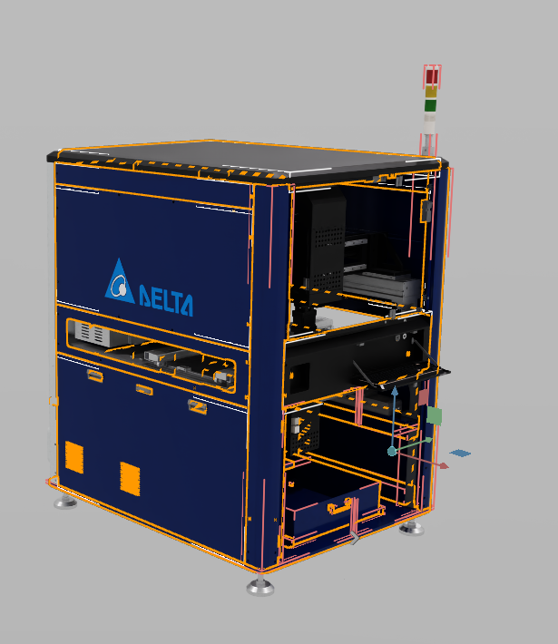
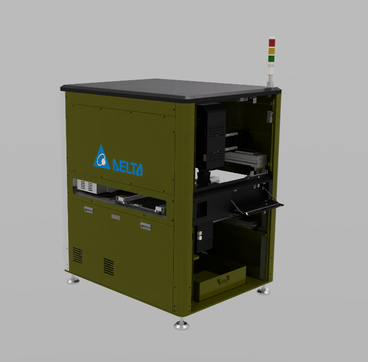

# Replacing Materials on Provided Assets[#](#replacing-materials-on-provided-assets "Link to this heading")

Let’s use the materials we added to our new library.

1. Open any machine, such as **N\_02\_PCB\_Router.usd**

   - Remember to set your lighting to **Grey Studio**
2. Browse to and select your MaterialLibrary.usd file and drag it onto the **World(defaultPrim)**

Note

It should be referenced in the scene rather than loaded as a payload. You can tell the difference by looking for an orange arrow (reference) instead of a blue arrow (payload). References (orange arrows) load automatically and are always accessible, while payloads (blue arrows) can be loaded/unloaded on demand to manage memory usage. For a material library that needs to be constantly available for material assignments, using a reference ensures the materials are immediately accessible without requiring manual loading.

What we want to do here is replace the current material assigned to the side walls of this machine to the nice **m\_Metal\_Blue\_Paint** material.

---

## **Create a Material Override Sublayer**[#](#create-a-material-override-sublayer "Link to this heading")

3. With your machine asset navigate to the **Layers** panel.
4. Click Create **Sublayer**

5. Name the sublayer **MaterialOverride.usd** and save it in the same directory as your machine asset.
6. Click **No** when prompted, “Do you want to transfer the root layer contents to the new sublayer?”.

   - We want to keep the original asset data in the root layer and only store our material modifications in the sublayer.
7. Double-click on **Material\_Override.usd** in the Layers panel to set it as the active authoring layer.

Now we’ll replace materials using a centralized materials library through a non-destructive sublayer workflow.

8. Navigate to the **machine asset hierarchy** and choose a metal component (e.g., a frame or housing piece that you want to modify).
9. In the Properties panel, click on the material thumbnail icon under **Materials on selected models**.

10. In the Stage, right-click on the selected material and from the context menu choose the **Select Bound Objects** option.

This will select all objects in the asset that share the same source material, allowing you to replace materials efficiently across multiple parts at once.

11. In the viewport, right-click on one of the highlighted parts of the asset and from the context menu select **Assign Material**

This will open a material assignment window where you can search for replacement materials.

12. In the material assignment window, you can filter by searching “**m\_**” in the material dropdown to find materials from your centralized library.
13. Find a replacement material (such as **m\_Metal\_Blue\_Paint** from your material library)
14. Select **Ok** to apply the new material to the selected parts.

Continue this workflow until all the materials are replaced with appropriate alternatives from your materials library.

Tip

Make sure to save your file as you complete the materials replacement task to preserve your work.

---

### **Non-Destructive Material Assignment Benefits**[#](#non-destructive-material-assignment-benefits "Link to this heading")

Notice that the **Material\_Override.usd** sublayer in the Layers panel now shows content (indicated by a small triangle). This demonstrates that:

- Material assignments exist only in the sublayer, not in the original asset file
- The original asset remains unchanged and intact
- You can easily revert changes by removing or muting the sublayer
- Multiple team members can work with different material variations simultaneously

Note

When you return to the **MaterialLibrary.usd** file and make a change to the referenced material, that change will propagate to all assets that link to it.

On this page
