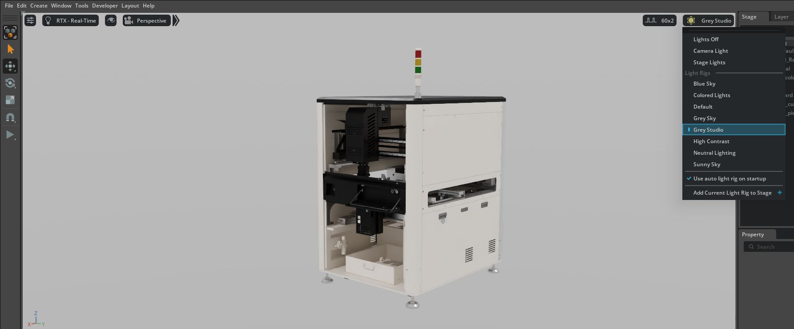
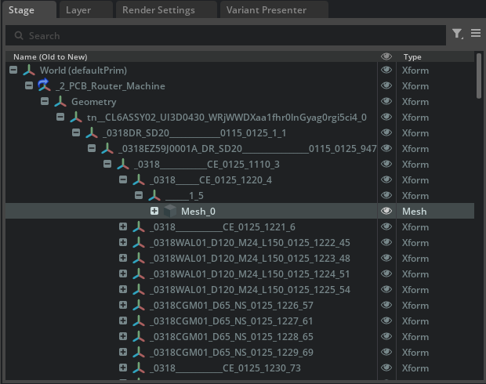
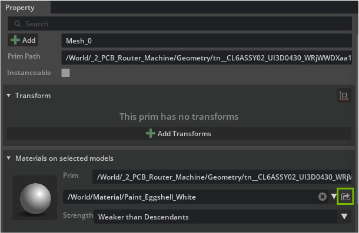
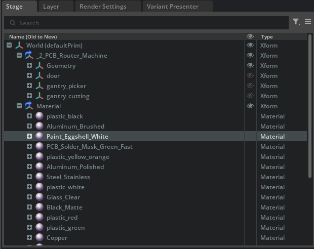
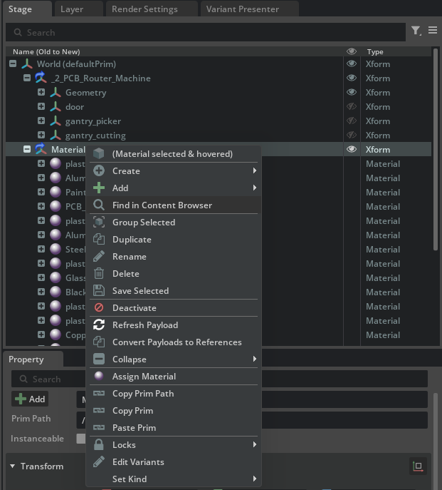

# Opening the Asset and Reviewing Current Materials[#](#opening-the-asset-and-reviewing-current-materials "Link to this heading")

1. In the Content Browser, navigate to **Assets > Machine\_USD > N\_02\_PCB\_Router**
2. Open **N\_02\_PCB\_Router.usd**
3. Set the stage lights to **Grey Studio** for better material visibility

With the **N\_02\_PCB\_Router** asset loaded and stage lights set to Grey Studio, we can now explore how to create and use a centralized materials library for consistent, non-destructive material management across our digital twin project.

4. In the **Stage** panel, expand the **PCB\_Router\_Machine** hierarchy to locate mesh components

5. Select a mesh prim that has materials assigned.
6. In the Property panel, scroll to find the **Materials on Selected Models** section
7. Press the **Go To** button next to the material binding to navigate to the material in the scene.

See that the selected material is located in its own USD file that has been prepared for these prims to all have access to one library we can pull from called **Material.usd**.

We can search for that in the **Content Browser**

8. Right-click on the Material and select **Find in Content Browser**

After clicking **Find in Content Browser**, the browser highlights the Material Xform that contains the shared materials referenced by multiple machine USD files.

---

- Creating a centralized material library (for example, `MaterialLibrary.usd` with a **/World/Looks/** scope) standardizes appearance across scenes and machines, reducing duplicates and mismatches.
- **Referencing this library in each scene makes it the single source of truth.** When a material is updated in the library, that change propagates automatically to every scene and asset that references it, without modifying the original machine files.
- This approach supports non-destructive editing, consistent visuals, and easier maintenance as the project scales.
