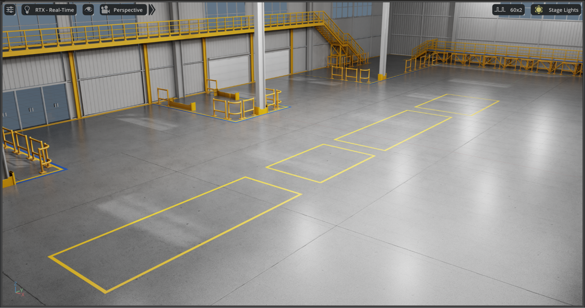
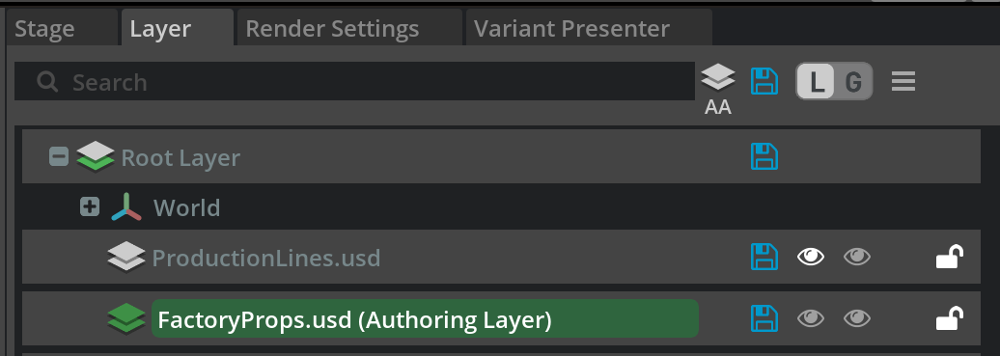
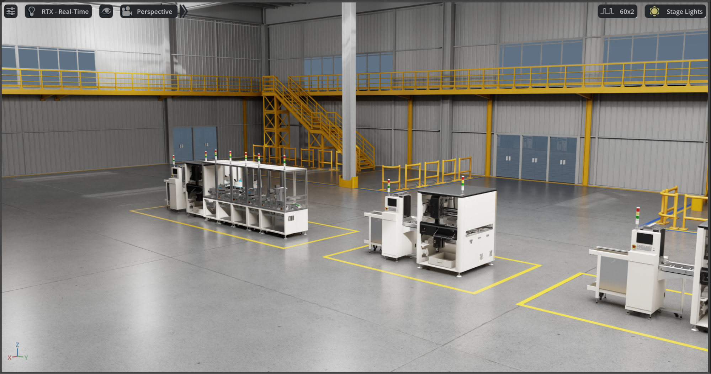
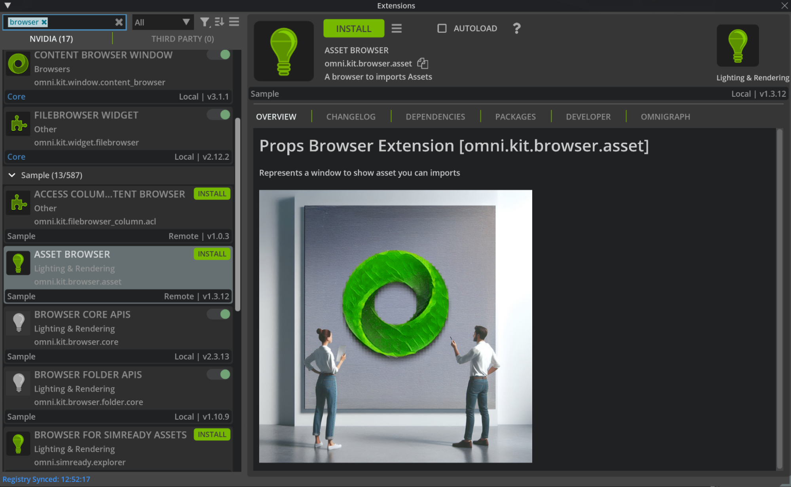
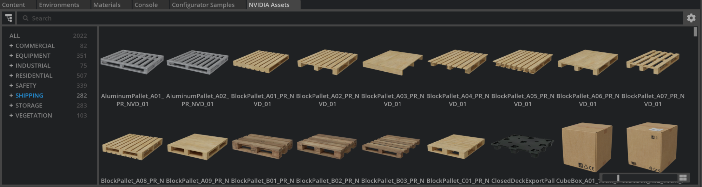
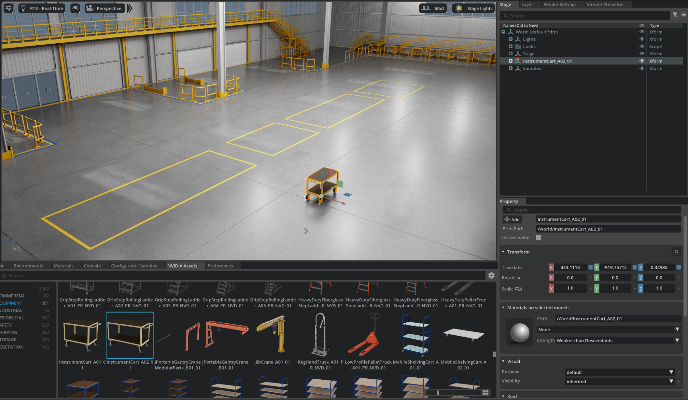
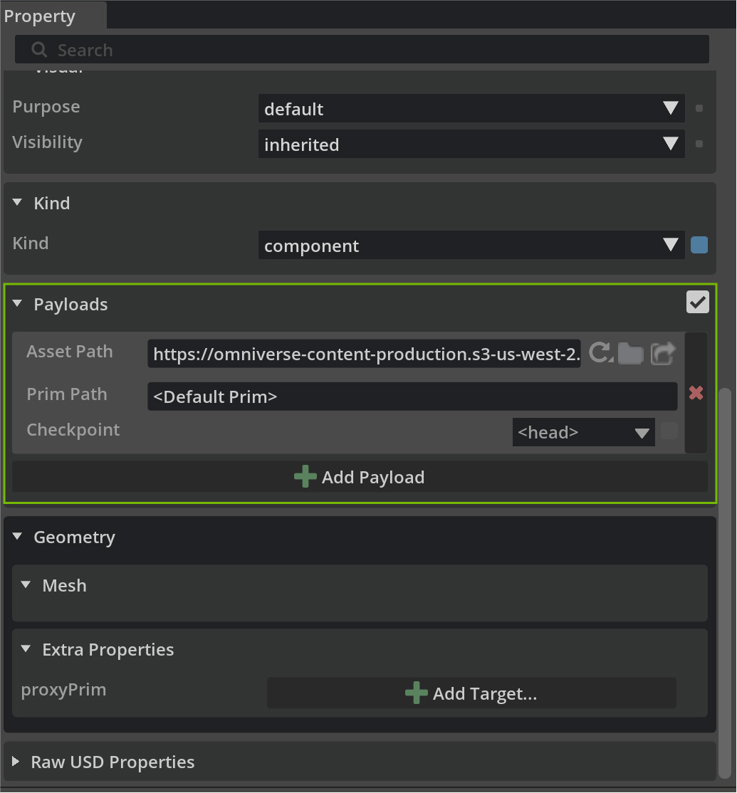
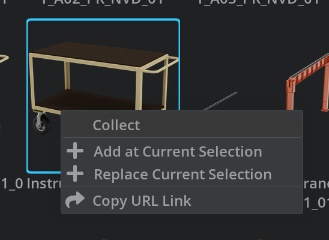
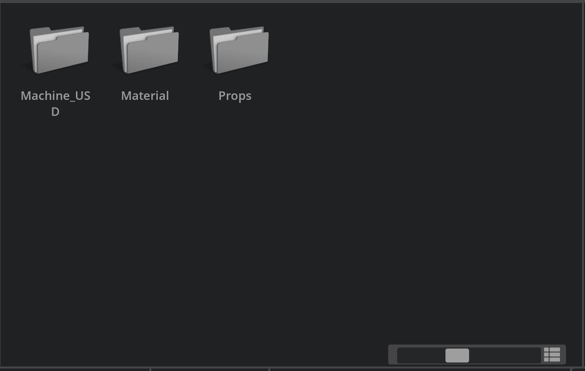
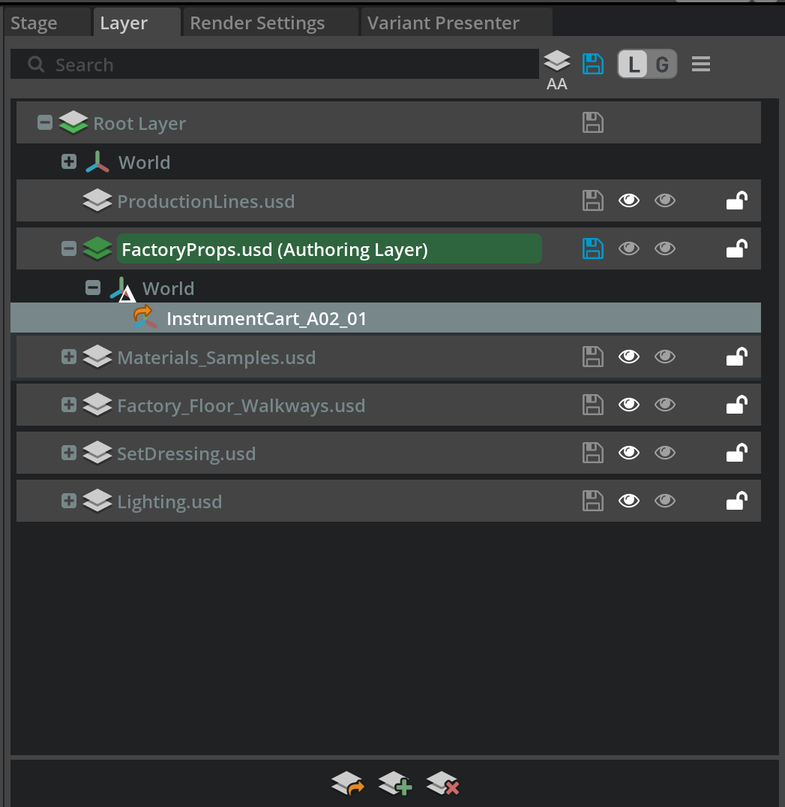

# Scene Optimization and Data Integration[#](#scene-optimization-and-data-integration "Link to this heading")

Welcome to **Scene Optimization and Data Integration**. This course walks through techniques for optimizing digital twin performance and integrating scene data with facility management systems.

With your production line assembled, you’ll now learn to scale your digital twin to facility-level complexity while maintaining interactive performance. This course covers critical optimization techniques including instancing for managing repetitive objects, adding environmental context and props, and programmatically extracting facility data for integration with operational systems.

Working with your assembled production line, you’ll add factory environment elements, implement performance best practices, write Python scripts to traverse USD stages and export asset inventories, and create navigation systems for scene exploration.

By the end of this course, you’ll have a complete, optimized digital twin scene that can serve as both a visualization tool and a data source for facility operations, maintenance planning, and strategic decision-making.

## Learning Objectives[#](#learning-objectives "Link to this heading")

1. **Implement USD instancing techniques** to optimize performance for scenes with repetitive elements.
2. **Integrate environmental props and context** to create complete facility representations.
3. **Write Python scripts for USD stage traversal** to programmatically query and export scene data.
4. **Generate CSV asset inventories** for integration with facility management and maintenance systems.
5. **Create navigation systems** using waypoints for effective scene exploration.

---

Before we jump in, let’s review a few best practices for your digital twin.

While we have already covered a few of these core topics, let’s review them in the context of Props.

## **Best Practices for Adding Props**[#](#best-practices-for-adding-props "Link to this heading")

There are a lot of these topics walked through in the [Learn OpenUSD](https://www.nvidia.com/en-us/learn/learning-path/openusd/) learning path.

**Use References, Not Copies**  
Just as we did with machine assets, always reference prop USD files rather than copying them. This maintains efficiency, enables easy updates across multiple scenes, and keeps file sizes manageable. Multiple instances of the same prop (like identical pallets or safety barriers) should reference the same source file.

**Organize Props by Function and Location**  
Structure your props logically within the scene hierarchy. Group related elements together (e.g., safety equipment, material handling props, or maintenance tools) and organize them by functional zones within the factory layout. This organization makes scene management much easier as complexity grows.

**Consider Scale and Units Consistency**  
Ensure all props maintain consistent units with your production line assets. As we established in previous modules, maintaining consistent scale prevents alignment issues and ensures accurate spatial relationships throughout your digital twin.

**Plan for Performance**  
While props add realism, they also increase scene complexity. Use instancing for repeated elements, apply appropriate levels of detail for props that will be viewed from a distance, and consider using simplified geometry for elements that serve primarily as visual context rather than functional analysis.

**Maintain Modular Flexibility**  
Organize props so they can be easily rearranged, replaced, or removed as manufacturing requirements change. This modularity ensures your digital twin can adapt to evolving facility layouts without requiring complete reconstruction.

## **Opening the Factory Environment**[#](#opening-the-factory-environment "Link to this heading")

Let’s start by setting up our factory shell as the foundation for our digital twin scene:

1. Navigate to **Factory > Factory.usd** in the Content Browser
2. Open the file

   - Lights are already set up in this scene, so we do not need to go to the Grey Studio lighting as we’ve previously done.



## **Creating Organized Layers for Asset Groups**[#](#creating-organized-layers-for-asset-groups "Link to this heading")

To maintain a clean, collaborative workflow, we’ll create dedicated layers for different types of factory content. This approach allows team members to work on different aspects simultaneously while keeping the scene organized.

**Create a Props Layer**

3. In the Layers panel, click **Create Sublayer**
4. Name the sublayer **FactoryProps.usd**
5. Save it in the same directory as **Factory.usd**
6. Double-click on **FactoryProps.usd** to set it as the active authoring layer

**Create a Production Lines Layer**

7. Create a third sublayer named **ProductionLines.usd**



This layer will reference the production line assemblies we created in Module 4.

Note

```
In this example, we’ve placed the assets in the sections provided, but use your build assemblies as needed.
```



---

## **Integrating NVIDIA Asset Browser Content**[#](#integrating-nvidia-asset-browser-content "Link to this heading")

The NVIDIA Asset Browser provides a wealth of factory-appropriate props and equipment that can enhance the realism and functionality of our digital twin.

**Accessing the NVIDIA Asset Browser**

8. Navigate to **Window > Extensions**.
9. In the search box, type “**NVIDIA Asset Browser**” or “omni.kit.browser\_asset”.
10. **Install and enable** the extension if not already active

Note

Keep the Asset Browser enabled only when needed to reduce startup overhead in large projects.



**Selecting Factory-Appropriate Assets**

11. Open the **NVIDIA Assets** tab from the **Window > Browsers > NVIDIA Assets**
12. Browse relevant categories: Industrial, Manufacturing, Warehouse.



**Choose practical props that add context to your factory scene:**

- Pallets and shipping containers

  - Forklifts and material handling equipment
  - Safety barriers and signage
  - Storage racks and shelving

13. Drag an asset from the NVIDIA Assets tab into the **viewport** or **Stage Tab** to place.



Note

Dropping assets directly from the NVIDIA Assets tab references cloud-hosted content. This is suitable for exploration but not for production scenes or team workflows.

With the asset selected, check the **Property panel > Payload/References > Asset Path** to see it points to a cloud location.



14. Right-click the asset in the **NVIDIA Assets** Browser and choose **Collect**



15. Choose a target within the project, such as:

    - Assets/Props/WorkingLibrary for review and curation, or
    - Assets/Props for approved, production-ready props.



Warning

The collect action often creates a nested folder structure (materials, textures, thumbnails). Move or rename folders to match your project conventions while keeping relative paths intact.

Maintain a clean destination such as:

- Assets/Props/Pallets/
- Assets/Props/MaterialHandling/
- Assets/Props/Safety/
- Assets/Props/Storage/

This is going to download a local copy that can be added to an accessible library. We can then reference this prop in our scenes as needed.

With the FactoryProps.usd set as the Authoring Layer, the newly added prims are being added directly to that layer.



Tip

Use consistent, descriptive names for collected USDs (for example, prop\_pallet\_closeddeck\_A01.usd) to improve search and automation.

On this page
