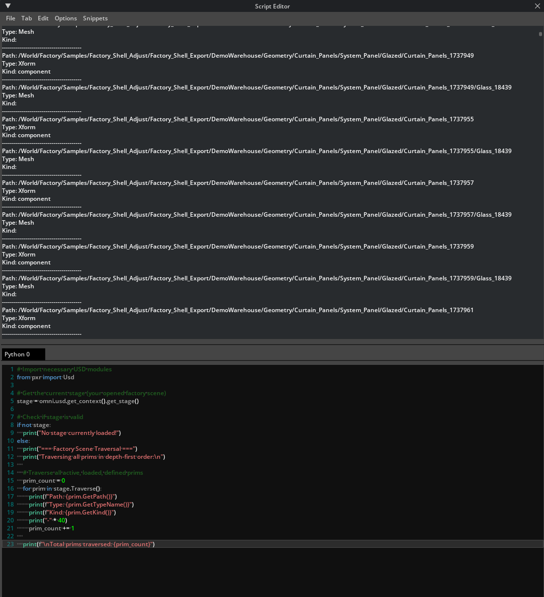
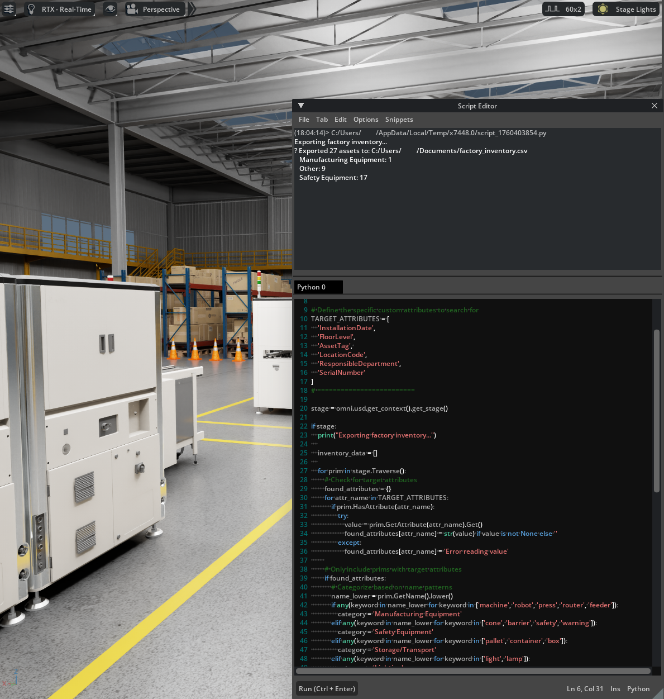
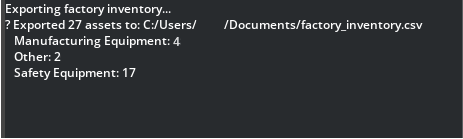

# Asset Inventory and Data Export[#](#asset-inventory-and-data-export "Link to this heading")

Now that you’ve learned to navigate your factory scene visually using waypoints, let’s explore how to navigate it **programmatically** using Python scripting. This section teaches you to automatically traverse your USD stage, identify all assets, and export the data to CSV format for facility management and reporting purposes.

## Understanding Stage Traversal[#](#understanding-stage-traversal "Link to this heading")

**Stage traversal** is the process of systematically walking through your USD scene’s hierarchy to query or extract data from every primitive (prim) in the stage. Think of it as an automated way to “visit” every object in your digital twin and collect information about it.

Tip

For a deep dive into Stage traversal and more OpenUSD topics, check out our [learning path](https://docs.nvidia.com/learn-openusd/latest/beyond-basics/stage-traversal.html).

## Why Stage Traversal Matters for Digital Twins[#](#why-stage-traversal-matters-for-digital-twins "Link to this heading")

As your factory digital twin grows in complexity, manually tracking assets becomes impractical. Consider these scenarios:

**Facility Management Needs**

- “How many safety devices do we have in the facility?”
- “What types of machines are installed in Production Line A?”
- “Which assets need maintenance based on their installation dates?”
- “What’s the total count of each asset type for procurement planning?”

In real facility management, you need to:

- **Generate asset inventories** for maintenance planning
- **Create compliance reports** showing all safety equipment locations
- **Track component installations** across production lines
- **Export data for ERP integration** and facility management systems

Manual clicking through hundreds of objects isn’t practical—scripting automates this essential workflow.

### How USD Stage Traversal Works[#](#how-usd-stage-traversal-works "Link to this heading")

USD traversal operates by walking through prims in **depth-first order**

```
/Factory (Root)
├── /Factory/ProductionLine\_A (visited first)
│ ├── /Factory/ProductionLine\_A/Machine\_001 (visited second)
│ └── /Factory/ProductionLine\_A/Machine\_002 (visited third)
└── /Factory/ProductionLine\_B (visited fourth)
└── /Factory/ProductionLine\_B/Machine\_003 (visited fifth)
```

This systematic approach ensures every prim gets visited exactly once, in a predictable order.

## Python Scripting in Omniverse[#](#python-scripting-in-omniverse "Link to this heading")

**Accessing the Script Editor**

1. Navigate to **Developer > Script Editor** to open the Script Editor.

### Basic Stage Traversal: Listing All Assets[#](#basic-stage-traversal-listing-all-assets "Link to this heading")

Let’s start with a fundamental script that traverses your factory stage and lists every prim path.

#### Script 1: Complete Stage Traversal[#](#script-1-complete-stage-traversal "Link to this heading")

Warning

Depending on the size of your scene this may take some time to complete.

**Copy and paste this script into the Script Editor**

```
1# Import necessary USD modules
2from pxr import Usd
3
4# Get the current stage (your opened factory scene)
5stage = omni.usd.get\_context().get\_stage()
6
7# Check if stage is valid
8if not stage:
9 print("No stage currently loaded!")
10else:
11 print("=== Factory Scene Traversal ===")
12 print("Traversing all prims in depth-first order:\n")
13
14 # Traverse all active, loaded, defined prims
15 prim\_count = 0
16 for prim in stage.Traverse():
17 print(f"Path: {prim.GetPath()}")
18 print(f"Type: {prim.GetTypeName()}")
19 print(f"Kind: {prim.GetKind()}")
20 print("-" \* 40)
21 prim\_count += 1
22
23 print(f"\nTotal prims traversed: {prim\_count}")
```

**Execute the script** and observe:



- The **hierarchical structure** of your factory scene
- **Prim types** (Xform, Mesh, Material, etc.)
- **USD Kind metadata** (Component, Assembly, Group)
- **Total count** of all objects in your scene

##### Understanding the Output[#](#understanding-the-output "Link to this heading")

Your results will show the organized structure of your digital twin:

| Output Element | What It Tells You | Why It Matters |
| --- | --- | --- |
| **Path** | Hierarchical location in scene | Navigation and organization |
| **Type** | USD primitive type (Mesh, Xform, etc.) | Technical structure understanding |
| **Kind** | Asset classification (Component, Assembly) | Logical grouping and filtering |

### Targeted Asset Identification[#](#targeted-asset-identification "Link to this heading")

Rather than listing everything, let’s create more focused scripts that identify specific types of assets relevant to facility management.

#### Script 2: Finding Manufacturing Equipment[#](#script-2-finding-manufacturing-equipment "Link to this heading")

**This script identifies machines and equipment specifically**

Note

This script finds the machine assets by searching for these keywords in the name or if the **Kind** is set to Component.
Keywords include: **machine**,\*\* robot\*\*, **conveyor**, etc.

```
1from pxr import Usd, UsdGeom
2
3# Get current stage
4stage = omni.usd.get\_context().get\_stage()
5
6if stage:
7 print("=== Manufacturing Equipment Inventory ===\n")
8
9 machines = []
10
11 for prim in stage.Traverse():
12 # Look for prims with "machine" in the name or specific kinds
13 prim\_name = prim.GetName().lower()
14 prim\_kind = prim.GetKind()
15
16 # Identify potential manufacturing equipment
17 if (any(keyword in prim\_name for keyword in ['machine', 'robot', 'conveyor', 'press', 'router', 'feeder'])
18 or prim\_kind == 'Component'):
19
20 # Get additional information
21 transform = UsdGeom.Xformable(prim)
22
23 machine\_data = {
24 'name': prim.GetName(),
25 'path': str(prim.GetPath()),
26 'type': prim.GetTypeName(),
27 'kind': prim\_kind
28 }
29
30 machines.append(machine\_data)
31
32 print(f"Equipment: {machine\_data['name']}")
33 print(f"Location: {machine\_data['path']}")
34 print(f"Type: {machine\_data['type']}")
35 print(f"Classification: {machine\_data['kind']}")
36 print("-" \* 50)
37
38 print(f"\nTotal manufacturing equipment found: {len(machines)}")
```

#### Script 3: Props and Safety Equipment Inventory[#](#script-3-props-and-safety-equipment-inventory "Link to this heading")

**This script focuses on props, safety equipment, and environmental objects**

Note

This script is searching prims similar to the previous one, but it will categorize them by type.  
Such as: **Safety Equipment**, **Storage/Transport**, **Lighting**

```
1from pxr import Usd
2
3# Get current stage
4stage = omni.usd.get\_context().get\_stage()
5
6if stage:
7 print("=== Props and Safety Equipment Inventory ===\n")
8
9 props = []
10 safety\_equipment = []
11
12 for prim in stage.Traverse():
13 prim\_name = prim.GetName().lower()
14 prim\_path = str(prim.GetPath()).lower()
15
16 # Categorize based on name patterns
17 if any(keyword in prim\_name for keyword in ['cone', 'barrier', 'sign', 'safety', 'warning']):
18 safety\_equipment.append({
19 'name': prim.GetName(),
20 'path': str(prim.GetPath()),
21 'category': 'Safety Equipment'
22 })
23
24 elif any(keyword in prim\_name for keyword in ['pallet', 'container', 'box', 'rack', 'shelf']):
25 props.append({
26 'name': prim.GetName(),
27 'path': str(prim.GetPath()),
28 'category': 'Storage/Transport'
29 })
30
31 elif any(keyword in prim\_name for keyword in ['light', 'lamp', 'fixture']):
32 props.append({
33 'name': prim.GetName(),
34 'path': str(prim.GetPath()),
35 'category': 'Lighting'
36 })
37
38 # Display results
39 print("SAFETY EQUIPMENT:")
40 for item in safety\_equipment:
41 print(f" {item['name']} at {item['path']}")
42
43 print(f"\nPROPS BY CATEGORY:")
44 for item in props:
45 print(f" {item['category']}: {item['name']} at {item['path']}")
46
47 print(f"\nSummary:")
48 print(f"Safety Equipment: {len(safety\_equipment)}")
49 print(f"Props: {len(props)}")
```

### CSV Export: Asset Data Export[#](#csv-export-asset-data-export "Link to this heading")



Now let’s create a comprehensive script that exports all asset data to CSV format for external use.

This final script combines all the techniques we’ve learned to create a focused, efficient export. Unlike the earlier exploratory scripts, this version is optimized for performance and targets only assets with specific custom attributes that you’ve added to your scene.

**Key Features of this Export Script**

**Targeted Filtering** Only exports assets that contain your custom metadata attributes, making the process faster and the results more relevant for facility management.

**Smart Categorization** Automatically categorizes assets based on naming patterns, grouping them into meaningful categories like “Manufacturing Equipment,” “Safety Equipment,” and “Storage/Transport.”

**Structured Output** Creates a standardized CSV format that can be easily imported into facility management systems, maintenance databases, or spreadsheet applications.

**Performance Optimization** Uses efficient USD methods to check for specific attributes without processing every prim’s complete attribute list.

Note

To change the location that the file will save to, search for the comment in the code:

```
# Set your CSV file save location here
CSV\_SAVE\_PATH = "C:/Users/YourName/Desktop/factory\_inventory.csv"
```

**Understanding the TARGET\_ATTRIBUTES Configuration**

The script searches specifically for these custom attributes:

- `InstallationDate` - When the asset was installed
- `FloorLevel` - Physical floor location
- `AssetTag` - Unique facility identifier
- `LocationCode` - Facility location reference
- `ResponsibleDepartment` - Owning department
- `SerialNumber` - Manufacturer serial number

Only assets containing at least one of these attributes will be included in the export, ensuring your CSV contains meaningful facility management data rather than every geometric primitive in the scene.

**Interpreting Your Export Results**



After running the script, you’ll see console output showing:

- **Export confirmation** with file location and asset count
- **Category breakdown** showing how many assets were found in each type
- **File location** where you can open the CSV in Excel or your preferred application

The resulting CSV file provides a complete asset inventory that bridges your 3D digital twin with traditional facility management workflows, enabling data-driven maintenance planning, compliance reporting, and operational decision-making.

```
1from pxr import Usd
2import csv
3import os
4
5# ===== CONFIGURATION =====
6# Set your CSV file save location here
7CSV\_SAVE\_PATH = "C:/Users/YourName/Desktop/factory\_inventory.csv"
8
9# Define the specific custom attributes to search for
10TARGET\_ATTRIBUTES = [
11 'InstallationDate',
12 'FloorLevel',
13 'AssetTag',
14 'LocationCode',
15 'ResponsibleDepartment',
16 'SerialNumber'
17]
18# =========================
19
20stage = omni.usd.get\_context().get\_stage()
21
22if stage:
23 print("Exporting factory inventory with attributes...")
24
25 inventory\_data = []
26
27 for prim in stage.Traverse():
28 # Check for target attributes
29 found\_attributes = {}
30 for attr\_name in TARGET\_ATTRIBUTES:
31 if prim.HasAttribute(attr\_name):
32 try:
33 value = prim.GetAttribute(attr\_name).Get()
34 found\_attributes[attr\_name] = str(value) if value is not None else ''
35 except:
36 found\_attributes[attr\_name] = 'Error reading value'
37
38 # Only include prims with target attributes
39 if found\_attributes:
40 # Categorize based on name patterns
41 name\_lower = prim.GetName().lower()
42 if any(keyword in name\_lower for keyword in ['machine', 'robot', 'press', 'router', 'feeder']):
43 category = 'Manufacturing Equipment'
44 elif any(keyword in name\_lower for keyword in ['cone', 'barrier', 'safety', 'warning']):
45 category = 'Safety Equipment'
46 elif any(keyword in name\_lower for keyword in ['pallet', 'container', 'box']):
47 category = 'Storage/Transport'
48 elif any(keyword in name\_lower for keyword in ['light', 'lamp']):
49 category = 'Lighting'
50 else:
51 category = 'Other'
52
53 prim\_data = {
54 'Name': prim.GetName(),
55 'Path': str(prim.GetPath()),
56 'Type': prim.GetTypeName(),
57 'Kind': prim.GetKind(),
58 'Category': category
59 }
60 prim\_data.update(found\_attributes)
61 inventory\_data.append(prim\_data)
62
63 if inventory\_data:
64 # Write CSV
65 base\_columns = ['Name', 'Path', 'Type', 'Kind', 'Category']
66 target\_columns = [attr for attr in TARGET\_ATTRIBUTES if any(attr in item for item in inventory\_data)]
67 columns = base\_columns + target\_columns
68
69 with open(CSV\_SAVE\_PATH, 'w', newline='', encoding='utf-8') as csvfile:
70 writer = csv.DictWriter(csvfile, fieldnames=columns)
71 writer.writeheader()
72 for item in inventory\_data:
73 row = {col: item.get(col, '') for col in columns}
74 writer.writerow(row)
75
76 print(f"âœ
Exported {len(inventory\_data)} assets to: {CSV\_SAVE\_PATH}")
77
78 # Category summary
79 categories = {}
80 for item in inventory\_data:
81 cat = item['Category']
82 categories[cat] = categories.get(cat, 0) + 1
83
84 for category, count in sorted(categories.items()):
85 print(f" {category}: {count}")
86
87 else:
88 print("No assets found with target attributes.")
89
90else:
91 print("No USD stage loaded.")
```

## Factory Inventory Export Results[#](#factory-inventory-export-results "Link to this heading")

| Name | Path | Type | Kind | Category | Installation Date | Asset Tag | Responsible Department | Serial Number |
| --- | --- | --- | --- | --- | --- | --- | --- | --- |
| CL6\_Line\_Full | /World/CL6\_Line\_Full | Xform | assembly | Manufacturing Equipment | 1/22/2024 | FAC-FDR-003 | Manufacturing | N03-FD-2024-0156 |
| CL6\_Line\_OnBoard\_Router | /World/CL6\_Line\_OnBoard\_Router | Xform | assembly | Manufacturing Equipment | 8/15/2025 | FAC-RTR-001 | Production Engineering | CL6-RT-2023-0847 |
| CL6\_Line\_Small | /World/CL6\_Line\_Small | Xform | assembly | Manufacturing Equipment | 3/10/2025 | FAC-ASM-005 | Assembly Operations | ASM-A-2024-0298 |
| CL6\_Line\_Full\_01 | /World/CL6\_Line\_Full\_01 | Xform | assembly | Manufacturing Equipment | 6/5/2025 | FAC-QIR-007 | Quality Assurance | QIR-07-2024-0445 |
| WarehousePile\_A1 | /World/Props/WarehousePile\_A1 | Xform | component | Other | 11/8/2023 | FAC-SHF-201 | Inventory Management |  |
| RackSmall\_A7 | /World/Props/RackSmall\_A7 | Xform | component | Other | 11/8/2023 | FAC-SHF-202 | Inventory Management |  |
| PopUpCone\_A04\_71cm\_PR\_NVD\_02 | /World/Props/PopUpCone\_A04\_71cm\_PR\_NVD\_02 | Xform | component | Safety Equipment | 11/8/2023 | FAC-SC-012 | Safety & Compliance | SC-ORG-2024-0891 |

### Practical Applications and Next Steps[#](#practical-applications-and-next-steps "Link to this heading")

#### Real-World Use Cases[#](#real-world-use-cases "Link to this heading")

The CSV export you’ve created enables:

| Use Case | Data Application | Business Value |
| --- | --- | --- |
| **Maintenance Planning** | Asset locations and schedules | Preventive maintenance optimization |
| **Compliance Reporting** | Safety equipment inventory | Regulatory compliance documentation |
| **Facility Management** | Complete asset database | Integration with CMMS systems |
| **Change Management** | Before/after asset comparisons | Impact assessment and planning |

### Extending the Scripts[#](#extending-the-scripts "Link to this heading")

You can enhance these scripts by:

- **Adding filters** for specific production lines or areas
- **Including geometric data** like bounding box dimensions
- **Collecting material information** for procurement planning
- **Integrating with databases** for real-time facility management
- **Generating reports** in different formats (JSON, Excel, XML)

### Integration with Facility Systems[#](#integration-with-facility-systems "Link to this heading")

This scripting approach transforms your visual digital twin into a data-rich facility management tool, bridging the gap between 3D visualization and operational business systems. The automated inventory generation you’ve learned represents a fundamental capability for industrial digital twin applications.

On this page
