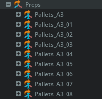
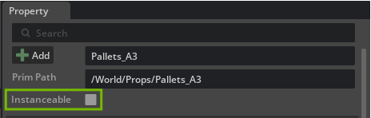
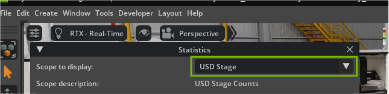
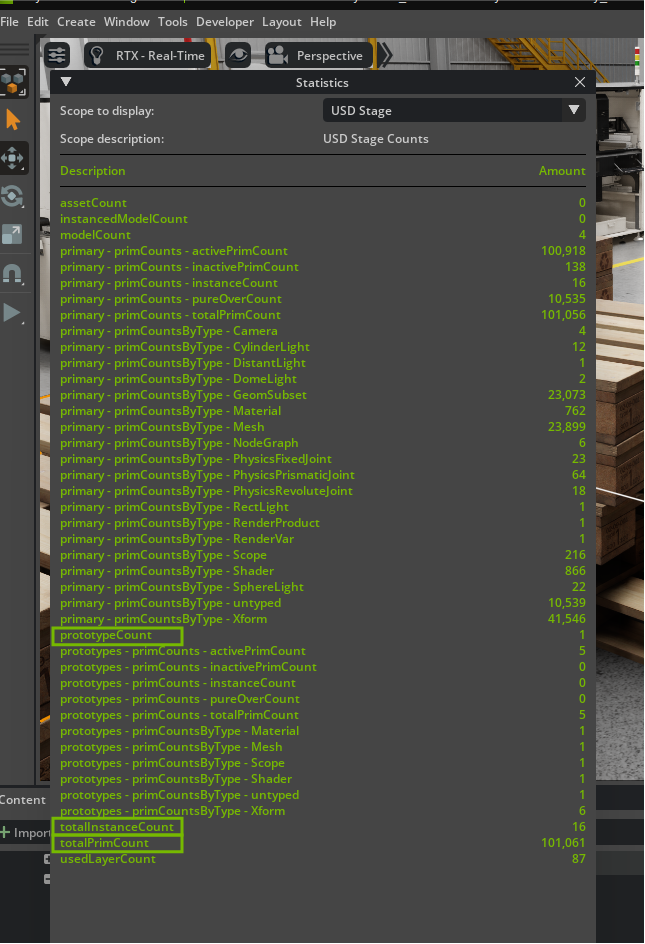

# Instancing and Performance Best Practices[#](#instancing-and-performance-best-practices "Link to this heading")

As you add props and other elements to your factory scene, you’ve likely noticed something: many objects are identical. Safety cones, pallets, mounting brackets, warning signs, these items appear multiple times throughout a real facility.

In the previous section, you may have placed several identical objects by referencing the same USD file repeatedly. While this approach works for small scenes, it creates significant challenges as your digital twin grows:

**The Memory Problem** Each reference loads a complete copy of the geometry, materials, and metadata into memory. Ten safety cones mean ten complete copies stored in RAM.

**The Performance Problem** As scene complexity increases, viewport navigation becomes sluggish. Frame rates drop. Simple operations like selecting and moving objects slow down.

**The Scale Problem** Industrial facilities contain hundreds or thousands of repetitive elements. A manufacturing plant might have 200+ safety devices, 500+ mounting points, and 1000+ fasteners. Traditional referencing approaches break down entirely at this scale.

This is exactly the problem USD instancing solves.

## What Are Instances in USD?[#](#what-are-instances-in-usd "Link to this heading")

**Instances** are USD’s solution to the repetitive object problem. Instead of creating multiple complete copies, instancing creates one **prototype** (the definition) and multiple **instances** (lightweight references to that prototype).

Think of instancing like a blueprint system:

- The **prototype** is the architectural blueprint—one detailed plan
- Each **instance** is a building constructed from that blueprint—sharing the same design but existing in different locations

### How Instances Work Differently[#](#how-instances-work-differently "Link to this heading")

| Traditional References | USD Instances |
| --- | --- |
| Each reference loads complete geometry | One prototype shared by all instances |
| Materials duplicated for each object | Materials defined once on the prototype |
| Full metadata copied to each reference | Core metadata shared, instance-specific data separate |
| Memory usage scales linearly | Memory usage stays nearly constant |

### Visual Identification in Omniverse[#](#visual-identification-in-omniverse "Link to this heading")

USD instances display distinct visual cues in the **Stage** panel:



**Instance icon** Small overlapping I symbol next to the primitive name

### Why Instances Are Critical for Digital Twins[#](#why-instances-are-critical-for-digital-twins "Link to this heading")

Understanding why instancing matters helps you build scalable, performant digital twins that can grow with your facility’s needs.

## Performance at Interactive Speeds[#](#performance-at-interactive-speeds "Link to this heading")

USD instances enable real-time interaction with complex scenes because:

**Faster Scene Traversal** The USD system processes one prototype instead of hundreds of individual objects

**Improved Rendering** Rendering multiple instances of the same geometry is a much lighter load on the GPU

**Reduced Processing Overhead** Less data to manage means faster viewport updates and smoother navigation

### When to Use Instances[#](#when-to-use-instances "Link to this heading")

Not every object benefits from instancing. Understanding when to apply this technique ensures optimal results.

#### Ideal Candidates for Instancing[#](#ideal-candidates-for-instancing "Link to this heading")

| Asset Type | Examples | Why They Work Well |
| --- | --- | --- |
| **Safety Equipment** | Cones, barriers, signs, emergency equipment | Standardized designs, multiple locations, regulatory compliance |
| **Infrastructure Components** | Mounting brackets, cable supports, pipe fittings | Standardized parts, repeated throughout facility, identical specifications |
| **Environmental Elements** | Lighting fixtures, flooring tiles, structural beams | Consistent appearance requirements, multiple installations |
| **Transport and Storage** | Pallets, containers, conveyor components | Standardized dimensions, frequent repetition, material handling needs |

#### When NOT to Use Instancing[#](#when-not-to-use-instancing "Link to this heading")

| Avoid For | Reason | Alternative Approach |
| --- | --- | --- |
| **Unique machinery** | Each machine serves different functions, has different configurations | Use references with individual customization |
| **Highly customized objects** | Objects requiring significant individual modifications | Create variants or separate asset versions |
| **Single or few objects** | No performance benefit with less than 3 identical items | Standard referencing is sufficient |
| **Frequently changing objects** | Objects that need regular individual updates | Standard references allow easier individual editing |

### Decision Framework[#](#decision-framework "Link to this heading")

Use this simple framework to determine if instancing is appropriate:

1. **Count** Do you have 3 or more identical objects?
2. **Complexity** Is the object geometrically complex enough to benefit from shared memory?
3. **Stability** Will the objects remain largely unchanged once placed?
4. **Scale** Do you expect to add more identical objects in the future?

If you answered “yes” to these questions, instancing is likely beneficial.

## Getting Started: Preparing for Instancing[#](#getting-started-preparing-for-instancing "Link to this heading")

Before creating instances, prepare your scene and identify appropriate candidates from the props you’ve already placed.

### Identifying Instance Candidates[#](#identifying-instance-candidates "Link to this heading")

Look through your current factory scene for:

- **Multiple identical props** placed in different locations
- **Objects you’ll likely need more of** as the scene develops
- **Standardized components** that appear throughout industrial facilities

## Step-by-Step Process: Creating Your First Instance[#](#step-by-step-process-creating-your-first-instance "Link to this heading")

We’ll walk through converting existing props to instances, then creating additional instances from the prototype.

### Converting Existing References to Instances[#](#converting-existing-references-to-instances "Link to this heading")

**Starting with props you placed in previous sections:**

#### Creating Instanced from the Properties Panel[#](#creating-instanced-from-the-properties-panel "Link to this heading")

1. **Select an object** you want to instance
2. Open the **Property** panel



3. Toggle **“Instanceable”**

### Monitoring Your Instancing Success[#](#monitoring-your-instancing-success "Link to this heading")

Omniverse provides tools to verify that instancing is working correctly and delivering performance benefits.

### Enabling USD Stage Statistics[#](#enabling-usd-stage-statistics "Link to this heading")

To monitor instancing effectiveness, enable the USD Stage Stats extension:

4. Navigate to **Developer > Extensions**
5. Search for **“USD Stage Stats”**
6. **Enable** the extension
7. Close the Extensions window

#### Opening the Statistics Window[#](#opening-the-statistics-window "Link to this heading")

1. Open **Window > Utilities “Statistics”** to open the statistics panel
2. In the Statistics window, set **“Scope to Display” to “USD Stage”**



#### Understanding the Statistics[#](#understanding-the-statistics "Link to this heading")

The USD Stage statistics display critical instancing metrics:



| Metric | What It Means | Why It Matters |
| --- | --- | --- |
| **PrototypeCount** | Number of unique prototypes in your scene | Shows how many different objects you’re instancing |
| **TotalInstanceCount** | Total number of instances across all prototypes | Indicates the scale of your instancing implementation |
| **TotalPrimCount** | Overall primitive count in the scene | Helps understand scene complexity and optimization opportunities |

#### Interpreting Your Results[#](#interpreting-your-results "Link to this heading")

**Good instancing implementation shows:**

- **High instance-to-prototype ratio** Many instances per prototype indicates effective reuse
- **Controlled primitive growth** Total primitive count grows slower than object count
- **Memory efficiency** Memory usage remains stable as you add instances

**Example interpretation:**

*This is different than the screenshot above.*

```
PrototypeCount: 5
TotalInstanceCount: 25
TotalPrimCount: 150
```

This shows 5 prototypes supporting 25 instances—an average of 5 instances per prototype, indicating good instancing efficiency.

## The Bigger Picture: Why This Matters[#](#the-bigger-picture-why-this-matters "Link to this heading")

While our current factory scene may not show dramatic performance improvements yet, instancing becomes absolutely critical as your digital twin scales. Here’s why establishing these practices now sets you up for success:

### Small Scenes vs. Large Facilities[#](#small-scenes-vs-large-facilities "Link to this heading")

**Current Scene Impact** With 10-20 props, instancing provides *modest* benefits but establishes good workflow habits.

**Industrial Scale Impact** Real manufacturing facilities contain thousands of repetitive elements.

### Future Capabilities Enabled[#](#future-capabilities-enabled "Link to this heading")

Proper instancing practices today enable advanced capabilities tomorrow:

- **Simulation Integration** Physics simulations with thousands of objects become possible
- **IoT Data Integration** Sensor data from hundreds of devices can be efficiently processed
- **Collaborative Workflows** Multiple team members can work simultaneously without performance degradation
- **Real-time Updates** Facility changes can be visualized instantly rather than waiting for scene rebuilds

The habits you build with these initial props, identifying repetitive elements, converting them to instances, and monitoring performance, become the foundation for managing digital twins at industrial scale. Every safety cone you instance now is practice for the thousands of components you’ll manage in production environments.

Remember: the goal isn’t just to complete this exercise, but to develop the instancing mindset that makes complex digital twins possible. Your facility’s future digital transformation depends on these fundamental optimization practices.

On this page
