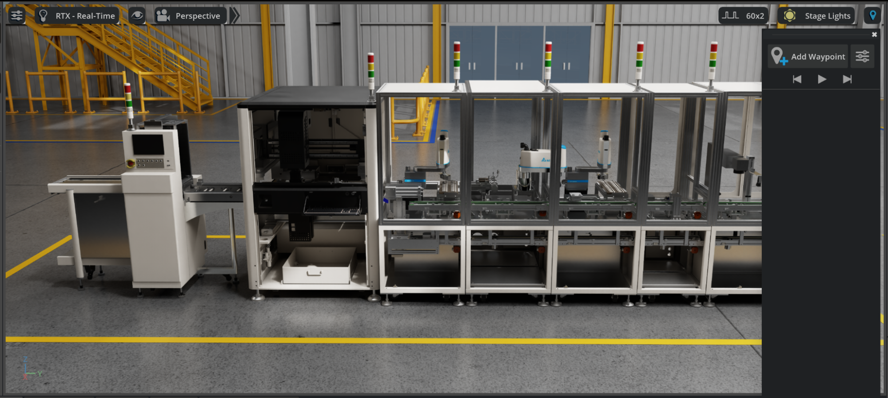
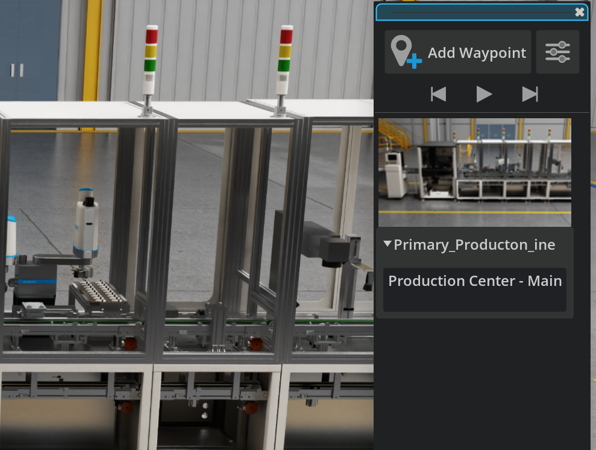
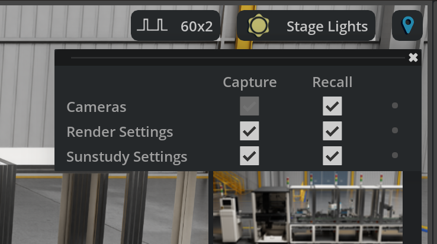
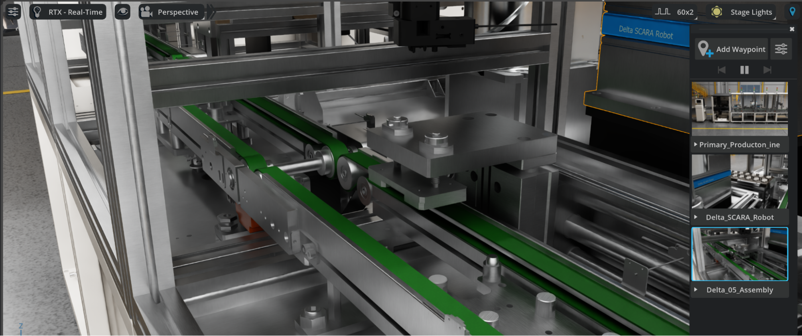

# Setting Up Navigation Waypoints[#](#setting-up-navigation-waypoints "Link to this heading")

Waypoints serve as essential navigation markers that enable smooth transitions between key areas of your digital twin factory. The **Waypoint Extension** allows you to create location markers that represent specific camera views and save them directly in your USD Stage for easy navigation and collaboration.

Note

The Waypoint Extension supports Live Collaboration, allowing multiple team members to create and view waypoints simultaneously.

## Accessing the Waypoint Filmstrip[#](#accessing-the-waypoint-filmstrip "Link to this heading")

The Waypoint Filmstrip is where waypoints can be created, viewed, and managed.

1. Look for the **Waypoint button** in the top right of the viewport

Note

If it is not there, you will need to install the Waypoint Core API and the Waypoint in Viewport Menu Bar extension.

## Creating Strategic Factory Waypoints[#](#creating-strategic-factory-waypoints "Link to this heading")

Let’s create waypoints for the key areas of our digital twin factory:

**Main Production Areas**

2. Position your camera to view the center of your **primary production line**
3. Click the Waypoint button in the viewport to open the **Waypoint Filmstrip**
4. Click **Add Waypoint** at the top of the panel

5. Add a **descriptive note** by clicking the Notes area: “Production Center - Main assembly line overview”

Tip

For enhanced realism and operational planning, you can also create dedicated camera prims positioned at strategic locations to mimic actual inspection cameras used in your factory. Set the camera properties (such as focal length and field of view) to match your real-world security or monitoring cameras.

## Enhance Waypoints With Scene Information[#](#enhance-waypoints-with-scene-information "Link to this heading")

1. Click the **Waypoint Settings** button at the top right of the Waypoint Filmstrip panel

2. **Configure Capture settings** - Check boxes for data you want stored with each waypoint:

   - Cameras
   - Render settings
   - Sun Study Setting
3. **Configure Recall settings -** Check boxes for data you want restored when navigating to waypoints

### Using Waypoint Playlist Controls[#](#using-waypoint-playlist-controls "Link to this heading")

The Waypoint Filmstrip includes playlist controls that allow you to:

- Play through waypoints at 5-second intervals for automated tours
- Advance between waypoints manually for precise navigation
- Click individual waypoints to jump directly to specific views

#### Testing Navigation Flow[#](#testing-navigation-flow "Link to this heading")

Verify your waypoint system provides logical factory navigation:

1. Use the playlist controls to move through waypoints in order
2. Ensure each waypoint provides clear, useful perspectives
3. Confirm that movement between waypoints feels natural and intuitive
4. Refine waypoint descriptions based on actual usage

---

#### Best Practices for Factory Waypoints[#](#best-practices-for-factory-waypoints "Link to this heading")

- Use descriptive names: “Production\_Line\_Overview” instead of “Waypoint\_01”
- Include purpose in notes: Explain why someone would navigate to this location
- Create logical sequences: Order waypoints to follow natural factory flow patterns
- Test with team members: Verify that waypoints serve their intended navigation purpose
- Update regularly: Modify waypoints as your factory layout evolves

Tip

Waypoints are automatically saved in your USD Stage and support Live Collaboration, making them perfect for team reviews and guided factory tours.

## Integration with Digital Twin Workflows[#](#integration-with-digital-twin-workflows "Link to this heading")

Your waypoint system now provides:

- Consistent navigation for team members reviewing the digital twin
- Guided tours for stakeholders and new team members
- Reference points for maintenance planning and safety protocols
- Documentation support for factory layout decisions and change management

### Why Waypoints are Important[#](#why-waypoints-are-important "Link to this heading")

Well-positioned cameras provide consistent viewpoints for presentations, ensuring that all stakeholders see the same critical perspectives during reviews and planning sessions.

Fixed camera positions create standardized views that can be referenced in documentation, training materials, and progress reports throughout the facility’s lifecycle.

Operational Planning Support

Strategic waypoints enable clear demonstration of material flow, worker movement patterns, and process sequences that are crucial for operational efficiency analysis.

Cameras positioned at maintenance access points help facilities teams plan service activities and identify potential access issues before they become problems.

Future Integration Capabilities

Waypoint metadata provides the foundation for integrating with automated material handling systems, robot navigation, and facility management software.

The navigation system supports virtual facility tours for training, safety briefings, and remote facility management - increasingly important capabilities in modern manufacturing.

Quality Assurance and Validation

Fixed camera positions ensure that quality inspections, progress reviews, and facility audits are conducted from consistent viewpoints, improving the reliability of assessments.

When facilities undergo modifications, the navigation system provides baseline viewpoints for comparing before and after conditions, supporting effective change management processes.

On this page
