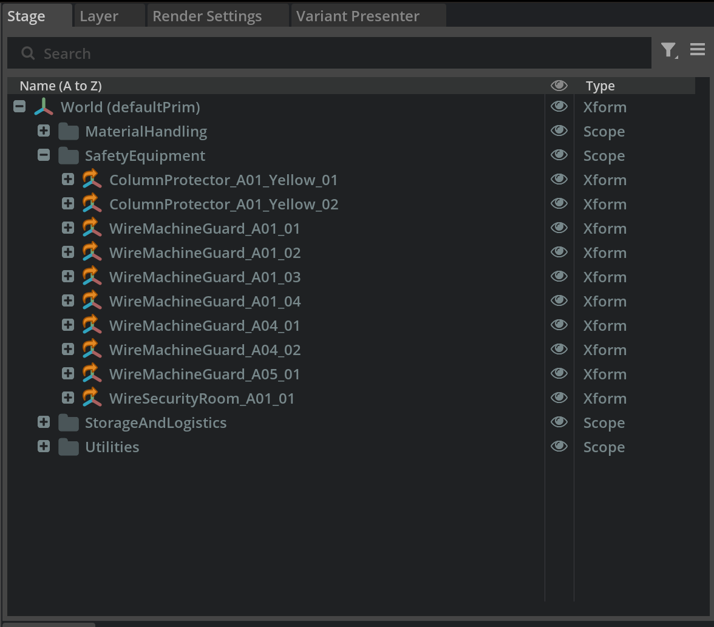

# Critical Considerations for Workflows[#](#critical-considerations-for-workflows "Link to this heading")

**Asset Location Strategy**

- While NVIDIA Asset Browser content is convenient, avoid direct dependencies on cloud-hosted assets for production scenes
- Create a dedicated Props and Equipment subfolder within your Assets directory
- This ensures all team members have consistent access regardless of network connectivity

**Modularity and Portability**

- Reference, don’t copy – Always use references to maintain single source of truth
- Keep asset hierarchies shallow and logical for easier management
- Use relative file paths to maintain portability when sharing projects
- Document any external dependencies in your project README

## **Organizing Asset Groups with Scopes**[#](#organizing-asset-groups-with-scopes "Link to this heading")

**Create Logical Groupings - Examples**

1. In the Stage panel, right-click on **World** and create Scope prims:

   - **StorageAndLogistics** – for pallets, containers, racks
   - **SafetyEquipment** – for barriers, signage, emergency equipment
   - **MaterialHandling** – for conveyors, forklifts, automated systems
   - **Utilities** – for lighting, power distribution, ventilation

Assign Assets to Appropriate Scopes

2. Drag and drop referenced assets under their logical scope parents

   - This creates a clear hierarchy that’s easy to navigate and manage

---

## **Team Collaboration Workflow Example**[#](#team-collaboration-workflow-example "Link to this heading")

**Layer Management for Teams**

- **Assign layer ownership** – different team members can work on different sublayers
- **Communicate changes** – use version control or shared documentation for major modifications

On this page
