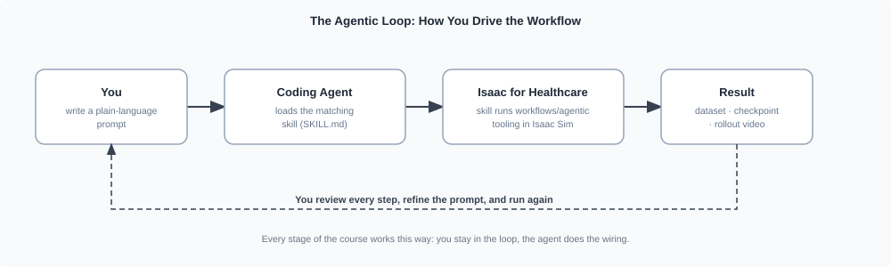

# Course Overview[#](#course-overview "Link to this heading")

Welcome to Agentic Workflows in Isaac for Healthcare. In this training lab you’ll go from an empty checkout of the open-source [i4h-workflows](https://github.com/isaac-for-healthcare/i4h-workflows) repository to a fine-tuned robot policy you record, train, and validate entirely in simulation. What makes this *agentic* is the loop below: you describe what you want in plain language, and the agent does the wiring while you stay in control.

Prefer a guided terminal experience? Start your coding agent with the
[Physical AI Tutor skill](https://developer.nvidia.com/downloads/Omniverse/learning/Courses/isaac-gr00t-e2e/Physical-AI-Tutor-skill.md)
and ask it to tutor you through this course. It keeps the walkthrough in the CLI, adapts
to your experience level, and pauses before each action-heavy step.

[](../_images/agentic-loop.svg)

Every stage of the course runs this loop, with **whichever coding agent you prefer**: a plain-language prompt loads a matching **skill** (a `SKILL.md` playbook in the repo), which drives the real `workflows/agentic/` tooling and hands back a result for you to review.[#](#id1 "Link to this image")

The stages chain into one **record-to-validate** pipeline:

[](../_images/i4h-workflow-e2e-system-diagram.svg)

The end-to-end pipeline has four phases: **prepare** the run, **build the dataset** (record → expand → annotate), **inspect & convert** to LeRobot, then **train & verify** the policy. Human review stays in the loop.[#](#id2 "Link to this image")

## Run It With a Prompt[#](#run-it-with-a-prompt "Link to this heading")

The pipeline carries a task from raw demonstrations to a validated policy: it records demonstrations, prepares them into a training-ready dataset, fine-tunes a policy on that data, and rolls the policy out in simulation to check it. A single prompt runs that entire pipeline end-to-end as a smoke test:

```
Run end-to-end smoke pipeline for scissor pick and place.
```

A single prompt hides useful detail. In this course, run the pipeline **one stage at a time**
and review each result before continuing. The stages form three phases:

| Phase | Pipeline stages | What happens |
| --- | --- | --- |
| **Collect data** | record → mimic → annotate → replay → convert → visualize | Generate demonstrations by teleoperation, a state machine, or a pretrained policy, then prepare a LeRobot dataset. |
| **Train a VLA model** | fine-tune | Fine-tune a GR00T or openpi **vision-language-action** policy on that dataset. |
| **Deploy it** | validate | Roll the policy out in simulation and record episodes for human review. |

Not sure where to begin? Ask the routing skill, which points you to the right per-stage skill without running anything itself:

```
What does the i4h workflow include, and where should I start?
```

## What Happens Under the Hood?[#](#what-happens-under-the-hood "Link to this heading")

The Isaac for Healthcare (i4h) workflow combines **IsaacLab-Arena** simulation with **GR00T**
and **openpi** control policies. Its healthcare workflows add clinical sensors, anatomy, and
robot embodiments that a general Isaac Lab task does not provide. Robotic ultrasound uses
GPU ray tracing to model tissue interactions and generate B-mode images. Catheter navigation
pairs patient vasculature digital twins and catheter physics with simulated X-ray fluoroscopy.
Surgical tasks use dVRK PSM, dual-PSM, and STAR embodiments for precise reaching and instrument
handling. The agentic workflow connects these simulation assets to data collection, training,
and validation stages.

### Supported Environments, Robots, and Models[#](#supported-environments-robots-and-models "Link to this heading")

Each environment pairs a robot with a Hugging Face policy model, configured by a single YAML file under `workflows/agentic/config/environments/`.

| Env id | Robot | HF model |
| --- | --- | --- |
| `scissor_pick_and_place` | SO-ARM 101 (SO-101) | `nvidia/SO_ARM_Starter_Gr00t` (shipped N1.5 default; optional N1.7 upgrade: `nvidia/SO_ARM_Starter_Gr00tN17`) |
| `locomanip_tray_pick_and_place` | Unitree G1 | `nvidia/GR00T-N1.6-Rheo-PickNPlaceTray` |
| `locomanip_push_cart` | Unitree G1 | `nvidia/GR00T-N1.6-Rheo-Sim-PushCart` |
| `assemble_trocar` | Unitree G1 | `nvidia/GR00T-N1.5-RL-Rheo-AssembleTrocar` |
| `ultrasound_liver_scan` | Franka-style arm | `nvidia/Liver_Scan_Pi0_Cosmos_Rel` |
| `surgical_reach_psm` | dVRK PSM | `nvidia/GR00T-N1.5-3B` or scripted state machine |
| `surgical_reach_dual_psm` | dVRK dual PSM | `nvidia/GR00T-N1.5-3B` or scripted state machine |
| `surgical_reach_star` | STAR | `nvidia/GR00T-N1.5-3B` or scripted state machine |
| `surgical_lift_block` | dVRK PSM | `nvidia/GR00T-N1.5-3B` or scripted state machine |
| `surgical_lift_needle` | dVRK PSM | `nvidia/GR00T-N1.5-3B` or scripted state machine |
| `surgical_lift_needle_organs` | dVRK PSM | `nvidia/GR00T-N1.5-3B` or scripted state machine |

The first five ship with policy-evaluation prompts you can run right away. Select an environment
to see its prompt and example rollout:

Scissors

**Environment:** `scissor_pick_and_place`

```
Evaluate scissor pick and place for 2 episodes using the shipped GR00T N1.5 policy.
```

[

](videos/scissor_pick_and_place.mp4)

Tray

**Environment:** `locomanip_tray_pick_and_place`

```
Evaluate locomanip tray pick and place for 1 episode.
```

[

](videos/tray_pick_and_place.mp4)

Cart

**Environment:** `locomanip_push_cart`

```
Evaluate locomanip push cart for 1 episode.
```

[

](videos/push_cart.mp4)

Trocar

**Environment:** `assemble_trocar`

```
Evaluate trocar assembly for 1 episode.
```

[

](videos/trocar_assembly.mp4)

Ultrasound

**Environment:** `ultrasound_liver_scan`

```
Evaluate ultrasound for 1 episode.
```

[

](videos/robotic_ultrasound.mp4)

The surgical environments also support quick scripted smoke runs through the validation skill:

```
Run surgical\_reach\_psm with the state machine for 1 episode.
Run surgical\_lift\_needle with the state machine for 1 episode.
```

*Optional deep dive:*

```
Open an env YAML in workflows/agentic/config/environments/ and walk me through every field: how it binds a robot, cameras, policy stack, and model, and which tool reads each one.
```

### How the Code Is Organized[#](#how-the-code-is-organized "Link to this heading")

Under `workflows/agentic/`, each stage has a focused subproject: `arena/` for simulation and
recording, `policy/` for inference and training, `dataset/` for LeRobot conversion and
visualization, plus the `mimic/`, `annotator/`, `cosmos/`, and `common/` helpers. Skills drive
these subprojects using defaults from the env YAML.

The repository also includes `workflows/catheter_navigation/` for fluoroscopy rendering,
vasculature digital twins, and XPBD catheter simulation. Its seven skills are listed in
[The Skill Library](08-the-skill-library.html#catheter-navigation-skills).

*Optional deep dive:*

```
Give me a guided tour of the workflows/agentic/ subprojects (arena, policy, dataset, mimic, annotator, cosmos) and trace how a single prompt flows through them.
```

## What’s Next?[#](#what-s-next "Link to this heading")

Now that you know what the workflow is and how the pieces fit, get your machine ready. Continue to [Setup and Environments](02-setup-and-environments.html) to check host requirements and run setup.

On this page
