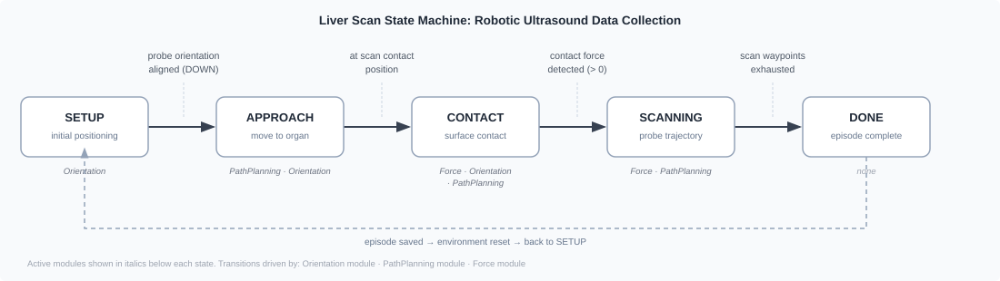

# Data Collection[#](#data-collection "Link to this heading")

Imitation learning starts with demonstrations. Isaac for Healthcare provides three sources:
**teleoperation**, a scripted **state machine**, or a **pretrained policy**. Each records robot
actions, joint states, and camera streams to an HDF5 dataset for replay and training.

## Learning Objectives[#](#learning-objectives "Link to this heading")

By the end of this lesson, you’ll be able to:

- **Compare** teleoperation, state-machine, and pretrained-policy collection.
- **Bootstrap** demonstrations by recording a pretrained policy’s rollouts under scene randomization.
- **Generate** scripted demonstrations with a state machine, and **record** teleoperated ones with Arena.
- **Replay** recorded episodes inside Isaac Sim for visual verification.

## Run It With a Prompt[#](#run-it-with-a-prompt "Link to this heading")

Here a **pretrained policy** drives the task and records its rollouts. Arena randomizes the
scene each episode. You will use teleoperation later in [Build Your Own Workflow](07-build-your-own-workflow.html).

[

Your browser does not support embedded video.
](videos/data_collection_scissors.mp4)

Data collection for the `scissor_pick_and_place` task. The pretrained policy
drives the SO-ARM through several reach, grasp, and place episodes. Arena randomizes each
scene and records every rollout to HDF5.

Record Demonstrations

```
Collect 2 scissor pick-and-place demonstrations with the shipped pretrained policy.
Randomize the scene each episode and report where the HDF5 dataset was saved.
```

Replay

```
Replay second episode.
```

## What Happens Under the Hood?[#](#what-happens-under-the-hood "Link to this heading")

All three collection strategies produce an HDF5 dataset of actions, joint states, and camera
frames. They differ in **who controls the robot**.

**Teleoperation: A Human Drives**

You move an input device (keyboard, SO-ARM leader arm, SpaceMouse, gamepad, or VR hand-tracking) and the simulated robot mirrors you.

Best for dexterous, contact-rich, or hard-to-script tasks where human intuition matters. Quality tracks operator skill, and collecting many episodes is hands-on work.

**State Machine: A Script Drives**

A hand-crafted controller steps the robot through fixed phases, calling control modules (force, orientation, path planning) to do the task on its own.

Best for scriptable, repeatable tasks: it runs unattended, scales to many episodes, and is deterministic. The cost is the engineering to write the state machine up front.

**Pretrained Policy: A Model Drives**

A policy already trained on this or a similar task runs in inference and performs it on its own, while scene randomization varies each episode.

Best for bootstrapping data fast with no human and no scripting. The catch: episodes are only as good as the source model on the new scene, so review them before trusting them.

### Strategy 1: Teleoperation[#](#strategy-1-teleoperation "Link to this heading")

A human drives the robot through Arena while it records. The `keyboard` device needs no extra hardware; the `so101_leader` arm produces smoother trajectories. Whatever the device, the same reserved keys control the episode: **`B`** starts it (the robot idles until you press it), **`N`** saves a successful episode and advances, and **`R`** discards and retries. The keys that *move* the robot vary by device and are printed to the log at startup.

The `so101_leader` option uses a **physical SO-101 leader arm** to control the simulated
follower. Assemble, configure, and calibrate it before starting Arena. Follow the
[LeRobot SO-101 setup guide](https://github.com/huggingface/lerobot/blob/main/docs/source/so101.mdx)
or the NVIDIA [SO-101 sim-to-real learning path](https://docs.nvidia.com/learning/physical-ai/sim-to-real-so-101/latest/01-overview.html).

#### Driving the Humanoid With `keyboard_23d`[#](#driving-the-humanoid-with-keyboard-23d "Link to this heading")

The two locomanip envs drive a Unitree G1 through the `keyboard_23d` device. It’s **mode-based**: press a number to choose what you control, then drive with the movement keys.

`keyboard_23d` Mode and Key Reference

| Mode | Select | Movement keys |
| --- | --- | --- |
| Both hands (synchronized) | `0` | `W`/`S` forward·back · `A`/`D` apart·together · `Q`/`E` up·down · `Z`/`X` symmetric roll · `T`/`G` pitch · `K`/`J` close·open both grippers |
| Right hand | `1` | `W`/`S` forward·back · `A`/`D` left·right · `Q`/`E` up·down · `Z`/`X` roll · `T`/`G` pitch · `C`/`V` yaw · `K`/`J` close·open gripper |
| Left hand | `2` | same keys as right hand |
| Base navigation (walk) | `3` | `W`/`S` forward·back · `A`/`D` strafe · `Q`/`E` rotate · `X` stop |
| Torso orientation | `4` | `Z`/`X` roll · `T`/`G` pitch · `C`/`V` yaw |
| Base height | `5` | `W`/`S` raise·lower |

Anytime: `R` reset · `L` lock the current mode · `Space` pause/resume.

You will teleoperate in [Build Your Own Workflow](07-build-your-own-workflow.html). A new task
has no pretrained policy, so a human records its first demonstrations.

*Optional deep dive:*

```
Show me how Arena's teleop loop maps a --teleop-device's keys to robot actions and records successful episodes to HDF5.
```

### Strategy 2: State Machine[#](#strategy-2-state-machine "Link to this heading")

A **state machine** generates demonstrations for tasks that can be expressed as fixed steps.
The robotic ultrasound **liver scan** is the scripted counterpart to the
`ultrasound_liver_scan` environment.

[](../_images/liver-scan-state-machine.svg)

The five-state liver scan machine. Each transition is driven by a different control module: the **Orientation module** aligns the probe and triggers APPROACH; the **PathPlanning module** moves to the contact point and later executes the scan trajectory; the **Force module** detects surface contact and governs pressure during SCANNING. A dashed arc returns to SETUP after each episode.[#](#id1 "Link to this image")

Three modules run concurrently: force for contact pressure, orientation for probe angle, and
path planning for the scan trajectory. Their outputs combine into one action. The same pattern
drives needle lift, peg lift, and dVRK reach subtasks.

**Script or teleoperate?** Script when the motion is well-defined and you need many consistent episodes; teleoperate when the task needs human judgment or fine contact adjustments that are hard to encode.

*Optional deep dive:*

```
Walk me through the liver scan state machine: how each state transition is decided, and how the force, orientation, and path-planning modules combine into one action.
```

### Strategy 3: Pretrained Policy[#](#strategy-3-pretrained-policy "Link to this heading")

The prompt above uses a **pretrained vision-language-action policy** from the env YAML’s
`policy.model_repo`. If that model can perform the task, its rollouts provide demonstrations
without human control or a state machine.

**This requires a capable model.** For a new task without one, collect the first demonstrations
by teleoperation, then train a model that can take over.

[](../_images/vla-inference-data-flow.svg)

Each inference step: Arena sends **RGB camera frames** and **robot state** (joint positions) to the policy server over Zenoh topics. The VLA policy fuses vision, state, and the pre-loaded **language instruction** to produce a 16-step action chunk, which Arena executes and records to HDF5. Scene randomization varies the start pose on every episode reset, giving the dataset diversity without extra human effort.[#](#id2 "Link to this image")

This reuses the rollout path from [Deployment in Simulation](06-deployment-in-simulation.html).
The policy daemon serves inference while Arena steps and records each episode.

**Scene randomization comes for free.** Each env randomizes object poses on every reset, so the same policy across many episodes yields *varied* demonstrations rather than identical copies. Because episodes are only as good as the source model on the scene, this strategy pairs naturally with the VLM annotator in [Data Preparation](04-data-preparation.html), which filters out the failures.

*Optional deep dive:*

```
Explain how a pretrained policy rollout gets recorded as a dataset, and show me where the env's task code configures scene randomization on reset.
```

### Replay To Verify[#](#replay-to-verify "Link to this heading")

Replay an episode in the environment that recorded it. Check the intended reach, grasp, and
place motion for jumps or drift, then discard failed episodes. Replay is **visual verification
only**.

*Optional deep dive:*

```
Walk me through Arena's --replay code path: how it reconstructs and steps an episode from an HDF5 file.
```

## What’s Next?[#](#what-s-next "Link to this heading")

You now have a small, verified HDF5 dataset of demonstrations. Next you’ll turn those raw recordings into a training-ready form in [Data Preparation](04-data-preparation.html).

On this page
