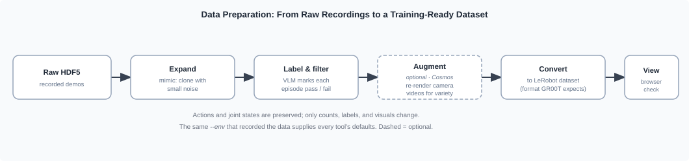

# Data Preparation[#](#data-preparation "Link to this heading")

Raw recordings may be sparse, contain failed episodes, or lack visual variety. Here you clean,
label, convert, and inspect them as a LeRobot dataset.

## Learning Objectives[#](#learning-objectives "Link to this heading")

By the end of this lesson, you’ll be able to:

- **Explain** the four stages that turn raw recordings into a training-ready dataset.
- **Run** the preparation pipeline from a prompt and **review** the result in the visualizer.

## Run It With a Prompt[#](#run-it-with-a-prompt "Link to this heading")

[

Your browser does not support embedded video.
](videos/data_conversion_scissors_and_review.mp4)

Preparing the `scissor_pick_and_place` dataset: the recorded episodes are converted
to a LeRobot dataset, then opened in the LeRobot visualizer. Camera videos appear on the
left and synchronized joint-state and action timelines on the right, so you can confirm the
demonstrations look right before training.

Expand and Visualize the Dataset

```
Mimic 3 more episodes and visualize my dataset.
```

Annotate Episodes for Success

```
Run Annotation on all recorded episodes and summarize.
```

## What Happens Under the Hood?[#](#what-happens-under-the-hood "Link to this heading")

Preparation is a short pipeline. The shipped skills cover mimic, annotate, replay, convert, and visualize; the middle stages are optional and repeatable, and conversion is the hand-off to training.

[](../_images/data-prep-pipeline.svg)

The preparation pipeline preserves the robot’s **actions and joint states**. Expansion adds
lightly jittered copies, labeling tags episodes, and augmentation re-renders camera videos.
Each tool reads defaults from the recorded environment.[#](#id1 "Link to this image")

- **Expand: mimic.** Clone trajectories with small action and state noise to increase episode count.
- **Label and filter: VLM annotator.** Judge task success so failed episodes can be removed before training.
- **Augment, optional: Cosmos Transfer.** Re-render camera streams with varied lighting and backgrounds while preserving trajectories.
- **Convert: LeRobot.** Package the recording for GR00T or openpi and detect dimensions and camera keys.
- **Visualize.** Review camera videos and joint timelines before using GPU time for training.

*Optional deep dive:*

```
Walk me through the data-prep tools (mimic, the VLM annotator, the LeRobot converter) and how each transforms an HDF5 recording while leaving actions and joint states intact.
```

## What’s Next?[#](#what-s-next "Link to this heading")

You now have a labeled, converted, and inspected LeRobot dataset. In [Imitation Learning with GR00T](05-imitation-learning-gr00t.html) you’ll fine-tune a policy on it.

On this page
