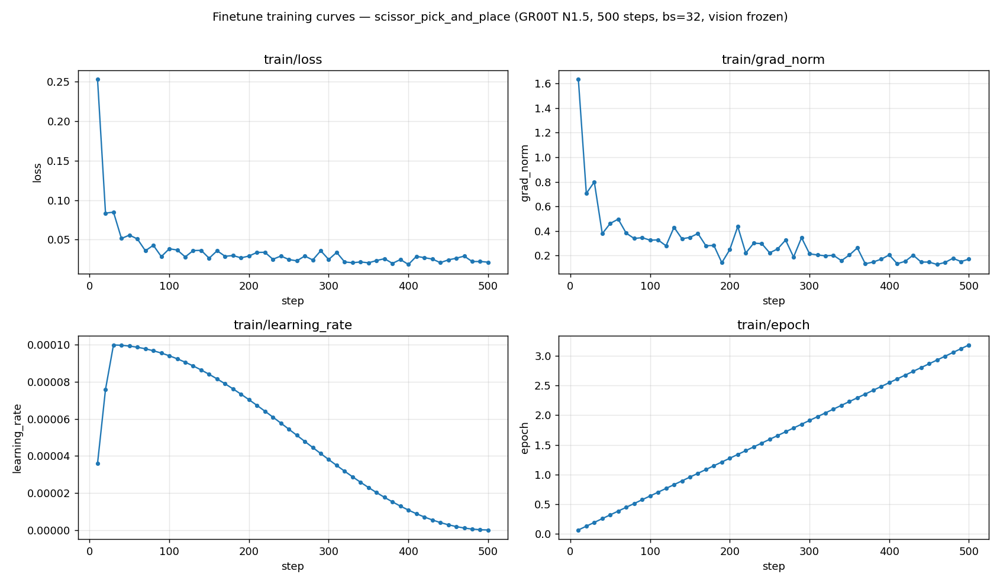

# Imitation Learning With GR00T[#](#imitation-learning-with-gr00t "Link to this heading")

Fine-tune NVIDIA [GR00T](https://developer.nvidia.com/isaac/gr00t) or openpi PI0 on the
demonstrations you collected. The public repository ships `scissor_pick_and_place` on GR00T
N1.5. You can keep that default or upgrade the task to GR00T N1.7.

## Learning Objectives[#](#learning-objectives "Link to this heading")

By the end of this lesson, you’ll be able to:

- **Launch** a fine-tuning run on a dataset you collected, straight from a prompt.
- **Explain** what a policy stack contains and map each environment to the right one.

## Run It With a Prompt[#](#run-it-with-a-prompt "Link to this heading")

You launch training by pasting a prompt to your coding agent. It finds the policy stack your
environment uses, starts that trainer on your collected LeRobot dataset, and writes a checkpoint
you’ll deploy next.

[](../_images/training_curves_clean.png)

Historical training curves from a 500-step `scissor_pick_and_place` fine-tune using GR00T
N1.5, batch size 32, and frozen vision. The same metrics are used to inspect an N1.7 run.
See *Reading the Training Curves* below.[#](#id1 "Link to this image")

N1.5: Train (Shipped Default)

```
Fine-tune scissor\_pick\_and\_place on the LeRobot dataset I just prepared for a 200-step
smoke run. Report the checkpoint path.
```

N1.7: Train (Optional Upgrade)

```
Update scissor\_pick\_and\_place to policy.stack gr00t\_n17 and policy.model\_repo
nvidia/SO\_ARM\_Starter\_Gr00tN17. Show me the YAML changes and verify the N1.7 policy and
training routes. Fine-tune GR00T N1.7 on the scissor LeRobot dataset I just prepared for
200 steps with batch size 32 and vision tuning off. Use nvidia/GR00T-N1.7-3B as the base
model and report the checkpoint path.
```

A 200-step run is a smoke test, not a strong policy. The deployment lesson can use a checkpoint
from a longer training run. GR00T N1.7 support is already implemented in the repository, but
the shipped scissor YAML and finetune skill select N1.5. The N1.7 option overrides that routing
before training.

## What Happens Under the Hood?[#](#what-happens-under-the-hood "Link to this heading")

Each env YAML selects one policy stack under `workflows/agentic/policy/`. A stack is a separate
`uv` project that pins a policy framework and its dependencies, then supplies the task-specific
observation adapters, action format, inference service, and trainer. It is more than a model
name. The stack and checkpoint must use the same model layout.

### Which Model Trains Which Environment[#](#which-model-trains-which-environment "Link to this heading")

An env YAML selects one model and stack at a time. The dataset must match that environment’s
camera, state, and action contract.

| Policy stack | Runtime and data contract | Course use |
| --- | --- | --- |
| GR00T N1.5 (`gr00t_n15`) | Released SO-101, trocar, and surgical policy adapters. | Shipped default for `scissor_pick_and_place`; trocar and surgical smoke paths. |
| GR00T N1.7 (`gr00t_n17`) | Current N1.7 model layout and dependency set; SO-101 room/wrist video, six joint values, and 16-step absolute action chunks. | Optional upgrade for `scissor_pick_and_place`; requires a YAML and training-route override. |
| GR00T N1.6 (`gr00t_n16`) | G1 loco-manipulation adapters; 43-DoF state/actions, head or dual cameras, and navigation/base commands. | `locomanip_tray_pick_and_place`, `locomanip_push_cart`. |
| openpi PI0 (`openpi_pi0`) | Separate JAX/OpenPI runtime; Franka room/wrist video and 50-step relative joint-action chunks. | `ultrasound_liver_scan`. |

The workshop fine-tune path is verified for `scissor_pick_and_place`. `assemble_trocar`
and the surgical environments ship for inference or scripted smoke validation and do not
declare a training module in their env YAMLs.

Command Line: Launch Shipped N1.5 Training Directly

Point `--dataset-path` at the converted LeRobot dataset:

```
uv --directory workflows/agentic/policy/gr00t\_n15 run i4h-agentic-gr00t-n15-train \
--env scissor\_pick\_and\_place \
--dataset-path "${DATASET\_PATH}" \
--output-dir "$PWD/runs/scissor\_finetune" \
--base-model-path nvidia/SO\_ARM\_Starter\_Gr00t \
--max-steps 200 \
--batch-size 32 \
--no-tune-visual \
--num-gpus 1
```

The run writes a `checkpoint-<N>/` directory and a log with `train_loss` lines you can inspect.

*Optional deep dive:*

```
Explain how policy/run.sh routes an env to its training stack via policy.stack, and how each stack registers its train CLI.
```

### Reading the Training Curves[#](#reading-the-training-curves "Link to this heading")

The figure at the top of this page plots the four key scalars TensorBoard logged for the run. A healthy fine-tune on a small dataset looks like this:

- **`train/loss`:** drops from about 0.25 to 0.03 in the first 50 steps, then plateaus near 0.02 to 0.03.
- **`train/grad_norm`:** starts near 1.6 and settles around 0.15 to 0.2 without spikes.
- **`train/learning_rate`:** warms up to about 9e-5, then decays to zero by step 500.
- **`train/epoch`:** rises linearly to about 3.18.

A flat plateau can indicate overfitting on a small dataset. Collect more varied demonstrations
or unfreeze the vision backbone when the policy must generalize.

*Optional deep dive:*

```
Walk me through the GR00T fine-tuning loop, its TensorBoard logs, and how it produces loss, grad\_norm, and the learning-rate schedule.
```

## What’s Next?[#](#what-s-next "Link to this heading")

With a checkpoint in hand, you’ll start the matching policy daemon and watch the policy act inside the simulated environment. Continue to [Deployment in Simulation](06-deployment-in-simulation.html).

On this page
