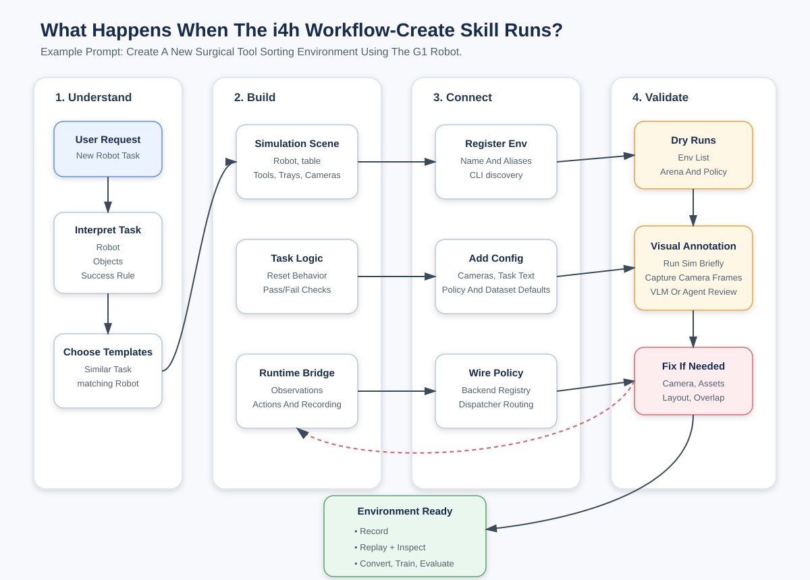

# Build Your Own Workflow[#](#build-your-own-workflow "Link to this heading")

Build new environments by forking the closest existing task and updating its contract. This
preserves compatible assets, actions, policy routing, and dataset fields.

## Learning Objectives[#](#learning-objectives "Link to this heading")

By the end of this lesson, you’ll be able to:

- **Choose** the scene, robot, policy stack, and base model for a new environment.
- **Fork** the required arena and config files into their correct paths.
- **Add** policy routing in the environment YAML (`stack`, `infer_module`, `train_module`).
- **Validate** a new scene with the scene-edit bridge and zero-action runs.

## Run It With a Prompt[#](#run-it-with-a-prompt "Link to this heading")

Natural-language prompts load the matching skill and run each create-and-edit step for review.

[](../_images/i4h-workflow-create-system-diagram.svg)

Creating an environment is a fork-and-validate loop: pick components, copy the nearest env’s files, route the policy in YAML, then probe the live scene through the bridge before baking changes back to source.[#](#id1 "Link to this image")

Work through the prompts in order. After each prompt, compare the result with the expected
outcome and complete the check before continuing.

**1. Create a new environment**

```
Create a new i4h environment for surgical tool sorting using G1 based on scissor\_pick\_and\_place.
```

**Expect:** A new `g1_surgical_tool_sort` environment that combines the scissor task pattern
with the G1 locomanipulation robot, policy stack, runtime, and dataset contract.

**Check:** Confirm the new env appears in the environment list, its YAML uses unique health and
bridge ports, and its generated Python modules import successfully.

**2. Edit the scene in place and bake it**

```
Edit the scene for the new env in live mode.
- Add a new red cube on the table.
- Increase the size of the red cube by 2x.
- Shift G1 to the opposite side of the table and 4 ft away from table.
- Add a room camera based on the current perspective view and include it in the dataset and policy camera config.
- Bake all changes and stop.
```

**Expect:** The live scene opens for review before the tool bakes the robot position, cube,
room camera, and camera mappings into source.

**Check:** Inspect the bridge view, confirm both cameras produce frames, then run a zero-action
smoke test after baking.

**3. Update the policy task description**

```
Change policy task description to "Walk towards surgical table"
```

**Expect:** The agent updates `policy.language_instruction` in the env YAML. The next policy
launch receives the new instruction without changing the task geometry.

**Check:** Read the YAML value back and confirm the policy launcher resolves the same env.

**4. Collect demonstrations on the new scene**

```
Run teleop for 5 episodes.
```

### Collect Data on Your New Scene[#](#collect-data-on-your-new-scene "Link to this heading")

A new environment has no pretrained policy. After the zero-action smoke test, use
teleoperation to collect its first demonstrations. Press `B` to begin an episode, `N` to save
a success, and `R` to retry. G1 uses the mode-based `keyboard_23d` device.

`keyboard_23d` Controls

| Mode | Select | Controls |
| --- | --- | --- |
| Both hands | `0` | `W`/`S` forward/back; `A`/`D` apart/together; `Q`/`E` up/down; `Z`/`X` roll; `T`/`G` pitch; `K`/`J` close/open grippers. |
| Right hand | `1` | `W`/`S` forward/back; `A`/`D` left/right; `Q`/`E` up/down; `Z`/`X` roll; `T`/`G` pitch; `C`/`V` yaw; `K`/`J` close/open gripper. |
| Left hand | `2` | Same movement and gripper keys as right-hand mode. |
| Base navigation | `3` | `W`/`S` forward/back; `A`/`D` strafe; `Q`/`E` rotate; `X` stop. |
| Torso orientation | `4` | `Z`/`X` roll; `T`/`G` pitch; `C`/`V` yaw. |
| Base height | `5` | `W`/`S` raise/lower. |

At any time, `L` locks the selected mode and `Space` pauses or resumes.

**Expect:** Arena starts the new scene with G1’s `keyboard_23d` controls and records five
successful demonstrations to HDF5.

**Check:** Replay one saved episode and verify that the HDF5 contains five demonstrations,
joint actions, joint states, and both camera streams.

**5. Expand and visualize the dataset**

```
Mimic 3 more episodes and visualize my dataset.
```

**Expect:** Mimic adds three perturbed trajectories, then the converter prepares the expanded
dataset and opens the LeRobot visualizer.

**Check:** Confirm the visualizer shows eight episodes and that actions, states, head camera,
and room camera data stay aligned.

**6. Fine-tune and evaluate**

```
Finetune for 200 steps with batch size of 32. Turn off vision tuning.
Run eval using new checkpoint for 300 timesteps.
```

**Expect:** The GR00T N1.6 trainer writes a 200-step checkpoint, then the policy daemon loads it
for a 300-timestep Arena rollout.

**Check:** Confirm the training log reports loss, the checkpoint contains model and processor
files, and the evaluation records a rollout without policy or Arena errors.

[

Your browser does not support embedded video.
](videos/create_your_own_720.mp4?v=2)

Sped-up walkthrough. First-time setup, model downloads, and training take longer than
shown. The recording creates `g1_surgical_tool_sort`, edits and bakes the scene,
collects teleop demos, fine-tunes briefly, and evaluates the checkpoint in simulation.

## What Happens Under the Hood?[#](#what-happens-under-the-hood "Link to this heading")

The skills drive a fork-and-validate loop: choose components, copy the nearest environment, route the policy in YAML, inspect the live scene, then bake only when the layout is right.

### Choose Components[#](#choose-components "Link to this heading")

The environment YAML at `workflows/agentic/config/environments/<env>.yaml` is the source of truth. Pick one option from each row; scene, robot, and policy are related but not automatically interchangeable.

| Choice | Examples |
| --- | --- |
| Assets / scene | `scissor_pick_and_place`, `locomanip_tray_pick_and_place`, healthcare catalog USDs |
| Robot | SO-ARM, Unitree G1, Franka-style arm, dVRK PSM, STAR |
| Policy stack | `gr00t_n15`, `gr00t_n16`, `gr00t_n17`, `openpi_pi0` |
| Foundation / base model | `nvidia/GR00T-N1.7-3B`, `nvidia/SO_ARM_Starter_Gr00tN17`, `nvidia/GR00T-N1.6-3B`, `nvidia/GR00T-N1.6-Rheo-PickNPlaceTray`, custom HF/local path |

A few stack rules constrain the pairing:

- `gr00t_n15`: scissor envs, assemble-trocar inference, and surgical baseline envs.
- `gr00t_n16`: shared G1 locomanip code (`policy.locomanip.*`).
- `gr00t_n17`: SO-101 scissor training and inference, with optional TRT acceleration.
- `openpi_pi0`: ultrasound.
- Env YAMLs with `train_module: null` are inference or smoke-validation only.

*Optional deep dive:*

```
Explain the rules that constrain which robot, scene, and policy stack can be combined, and where those constraints live in the code.
```

### Generated Files[#](#generated-files "Link to this heading")

The `g1_surgical_tool_sort` workflow is generated as five environment contract files. Forking
keeps action spaces, asset patterns, and policy plumbing intact, but each generated file owns
a different surface. Select a file type to see what it owns:

Configuration

**Generated file:** `workflows/agentic/config/environments/g1_surgical_tool_sort.yaml`

This file is the environment source of truth. It defines the G1 robot, head and room cameras,
GR00T N1.6 base model and instruction, service ports, rollout limits, 43-DoF policy configuration,
dataset keys, and dual-camera training mappings.

Scene

**Generated file:** `workflows/agentic/arena/arena/assets/g1_surgical_tool_sort.py`

This file defines the non-robot scene: ground, table, scissors, tweezers, red-cube distractor,
red and blue destination trays, lights, and room camera. G1 and its head camera come from the
embodiment.

Task

**Generated file:** `workflows/agentic/arena/arena/tasks/g1_surgical_tool_sort.py`

This file defines randomized resets, paired tool-to-tray success checks, timeout and success
termination, viewer and spacing configuration, and room-camera policy observation. It exposes
the camera to the policy; recording is handled elsewhere.

Assembly

**Generated file:** `workflows/agentic/arena/arena/environments/g1_surgical_tool_sort_environment.py`

This file resolves the configured embodiment, applies G1’s WBC base height, places the robot
exactly 4 ft from the table center, and combines the scene, task, and teleoperation device.
The YAML selects G1.

Runtime

**Generated file:** `workflows/agentic/arena/arena/runtimes/g1_surgical_tool_sort.py`

This file re-exports the existing G1 locomanipulation policy I/O and runtime, preserving its
Zenoh and GR00T rollout behavior.

*Optional deep dive:*

```
Diff my new env's five files against the originals I forked from and explain each change and why it was needed.
```

## What’s Next?[#](#what-s-next "Link to this heading")

You can now fork, wire, and validate a new environment end to end. Next, you’ll look at the reusable building blocks that higher-level agentic behavior is composed from in [The Skill Library](08-the-skill-library.html).

On this page
