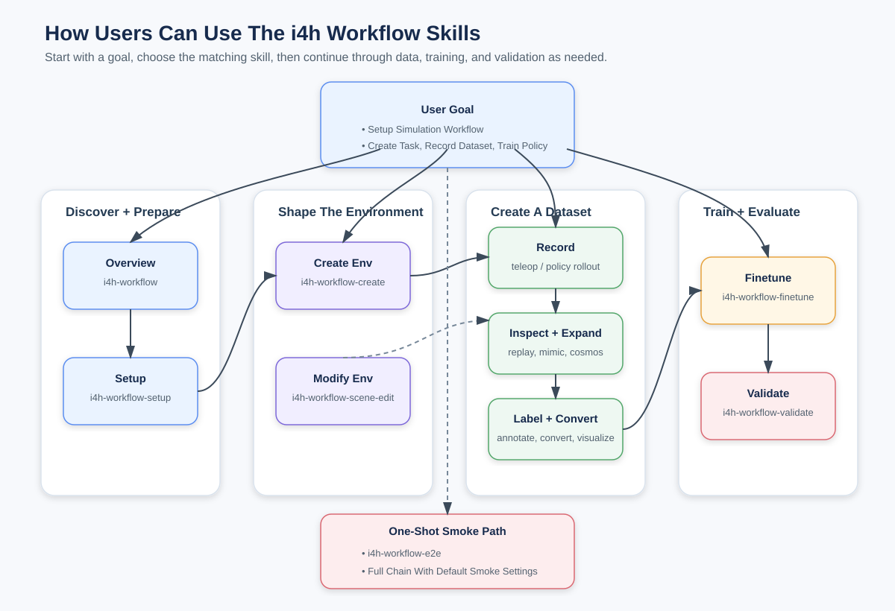

# The Skill Library[#](#the-skill-library "Link to this heading")

In Agentic Workflows in Isaac for Healthcare you drive the pipeline with natural-language prompts, not shell commands. Each prompt loads a focused *skill* from the repository. In source checkouts these live under `skills/`; when installed, they may live in your agent’s configured skills directory. Together they form a library you compose to move from raw scene to validated policy.

The current repository has 20 skills: 13 for the agentic robot-learning workflow and seven
for the catheter-navigation workflow.

## Learning Objectives[#](#learning-objectives "Link to this heading")

By the end of this lesson, you’ll be able to:

- **Identify** which skill drives each agentic or catheter-navigation stage.
- **Run** the full pipeline with the `i4h-workflow-e2e` skill.

## Run It With a Prompt[#](#run-it-with-a-prompt "Link to this heading")

You smoke the whole pipeline by pasting one natural-language prompt to your coding agent. It loads the `i4h-workflow-e2e` skill, which chains every stage and keeps you in the loop to review each step.

[](../_images/i4h-workflow-skills-system-diagram.svg)

The skill library: each natural-language prompt loads one stage skill, which drives the corresponding `workflows/agentic/` subproject (arena, policy, dataset, mimic, annotator, cosmos).[#](#id1 "Link to this image")

```
Run end-to-end smoke pipeline for scissor pick-and-place.
```

## What Happens Under the Hood?[#](#what-happens-under-the-hood "Link to this heading")

Every stage of the agentic workflow has its own skill. You compose them in sequence, or hand the whole sequence to the end-to-end skill. The sections below show how the library is organized and the commands that run beneath the prompt.

### Agentic Workflow Skills[#](#agentic-workflow-skills "Link to this heading")

The table lists each skill, its stage, and an example prompt.

| Skill | Stage / Purpose | Example prompt |
| --- | --- | --- |
| `i4h-workflow` | Overview and routing | `What does the i4h workflow include, and where should I start?` |
| `i4h-workflow-setup` | Verify host requirements and run setup | `Set up the i4h workflow on this machine and tell me if any host requirements are missing.` |
| `i4h-workflow-create` | Create a new env from a template | `Create a new i4h environment by forking the scissor pick-and-place task for surgical tool sorting.` |
| `i4h-workflow-scene-edit` | Edit an existing scene / task / camera | `Edit the scissor pick-and-place scene to replace the scissors with a red cube and save the scene.` |
| `i4h-workflow-dataset-teleop` | Record teleoperated demos to HDF5 | `Record 5 keyboard teleop demos for the scissor pick-and-place task.` |
| `i4h-workflow-dataset-replay` | Replay HDF5 episodes in Isaac Sim | `Replay episode 0 from my scissor pick-and-place recording in Isaac Sim.` |
| `i4h-workflow-dataset-mimic` | Expand HDF5 demos with small noise | `Expand my scissor pick-and-place recording to 10 episodes with small action and state noise.` |
| `i4h-workflow-dataset-annotate` | VLM success labeling / filtering | `Run the VLM annotator on my scissor pick-and-place recording and label which episodes satisfy the task.` |
| `i4h-workflow-dataset-convert` | Convert HDF5 to a LeRobot dataset | `Convert my scissor pick-and-place recording into a LeRobot dataset.` |
| `i4h-lerobot-viz` | Serve the LeRobot HTML visualizer | `Serve the LeRobot visualizer for my converted scissor pick-and-place dataset and show me the local URL.` |
| `i4h-workflow-finetune` | Fine-tune a GR00T / openpi PI0 policy | `Fine-tune a policy for the scissor pick-and-place task on my converted dataset for a short smoke run.` |
| `i4h-workflow-validate` | Evaluate a policy / checkpoint, or run scripted state-machine smokes | `Evaluate scissor pick and place with 3 episodes.` |
| `i4h-workflow-e2e` | Run the full smoke pipeline | `Run the full end-to-end smoke pipeline for the scissor pick-and-place task.` |

*Optional deep dive:*

```
Open one SKILL.md and walk me through how its body drives the corresponding workflows/agentic/ subproject.
```

### Catheter Navigation Skills[#](#catheter-navigation-skills "Link to this heading")

These seven v0.7 skills drive the separate `workflows/catheter_navigation/` tree. They cover
CT preprocessing, a vasculature digital twin, digitally reconstructed radiographs (DRRs),
XPBD catheter physics, an interactive fluoroscopy viewport, and smoke tests. This optional
path has its own compute and patient-data prerequisites in each skill.

| Skill | Purpose | Example prompt |
| --- | --- | --- |
| `i4h-catheter-navigation` | Overview and routing | `What does the catheter navigation workflow include, and where should I start?` |
| `i4h-catheter-navigation-setup` | Verify host, GPU, CLI, and imports | `Set up the catheter navigation workflow and report missing host or GPU requirements.` |
| `i4h-catheter-navigation-digital-twin` | Preprocess CT and segment vessels | `Build a catheter navigation digital twin from my TotalSegmentator subject at <path>.` |
| `i4h-catheter-navigation-render-drr` | Render a synthetic or CT-based DRR | `Render a synthetic DRR frame for the catheter navigation workflow.` |
| `i4h-catheter-navigation-viewport` | Open the interactive fluoroscopy viewport | `Open the catheter navigation viewport using my CT cache at <path>.` |
| `i4h-catheter-navigation-smoke` | Run CPU-only smoke tests | `Run the CPU-only catheter navigation smoke tests.` |
| `i4h-catheter-navigation-e2e` | Run setup, digital twin, DRR, and tests | `Run the catheter navigation v0.7 smoke pipeline using my TotalSegmentator subject at <path>.` |

### The Agentic Router and Limitations[#](#the-agentic-router-and-limitations "Link to this heading")

The `i4h-workflow` skill is the **router**: it runs no stage itself, it just orients you on what’s supported and which per-stage skill to invoke next. Start there (`What does the i4h workflow include...`) whenever you’re unsure.

Known limitations to consider before you plan a long run: `i4h-workflow-dataset-teleop`
is verified for `keyboard`, `keyboard_23d`, and `so101_leader`, while `manus-gloves` is not
verified; `i4h-workflow-finetune` and `i4h-workflow-e2e` are verified for the
`scissor_pick_and_place` smoke path first.

*Optional deep dive:*

```
Explain how the i4h-workflow routing skill uses each skill's description to decide which one to invoke.
```

### One Prompt Runs Everything[#](#one-prompt-runs-everything "Link to this heading")

The `i4h-workflow-e2e` skill runs setup → record → mimic → annotate/filter → replay → convert
→ visualize → finetune → validate from one prompt. It is an unattended smoke test of the
record-to-validate loop.

*Optional deep dive:*

```
Walk me through the e2e script and how it chains the stages from setup through validate, including how it skips the optional ones.
```

## What’s Next?[#](#what-s-next "Link to this heading")

You now know both skill families and how each skill maps to a stage. Next, author your own in
[Adding Your Own Skills](09-adding-your-own-skills.html).

On this page
