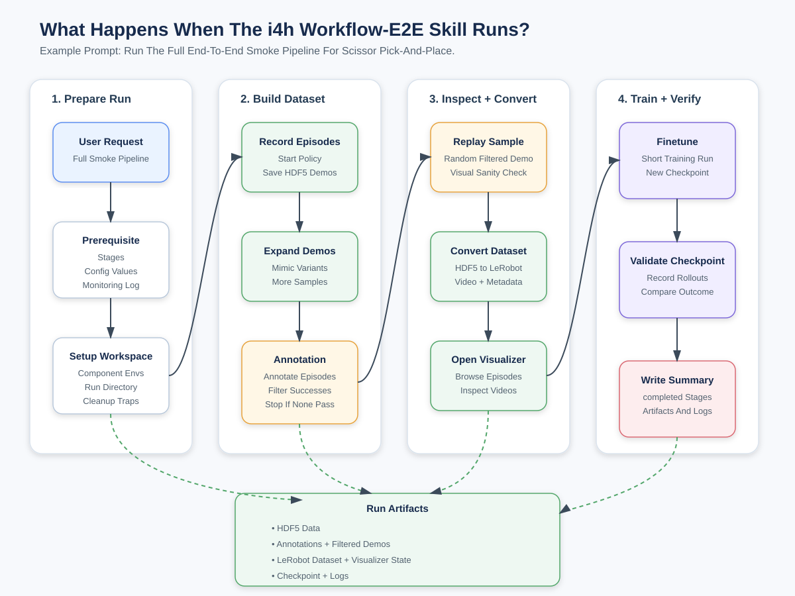

# Agentic Workflows in Isaac for Healthcare[#](#agentic-workflows-in-isaac-for-healthcare "Link to this heading")

From prompt to policy

## Prompt Your Way to a Healthcare Robotics Simulation

Isaac for Healthcare supplies the simulation, data, and policy building blocks for
robotic autonomy. In this course, you use agentic workflows to create a healthcare task,
collect demonstrations, train a policy, and validate it in Isaac Sim.

[](videos/course_highlight.mp4?v=3)

This hands-on course teaches you to build, simulate, and extend **healthcare-robotics
workflows** with NVIDIA Isaac for Healthcare, the unified **IsaacLab-Arena** simulator,
**GR00T**, and **openpi** policies. You’ll work entirely in simulation, following the same
record → prepare → train → deploy loop the platform’s agentic skills automate.

The course is organized as **self-paced sections**. Work through them, then extend the platform with your own environments and skills.

## Compute Requirements[#](#compute-requirements "Link to this heading")

This is a GPU course. Before you begin, use a local or remote machine with:

- Ubuntu 22.04 or 24.04 on `x86_64` or `aarch64`.
- An NVIDIA GPU with Linux driver `580.65.06` or newer for Isaac Sim 5.1.0 and CUDA 13.
- About 30 GB of free disk space.
- `git` and `uv` available on `PATH`.
- Network access to GitHub, PyPI, NVIDIA PyPI, and PyTorch CUDA wheels.

Cosmos visual expansion is optional. It also needs Docker with GPU support and an
`HF_TOKEN` or `HUGGING_FACE_HUB_TOKEN` after you accept the NVIDIA Cosmos model license.

## Stay in the CLI With the Tutor Skill[#](#stay-in-the-cli-with-the-tutor-skill "Link to this heading")

If you prefer to stay in your terminal the whole time, load the
[Physical AI Tutor skill](https://developer.nvidia.com/downloads/Omniverse/learning/Courses/isaac-gr00t-e2e/Physical-AI-Tutor-skill.md)
into your coding agent before you begin. It turns this course into an interactive CLI tutor:
it adapts to your experience level, explains one step at a time, pauses before hands-on
actions, and helps diagnose errors from the same shell session.

```
Tutor me through Agentic Workflows in Isaac for Healthcare from the beginning.
Use the course instructions at https://docs.nvidia.com/learning/physical-ai/getting-started-with-isaac-for-healthcare/latest/agentic-workflows.
Keep me in the CLI, adapt to my level, and pause before each hands-on step.
```

[](../_images/i4h-workflow-e2e-system-diagram.svg)

The end-to-end agentic pipeline runs in four phases: prepare → build dataset → inspect & convert → train & verify.[#](#id1 "Link to this image")

## What You’ll Do[#](#what-you-ll-do "Link to this heading")

Get Set Up

Install the workflow, list the supported environments, and run a zero-action smoke test in
[Setup and Environments](02-setup-and-environments.html).

Build a Dataset

[Collect](03-data-collection.html) teleop demos and [prepare](04-data-preparation.html) them into a
LeRobot dataset.

Train and Deploy

[Fine-tune a GR00T policy](05-imitation-learning-gr00t.html) and
[deploy it in simulation](06-deployment-in-simulation.html).

Extend the Platform

[Build your own workflow](07-build-your-own-workflow.html) and
[add your own skills](09-adding-your-own-skills.html).

On this page
