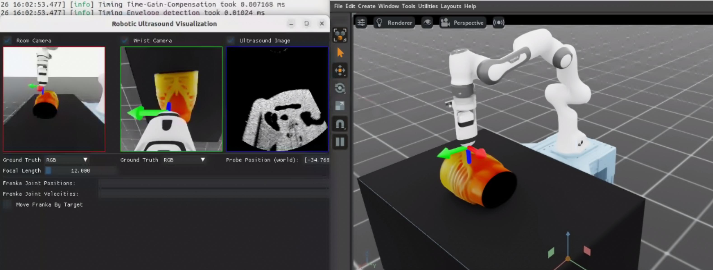

# Getting Started With Isaac for Healthcare[#](#getting-started-with-isaac-for-healthcare "Link to this heading")

This learning path introduces [NVIDIA Isaac for Healthcare](https://developer.nvidia.com/isaac/healthcare): simulation, synthetic data, and policy training for medical robotics. The two courses below are independent. Choose the one that best matches your goals, or complete both in either order.

## Recommended starting point: Agentic Workflows in Isaac for Healthcare[#](#recommended-starting-point-agentic-workflows-in-isaac-for-healthcare "Link to this heading")

Start here for the fastest way to understand how Isaac for Healthcare is structured and how its components work together. You use coding agents and the skills provided by [Isaac for Healthcare Agentic Workflows](https://github.com/isaac-for-healthcare/i4h-workflows) to build an end-to-end workflow from plain-language prompts.

The course teaches you how to:

- Create a simulation environment for a healthcare robotics task that you design.
- Use the environment to collect and prepare training data.
- Train a policy on the collected data and deploy it in simulation to achieve task autonomy.
- Build your own workflows and extend the skill library for new applications.

You review every stage, including environment creation, data collection, training, and deployment, so you learn both how to work with the coding agent and how the underlying Isaac for Healthcare workflow fits together.

Describe a task, build the simulation, collect data, train a policy, and validate autonomous behavior.

[Start Agentic Workflows in Isaac for Healthcare →](agentic-workflows/index.html)

## Focused deep dive: Training Healthcare Robots From Scratch[#](#focused-deep-dive-training-healthcare-robots-from-scratch "Link to this heading")

This earlier, code-first course provides a more detailed look inside the repositories through one specific application: robotic ultrasound. It is a strong fit if you want deeper implementation insight or are especially interested in:

- Simulating healthcare sensors and specific imaging modalities.
- Bringing patient anatomy and medical data into an Isaac Sim environment.
- Building and teleoperating a robotic ultrasound setup.
- Collecting demonstrations and fine-tuning a vision-language-action policy for that application.

The course was developed before the agentic workflow and does not focus on coding-agent-driven development. You can take it independently; completing it is not a prerequisite for the Agentic Workflows course.

Build a robotic ultrasound application with patient anatomy, sensor simulation, teleoperation, data collection, and policy training.[#](#id1 "Link to this image")

[Start Training Healthcare Robots From Scratch →](training-healthcare-robots-from-scratch/index.html)

On this page
