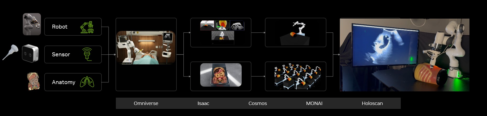

# Introduction[#](#introduction "Link to this heading")

Welcome to the course, *Training Healthcare Robots from Scratch Using Isaac for Healthcare*!

Autonomous robots are increasingly relevant in healthcare due to their ability to address workforce shortages, enhance efficiency, and improve patient outcomes. By automating routine, physically demanding, and high-risk tasks, robots support medical staff and enable more focused patient care.

This course will introduce you to [NVIDIA Isaac for Healthcare](https://developer.nvidia.com/isaac/healthcare) and its workflows. If you’ve used [Isaac Sim](https://developer.nvidia.com/isaac/sim) and [Isaac Lab](https://isaac-sim.github.io/IsaacLab/main/index.html) before you’re well prepared to study this course.

We will explain and perform a complete, end-to-end implementation that demonstrates how to build, simulate, and deploy robotic system for a specific medical application: an ultrasound scan.

# Learning Objectives[#](#learning-objectives "Link to this heading")

By the end of this course, you will be able to:

- Create a scene in Isaac Sim with custom medical assets
- Modify a robotic arm to hold an ultrasound probe
- Generate synthetic patient CT data using [MAISI CT](https://build.nvidia.com/nvidia/maisi)
- Use a state machine to collect data for imitation learning
- Fine-tune [GR00T](https://developer.nvidia.com/isaac/gr00t) N1, a Vison-Language-Action (VLA) model
- Deploy GR00T N1 to autonomously scan a liver model

If you’re new to robotics, we recommend going to our [Robotics Fundamentals Learning Path](https://www.nvidia.com/en-us/learn/learning-path/robotics/), and taking the courses under **Getting Started with Isaac Sim** and **Getting Started with Isaac Lab**, then coming back to this course.

- [Robotics Meets Healthcare](02-robotics-meets-healthcare.html)
  - [Healthcare Requires Dynamic, Adaptable Robot Behavior](02-robotics-meets-healthcare.html#healthcare-requires-dynamic-adaptable-robot-behavior)
    - [Unique Challenges](02-robotics-meets-healthcare.html#unique-challenges)
    - [Train in Isaac Lab, Simulate and Evaluate in Isaac Sim](02-robotics-meets-healthcare.html#train-in-isaac-lab-simulate-and-evaluate-in-isaac-sim)
  - [Isaac for Healthcare](02-robotics-meets-healthcare.html#isaac-for-healthcare)
- [Foundation Models in Healthcare Robotics](03-foundation-models-in-healthcare-robotics.html)
  - [GR00T and Cosmos](03-foundation-models-in-healthcare-robotics.html#gr00t-and-cosmos)
  - [Synthetic Data Generation (SDG)](03-foundation-models-in-healthcare-robotics.html#synthetic-data-generation-sdg)
  - [Phantom Models](03-foundation-models-in-healthcare-robotics.html#phantom-models)

On this page
