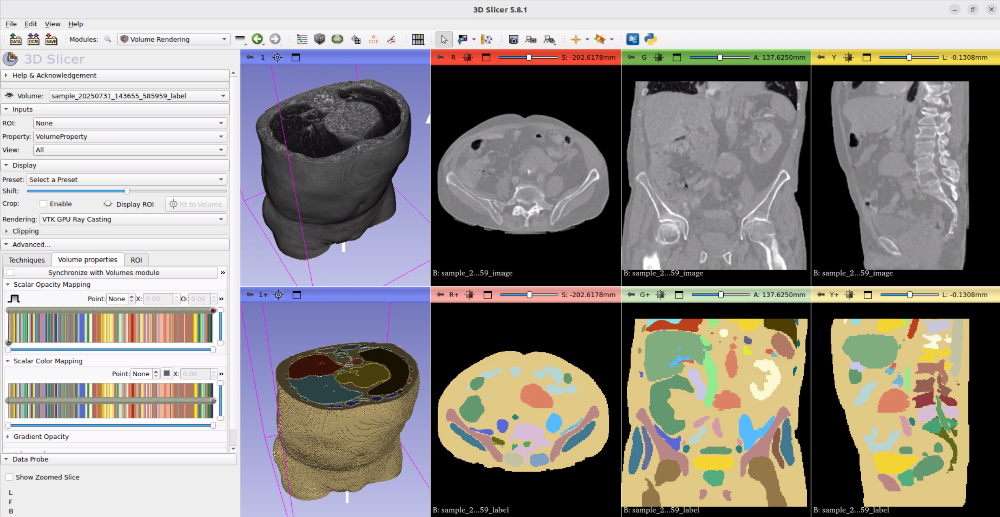

# MAISI Synthetic Medical Data[#](#maisi-synthetic-medical-data "Link to this heading")

Now that we’ve assembled a scene, let’s dive into bringing more medical data into our simulation.

How can we bring detailed medical data, such as a CT scan, into a robotics simulation? How can generative AI solve this difficult data-scarcity problem?

Note

A CT scan (computed tomography) uses X-rays and computer processing to generate detailed 3D images of the body. The primary clinical use cases are diagnosis of diseases, injuries, and abnormalities in organs, bones, and blood vessels.

## MAISI[#](#maisi "Link to this heading")

Medical AI for Synthetic Imaging (MAISI) is a project designed to solve this problem.

MAISI is a state-of-the-art AI framework for generating synthetic 3D medical images, particularly high-resolution CT scans, and their corresponding anatomical segmentations. MAISI is designed to address data scarcity, annotation costs, and patient privacy concerns in medical imaging by creating high-quality synthetic data for research, model training, and algorithm development. Its synthetic data can be mixed with real scans to augment datasets, enhancing model robustness and generalizability in tasks such as tumor segmentation and detection.

Note

You can use readily created assets to continue the course, or follow the instructions here to generate your own synthetic CT data.
Download the generated CT data from [here](#/static/sample_CT-20250829T154411Z-1-001.zip).
To verify the download the sha256 hash should be `BA6D02C90674841913C9F75C5A96FFCFF382E81A0707E907C83E78D55D03F12A`

---

## Benefits of Synthetic Data Generation (SDG)[#](#benefits-of-synthetic-data-generation-sdg "Link to this heading")

Synthetic data generation is highly valuable for both medical imaging and robotics technologies due to several critical benefits:

| Benefit | Medical Imaging | Robotics Technologies |
| --- | --- | --- |
| **🔍 Addressing Data Scarcity** | Medical imaging data, especially for rare diseases or edge cases, is often scarce or expensive to collect. Synthetic data fills these gaps by generating realistic images, improving data diversity and volume for training AI models. | Robotics applications often require vast, diverse datasets for training machine learning models in tasks like object recognition or motion planning. Synthetic data provides scalable, customizable data for these needs. |
| **🔒 Enhancing Privacy** | Synthetic data is not linked to real individuals and thus avoids patient privacy concerns and regulatory hurdles. This enables wider data sharing and collaboration without violating laws like HIPAA or GDPR. | In scenarios where sensor or camera data is sensitive, synthetic data can be shared more freely for cross-team or cross-institution advancement. |
| **💰 Cost and Efficiency** | Creating and annotating real medical images is time-consuming and costly. Synthetic data can be rapidly generated at lower cost, expediting the development and validation of AI tools. | Generating and annotating real-world robotics data can be prohibitively expensive. Synthetic data circumvents this by allowing efficient creation and labeling of diverse datasets. |
| **⚖️ Reducing Bias** | By generating data for underrepresented populations or rare conditions, synthetic datasets can help reduce bias in AI models, leading to fairer, more generalizable healthcare solutions. | Exposure to a broad spectrum of synthetic scenarios enhances robots’ adaptability to new or unseen real-world conditions. This is crucial for applications like assistive robotics or autonomous navigation. |
| **⚡ Accelerating Innovation** | Synthetic data is used to train, validate, and benchmark AI models, speeds up clinical trials simulation, and supports medical education by providing diverse case material. | Robotic systems can be tested and trained in photorealistic or highly variable virtual environments, including edge cases that are rare or hazardous in the physical world, increasing safety and robustness. |

## Simulation Benefits[#](#simulation-benefits "Link to this heading")

Simulation environments reduce development time and cost by enabling rapid prototyping and testing of algorithms and designs entirely in a virtual setting—eliminating the need to build and modify early physical prototypes. This approach allows software to be developed and iterated quickly, accelerates the engineering timeline, and lowers expenses related to hardware and materials.

### Software-in-the-loop (SIL)[#](#software-in-the-loop-sil "Link to this heading")

SIL testing lets developers validate control algorithms in a fully simulated environment, allowing fast, low-risk iterations.

### Hardware-in-the-loop (HIL)[#](#hardware-in-the-loop-hil "Link to this heading")

HIL testing connects real hardware to simulated scenarios, detecting hardware-specific issues and increasing system reliability before full deployment—all while reducing the need for costly prototype builds.

---

# MAISI CT: Foundational CT Volume Generation Model[#](#maisi-ct-foundational-ct-volume-generation-model "Link to this heading")

Patient anatomy examples can be generated using the **MAISI foundational CT volume generation model**, which leverages generative AI to create high-quality, diverse synthetic CT data for medical imaging research and development. MAISI CT helps address data scarcity and privacy challenges in healthcare AI by providing realistic, customizable anatomical datasets.

## Resources[#](#resources "Link to this heading")

- [Overview Blog: Addressing Medical Imaging Limitations with Synthetic Data Generation](https://developer.nvidia.com/blog/addressing-medical-imaging-limitations-with-synthetic-data-generation/)
- [MAISI CT Paper (arXiv)](https://arxiv.org/html/2409.11169v1)
- [MAISI Nvidia Inference Microservice (NIM)](https://build.nvidia.com/nvidia/maisi)
- [Project-MONAI/models/maisi\_ct\_generative (Model Zoo)](https://github.com/Project-MONAI/model-zoo/tree/dev/models/maisi_ct_generative)

---

# MAISI CT Pipeline[#](#maisi-ct-pipeline "Link to this heading")

Let’s try out MAISI’s CT pipeline.

## Run MAISI CT Pipeline Locally With MONAI Model Zoo[#](#run-maisi-ct-pipeline-locally-with-monai-model-zoo "Link to this heading")

1. To clone and install `maisi_ct_generative`, follow the steps in the [official repository](https://github.com/Project-MONAI/model-zoo/tree/dev/models/maisi_ct_generative). The following modifications were tested on git commit hash: `05067dce4db8fcb87dc31e7fa510c494959230ea`.
   It’s recommended to use a new virtual environment for this task. Consider creating a new environment and activating it with:

```
conda create -n monai python=3.10
conda activate monai
```

```
pip install "monai[all]"
python -m monai.bundle download "maisi\_ct\_generative" --bundle\_dir "bundles/"
```

Tip

The standard model requires a selection of anatomical features, though skin is not one of them. For our purposes, we can simply uncomment the filter function in `bundles/maisi_ct_generative/scripts/sample.py`. This will save all labels used during the data generation.

```
# synthetic\_labels = filter\_mask\_with\_organs(synthetic\_labels, self.anatomy\_list)
```

2. Adjust the config to have an **empty `anatomy_list`**.

- Copy the inference script and modify it with the below instructions
- Edit the configuration file (e.g., `configs/inference_all.json`) and set `anatomy_list` to an empty list (`[]`)
- You may need to adjust additional parameters in the config to fit the model on your GPU. The file in `utils/config/inference_all.json` was used to generate the sample CTs for this course
- This ensures that all labels will be returned in the output

3. Run **MAISI** from the MONAI Model Zoo.

```
python -m monai.bundle run --config\_file configs/inference\_all.json
```

4. **Visualize** generated CT Data.

Install 3D Slicer or another application to view the CT data and labelmap.
[3D Slicer](https://www.slicer.org/) is an open-source platform for the development of medical image analysis and visualization tools.



In this video, we install the required monai packages, modify the sample.py script and create a new configuration to generate our synthetic CT data.
Lastly, we visualize the CT data along its labelmap in 3D Slicer.

Note

Sometimes the labelmap is not displayed correctly. Try renaming the file to `label.nii.gz` and reload it. You can open the label map as `Volume` or `Segmentation`.

On this page
