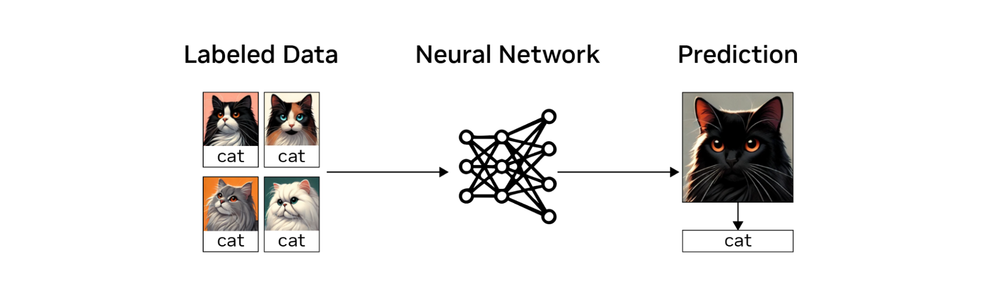

# Supervised Learning[#](#supervised-learning "Link to this heading")

**Supervised learning** is a method of learning from labeled data. Labeled data provides the ground truth or the correct answer for each input. For example, in image classification of cats and dogs, you would have pictures of cats and dogs with corresponding labels identifying each image. The input is the image, and the output is the label or name of the animal.

This labeled data is fed into a neural network, which then makes its own predictions. These predictions are compared to the ground truth, and through optimization and backpropagation, the neural network is trained to improve its accuracy.

The key concept in supervised learning is the necessity of labeled data. While there are various algorithms within supervised learning, such as K-Nearest Neighbors (KNN) and mean distance classifiers, they all fundamentally work by analyzing labeled data and solving an optimization problem.

In robot learning, supervised learning can be applied to various components of a robot. For instance, in object recognition and detection, a robot tasked with approaching humans can use supervised learning. By providing the algorithm with diverse images of humans, it can learn to recognize and move towards them.

Another application is pose estimation. By training the algorithm with samples of different objects and their corresponding ground truth poses, the robot can learn to estimate poses accurately.

These examples demonstrate how supervised learning is particularly useful for specific parts of a robot system, enabling autonomous movement and task completion. While it may not encompass the entire robotic system, supervised learning plays a crucial role in enhancing a robot’s perception and decision-making capabilities.
