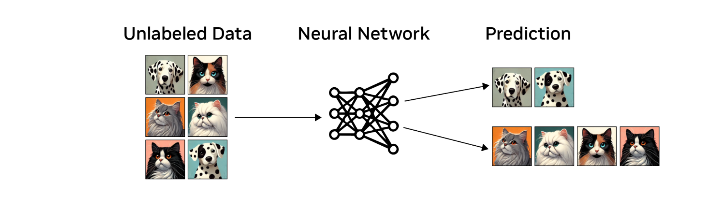
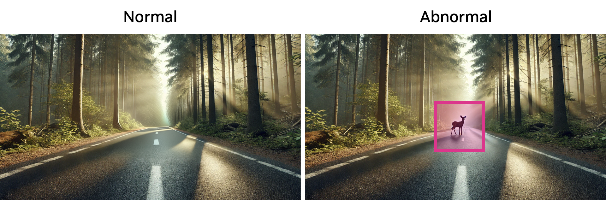

# Unsupervised Learning[#](#unsupervised-learning "Link to this heading")

**Unsupervised learning** is the second major class of robot learning algorithms. Unlike supervised learning, unsupervised learning works with unlabeled data. The goal of the neural network in this case is to identify patterns and relationships within the data without explicit guidance.

One common application of unsupervised learning is clustering. In the context of robotics, this can be used for environment mapping. The algorithm attempts to identify areas within an environment that share similar characteristics, grouping them together without being told explicitly what these areas represent.

Another important application is anomaly detection. For instance, consider a dataset containing images of roads, some in good condition and others with potholes or damages. An unsupervised learning algorithm can detect anomalies or differences in these images without being explicitly told which roads are “good” or “bad.” It accomplishes this by identifying features that deviate from the norm.

However, it’s important to note that unsupervised learning isn’t always the best solution, especially when dealing with datasets that have a high degree of variation. In such cases, techniques like dimensionality reduction may be employed to simplify the data and make it more manageable for the algorithm.

Unsupervised learning offers a powerful approach to extracting meaningful information from unlabeled data, making it particularly useful in scenarios where labeled data is scarce or expensive to obtain. Its ability to discover hidden patterns and structures in data makes it a valuable tool in the robotics field, complementing other learning approaches to create more versatile and adaptive robotic systems.

That’s a little bit about how supervised and unsupervised learning works. However, when it comes to robot learning, two major algorithms stand out: imitation learning and reinforcement learning. These branches of robot learning deal specifically with robots acting in their environment, as opposed to earlier algorithms (supervised and unsupervised learning) that focus on processing sensory information or specific robot components.
