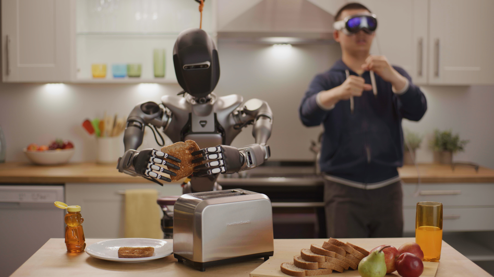

# Imitation Learning[#](#imitation-learning "Link to this heading")

Imitation learning is often interchanged with supervised learning because it involves learning by mimicking demonstrations. It bridges the gap between supervised learning and autonomous action.

In this case, the labeled data consists of environmental states paired with the correct actions to take in those states. These demonstrations can come from various sources, such as human experts, mathematical functions, or even other robots.

Fourier’s humanoid robot.[#](#id1 "Link to this image")

For example, imitation learning can be used to teach a robot assembly tasks in a factory or how to make breakfast by showing it a series of demonstrations performed by humans. Another application is in robot locomotion, where teleoperation is used to gather data on how to control the robot’s movements.

The key concept in imitation learning is that the labeled data takes the form of observations: the current environment state and the corresponding correct action to take in that state.

This approach is particularly useful when you have access to expert demonstrations or when you can generate data from existing mathematical models.

Tip

Learn More: [NVIDIA Accelerating the Future of AI & Humanoid Robots](https://www.youtube.com/watch?v=sygmkSXuYDQ&amp;t=2s)

## How Does It Work?[#](#how-does-it-work "Link to this heading")

The process of imitation learning can be broken down into three key stages:

- Collecting trajectory data
- Policy training
- Evaluation and deployment

### Collecting Trajectory Data[#](#collecting-trajectory-data "Link to this heading")

The first step in imitation learning is gathering high-quality demonstration data. This can be done through various methods:

- **Teleoperation**: A human operator controls the robot remotely, performing the desired task. The robot’s joint positions and movements are recorded as training data.
- **Video Demonstrations**: Recording videos of humans or robots performing the target task.
- **Motion Capture**: Using specialized camera systems to capture precise 3D movements of humans or objects.
- **Real Robot Trajectories**: Collecting data from robots already capable of performing the task.
- **Oracle or Expert Policies**: Using pre-existing algorithms or mathematical models to generate ideal trajectories.
- **Trajectory Optimization**: Employing complex numerical methods to create optimal movement paths.

### Policy Training[#](#policy-training "Link to this heading")

Once the demonstration data is collected, the next step is to train the robot’s policy. This is where the robot learns to map observations (current state of the environment) to actions. There are two main approaches to policy training in imitation learning:

- **Behavior Cloning**: This straightforward approach involves directly learning to replicate the expert’s behavior. The robot is trained on observation-action pairs, learning to associate specific environmental states with the corresponding actions taken by the expert. For example, in an autonomous driving scenario, the observation might be an image of the road, and the action would be the steering direction.
- **Inverse Reinforcement Learning (IRL)**: IRL is a more sophisticated approach used when the reward function for a task is not obvious. Instead of directly learning actions, IRL attempts to infer the reward function that the expert is optimizing. This inferred reward function can then be used in a reinforcement learning framework to generate more training data or to learn a more robust policy. IRL is particularly useful for complex tasks where direct behavior cloning might not capture the full complexity of the decision-making process.

### Evaluation and Deployment[#](#evaluation-and-deployment "Link to this heading")

After training, the learned policy must be evaluated in simulated or controlled environments. If the performance is satisfactory, the policy can be deployed on real robots for real-world tasks.

Key Algorithms and Techniques:

- **DAGGER (Dataset Aggregation)**: An iterative algorithm that addresses some limitations of simple behavior cloning by aggregating datasets over multiple rounds of training.
- **AMP (Adversarial Motion Priors)**: A technique that helps in learning more robust and natural motions, particularly useful in tasks involving complex physical interactions.

---

Imitation learning shines in scenarios where it’s easier to demonstrate a task than to program it explicitly. For instance, in the autonomous driving example, it’s more intuitive to demonstrate good driving behavior than to code all the rules and edge cases explicitly.

In imitation learning, an expert policy generates trajectories. A **trajectory** consists of the state of the robot or environment paired with the correct action to take in that particular state. Using these expert-generated trajectories, we can train the robot using algorithms such as **behavioral cloning** or **inverse reinforcement learning**.

However, imitation learning also has limitations. It may struggle with generalizing to new situations not covered in the training data, and it doesn’t inherently optimize for long-term consequences of actions

On this page
