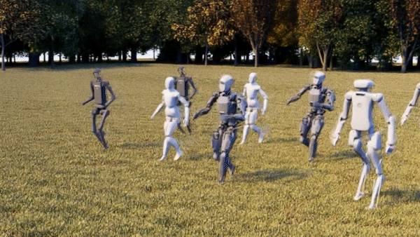
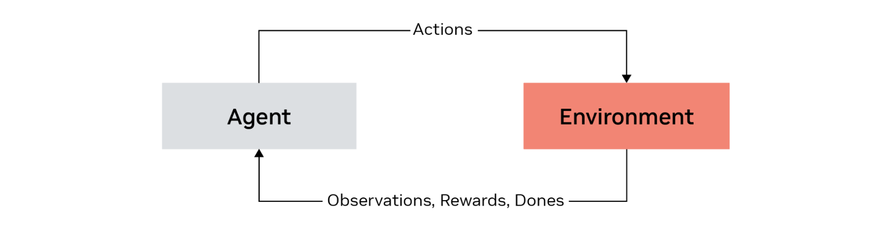

# Reinforcement Learning[#](#reinforcement-learning "Link to this heading")

Reinforcement learning is an approach to robot learning that doesn’t rely on pre-existing datasets. It’s crucial when demonstrations or labeled data are not available.

This method allows an agent to learn by interacting with its environment and receiving feedback in the form of rewards, penalties, or terminations based on its actions, essentially learning by trial and error.

In reinforcement learning, the robot interacts with its environment, trying different actions and receiving feedback in the form of rewards or penalties. The goal is to maximize the cumulative reward over time.

The design of the reward function becomes a critical research problem, as it defines what constitutes good or bad performance for the specific task at hand. Defining appropriate reward functions is a critical part of reinforcement learning. These functions determine which states and actions are better or worse. For instance, in a self-driving car scenario, staying on the road would yield a high reward, while hitting another car would result in a low reward.

This approach is particularly useful for complex tasks where generating labeled data is challenging or impossible. Examples include grasping objects, advanced locomotion, or other intricate tasks that are difficult to model mathematically or demonstrate exhaustively.

The reinforcement learning process involves an agent and an environment. The agent performs an action, and in return, it receives three things:

- An observation of the current state
- A reward
- A “done” signal

Important

State vs. Observation
The distinction between states and observations is important in robotics learning:

States represent the actual, pure data from the robot, such as the exact position coordinates.

Observations are what the system can actually measure or detect, and may require additional processing. An observation could be something like camera images that need Visual SLAM ( Simultaneous Localization and Mapping) to determine position.

For example, with a quadruped robot, the observation might include the position and orientation of its base, as well as the joint positions of each leg. The reward is defined based on whether the robot is performing the task correctly. The “done” signal indicates whether an episode has ended, which could be due to task completion or a predefined time limit.

Reinforcement learning tasks are defined as a Markov Decision Process (MDP), which is a stochastic decision-making process where decisions are made for the agents considering their current state and environment they interact with. This involves defining states, actions, reward functions, and transition probabilities based on the dynamics of the robot and its environment.

Tip

Learn More: [Reinforcement Learning Use Case Page](https://www.nvidia.com/en-us/use-cases/reinforcement-learning/)

## How Does It Work?[#](#how-does-it-work "Link to this heading")

The process is divided into three main phases:

- Initialization
- Rollout
- Policy update

### Initialization[#](#initialization "Link to this heading")

We start by initializing a policy network with random weights. This network takes in observations as input and outputs actions for the environment. The policy network can be a multi-layer perceptron, a convolutional neural network, or even a transformer, depending on the task.

### Rollout[#](#rollout "Link to this heading")

In this phase, we collect multiple trajectories by having the agent interact with the environment using the current policy. We store tuples of observation, action, reward, and done signal at each step.

### Policy Update[#](#policy-update "Link to this heading")

Using the collected trajectories, we update the policy to optimize the expected reward through an optimization algorithm. Initially, the rewards might be poor, but over time, the policy learns to maximize positive rewards and minimize negative ones.

---

## Algorithms and Approaches[#](#algorithms-and-approaches "Link to this heading")

There are various algorithms for reinforcement learning, including policy gradient methods, Q-learning, and SARSA. One popular algorithm is Proximal Policy Optimization (PPO), which is widely used in platforms like Isaac Lab.

Reinforcement learning can be broadly categorized into model-based and model-free approaches:

- **Model-free** approaches refers to methods where the agent learns to make decisions based solely on direct interactions with the environment, without building or relying on a model of the environment.
- **Model-based** approaches involve the agent learning a model of the environment (or having access to one) that predicts the next state and reward given the current state and action. By having this model, the agent can simulate future interactions with the environment, enabling more efficient learning and planning ahead without relying entirely on trial-and-error.

---

## Visual Rendering[#](#visual-rendering "Link to this heading")

One unique feature of Isaac Lab is its ability to use rendered images of the environment in training. This is known as visual RL.

For visual reinforcement learning, there’s an additional rendering pipeline where Isaac Sim generates visual data that feeds back into the policy training process. To reduce computational workload, a technique called tile rendering is used which we’ll cover later in this module.

---

Sometimes, reinforcement learning is combined with other methods. For example, you might start with imitation learning based on existing data, then fine-tune the model using reinforcement learning for more complex scenarios.

Both imitation learning and reinforcement learning are popular in robotics, especially when training robots to perform specific tasks. While supervised and unsupervised learning have their places in robotics, particularly in processing sensory data, imitation and reinforcement learning are the focus in platforms like Isaac Lab due to their direct applicability to robot behavior and task execution.

These algorithms allow robots to learn complex behaviors and adapt to new situations, making them crucial for advancing the field of robotics and creating more versatile and capable machines.

On this page
