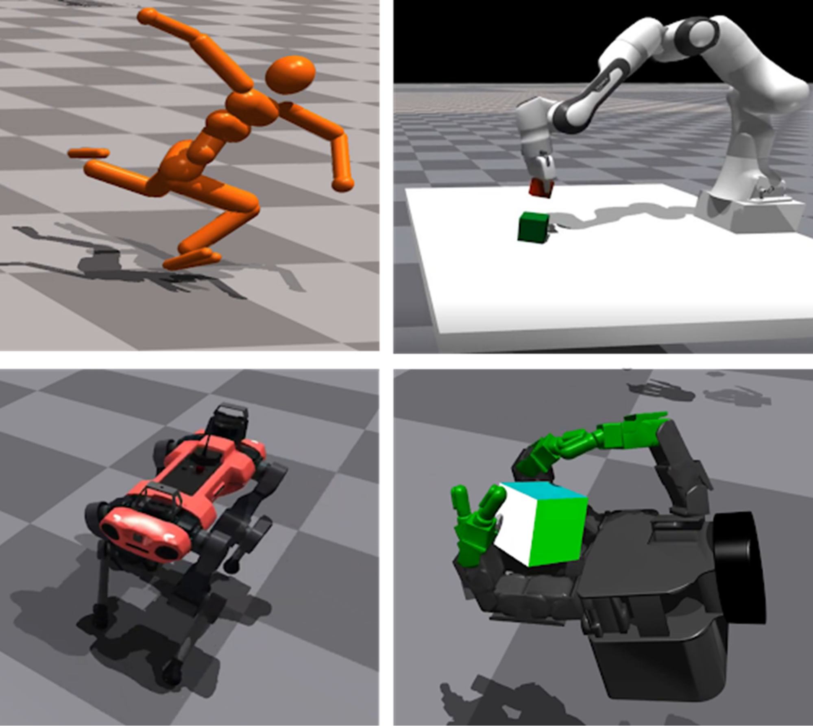

# Isaac Gym Standalone[#](#isaac-gym-standalone "Link to this heading")

We’ll start with Isaac Gym Standalone, one of NVIDIA’s simulators designed for GPU-accelerated learning. It addressed a key challenge in robot learning: the frequent data transfer between CPU and GPU that slowed down training. By bringing both data generation and training onto the GPU, Isaac Gym achieved a major breakthrough in accelerating reinforcement learning for robotics. Isaac Gym is not designed to be a general purpose simulator for robotics. For example, it does not include interaction between deformable and rigid objects, high-fidelity rendering, and support for ROS. It is also not built on Omniverse.

Tip

Learn more by reading the whitepaper: [Isaac Gym: High Performance GPU-Based Physics Simulation For Robot Learning](https://arxiv.org/abs/2108.10470)
