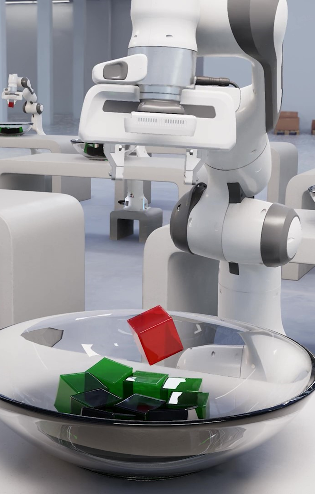

# Isaac Sim[#](#isaac-sim "Link to this heading")

Next, we have another NVIDIA simulator called **NVIDIA Isaac Sim**, a reference robotic simulation application built on NVIDIA Omniverse. It includes features like rigid and deformable body simulation, accelerated rendering for realistic visuals, and integration with popular robotics frameworks like ROS. Isaac Sim also broadened the focus from just reinforcement learning to include imitation learning.

As these simulators evolved, NVIDIA developed various environment collections. Isaac Gym Environments, or **IGE**, provided a set of predefined tasks and environments within Isaac Gym. **Legged Gym** focused specifically on reinforcement learning environments for legged robots, aiming to bridge the sim-to-real gap for quadrupeds and humanoids.

To transition from Isaac Gym to Isaac Sim, NVIDIA created **OIGE** - Omniverse Isaac Gym Environments. This ported the IGE environments to run within Isaac Sim, allowing users to leverage the more advanced simulator.

Then, we have **Orbit** - the Omniverse Robotics Interface. This learning-based ecosystem is built entirely on Isaac Sim, offering a new approach to defining robotic tasks and environments.
