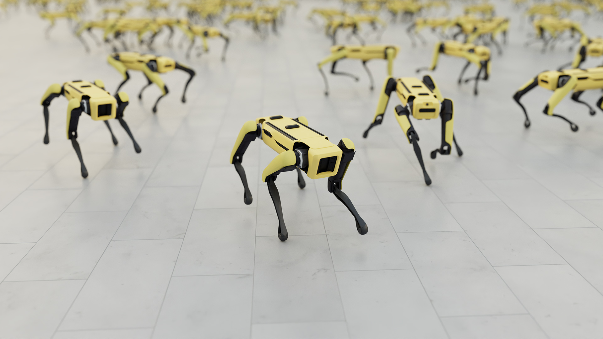
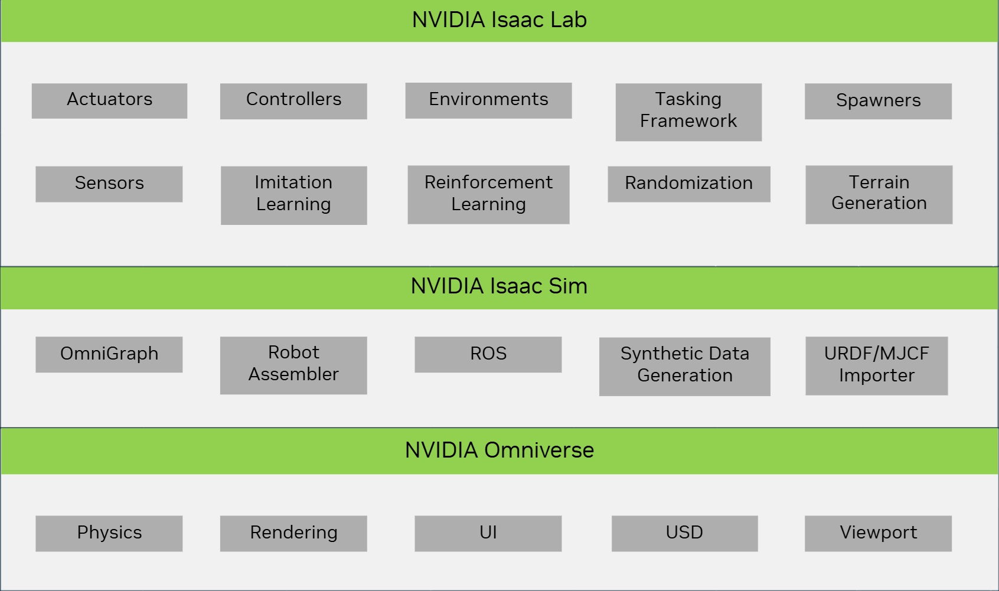
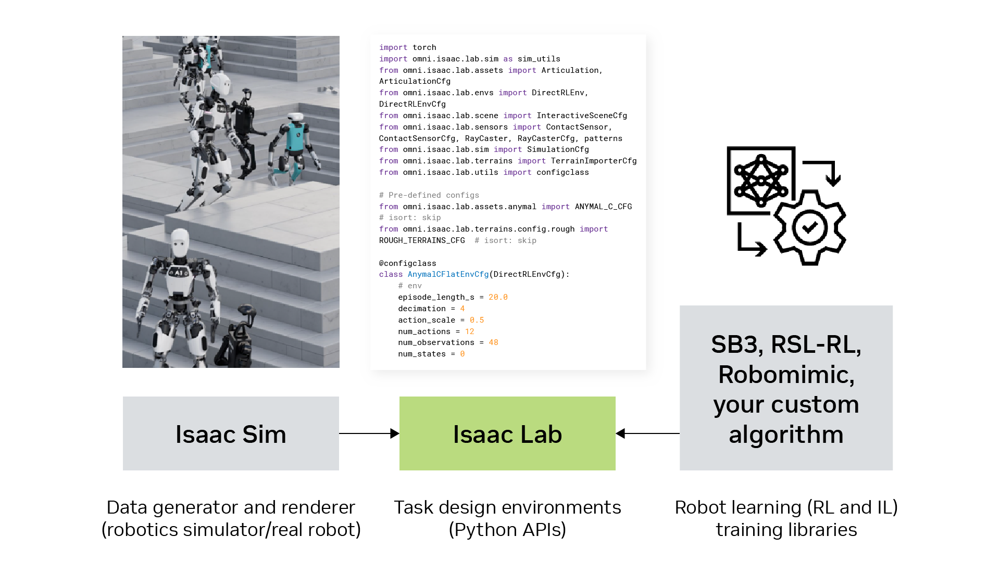

# Isaac Lab[#](#isaac-lab "Link to this heading")

Source: Boston Dynamics[#](#id1 "Link to this image")

Today, Isaac Lab brings together the best of OIGE and Orbit, creating a unified platform for robot learning at NVIDIA. It consolidates years of development effort, providing users with a single, powerful toolkit for advancing robotic capabilities through simulation and learning.

So, what is Isaac Lab? And how does Isaac Lab even fit into the ecosystem?

---

NVIDIA Isaac Lab brings together the best of OIGE and Orbit, creating a unified platform for robot learning. It consolidates years of development effort, providing users with a single, powerful toolkit for advancing robotic capabilities through simulation and learning.

Isaac Lab is designed to be a comprehensive solution within the Isaac Sim ecosystem. It offers a range of features and functionalities that make it an essential tool for robotics researchers and developers. The platform integrates seamlessly with Isaac Sim, leveraging its advanced simulation capabilities to create realistic environments for robot training.

One of the key strengths of Isaac Lab is its ability to support various learning algorithms, including reinforcement learning and imitation learning. This flexibility allows users to choose the most appropriate approach for their specific robotics tasks.

Isaac Lab also provides a collection of pre-defined environments and robots, which can significantly accelerate the development process. These ready-to-use assets allow researchers to focus on algorithm development and testing rather than spending time on environment setup.

The platform is built with scalability in mind, enabling users to run multiple simulations in parallel. This capability is crucial for generating large amounts of training data efficiently, which is often necessary for complex robot learning tasks.

Isaac Lab also offers tools for visualizing and analyzing training progress, making it easier for users to debug and optimize their learning algorithms. Additionally, it provides features to help bridge the gap between simulation and real-world deployment, addressing one of the key challenges in robotics research.

---

By combining the strengths of previous NVIDIA robotics tools and environments, we can address the three key components of robot learning:

- **Data generation and rendering**. You can do this with a robotic simulator or a real robot. Isaac Sim is the simulator.
- **Tasks and environments**. You define your environment through Python APIs in Isaac Lab.
- **Training libraries** (RSL-RL, RL-GAMES, SKRL, Stablebaselines, etc). Once you have your environment and your robot, you’re ready to train. There are various training algorithms you can use that feed into Isaac Lab in order to train your robot to do a particular task.

Isaac Lab aims to be a comprehensive solution for robot learning, catering to a wide range of applications and use cases in the field of robotics.
