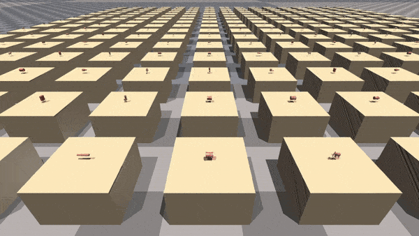
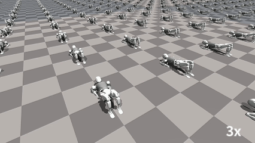
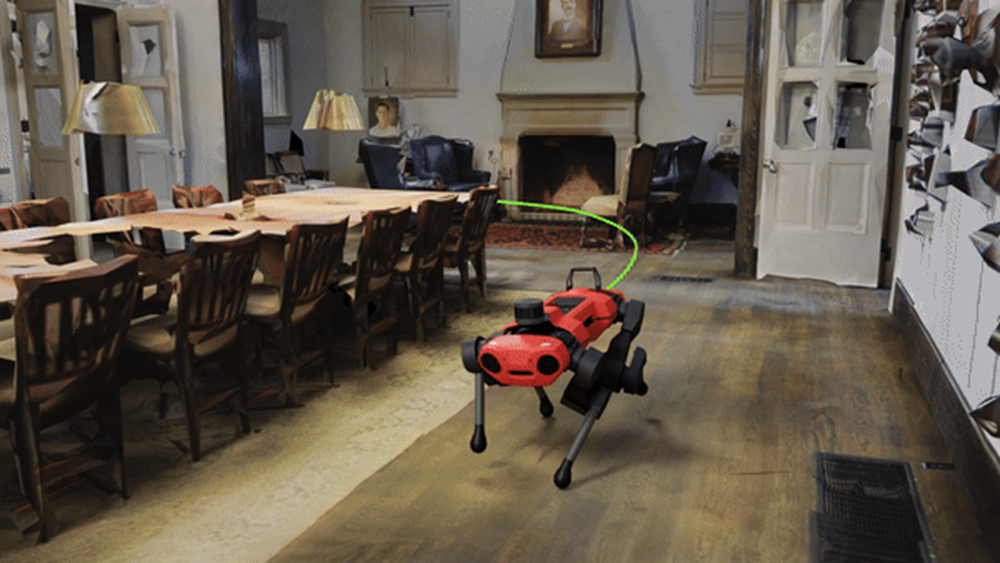
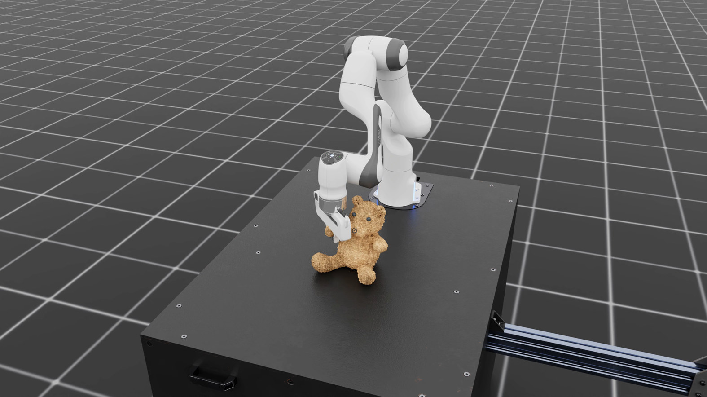

# Isaac Lab in Use[#](#isaac-lab-in-use "Link to this heading")

Various companies and research institutes are using Isaac Lab for different tasks. Let’s explore some of the ways researchers and product teams are using Isaac Lab today.

The [Berkeley humanoid team](https://berkeley-humanoid.com/static/berkeley_humanoid.pdf) is using Isaac Lab for locomotion training, to train their bipedal robot.

MenteeBot is another example, using a humanoid robot to learn how to push a cart in simulation.

Galbot built a [large-scale dexterous hand dataset](https://developer.nvidia.com/blog/spotlight-galbot-builds-a-large-scale-dexterous-hand-dataset-for-humanoid-robots-using-nvidia-isaac-sim/) for humanoids using Isaac Sim and Isaac Lab.

Fourier [trained their humanoid robots](https://developer.nvidia.com/blog/spotlight-fourier-trains-humanoid-robots-for-real-world-roles-using-nvidia-isaac-gym/) for real-world applications with Isaac Gym, and have been porting their workflows to Isaac Lab to train more complex algorithms.

Others are using Isaac Lab to focus on **navigation**, developing ways for robots to move from one specific point to another in space, like this example of quadruped training by ETH.

We’ve seen numerous sim-to-real applications using Isaac Lab. The support for physics and deformable objects enables a realistic training environment, preparing robots for interacting in the real world.

---

To summarize, Isaac Lab is capable of handling various types of robotic learning that require photorealistic scenes and high-fidelity simulation. It can provide support for a wide range of complex tasks, so whatever you can think of, Isaac Lab can likely help you achieve it.
