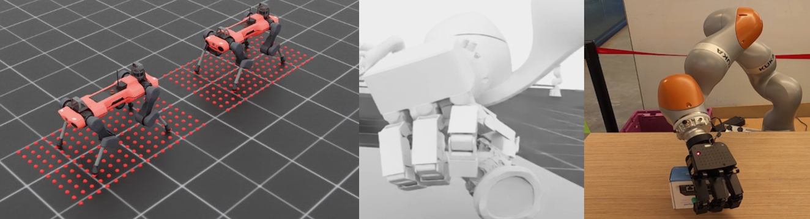

# Available Sensors[#](#available-sensors "Link to this heading")

Sensors are a critical part to giving your robot vision, enabling environmental perception, navigation assistance, and providing feedback for control systems. Isaac lab includes a variety of sensors that you can apply to specific tasks.

Some of the sensors included in Isaac Lab are:

- **RGB cameras**
- **Tiled cameras**
- **Depth cameras**
- **Raycast sensors** for simulating lidar or one-way cameras
- **Height scanners**, which are helpful for quadruped tasks like walking down stairs
- **Contact sensors**, which are great for tasks like pick and place operations

Tip

Learn More: [Sensors in the Isaac Lab Documentation](https://isaac-sim.github.io/IsaacLab/main/source/overview/core-concepts/sensors/index.html)
