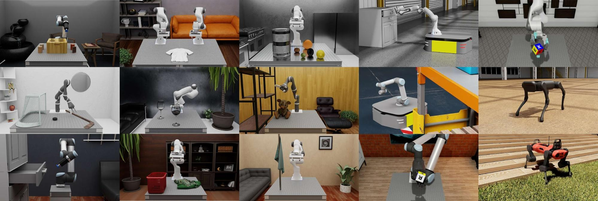

# Available Environments[#](#available-environments "Link to this heading")

Isaac Lab also includes over 26 pre-built environments and tasks that you can leverage in your simulations. The categories include:

- **Dexterous manipulation**, which includes a variety of tasks such as manipulating deformable objects, solving Rubik’s cubes and opening cabinets.
- **Legged locomotion**, focusing on moving quadrupeds or humanoids across different terrains.
- **Multi-agent reinforcement learning**, for example, two robotic arms attempting to pass a ball to each other. While challenging, this opens up exciting research possibilities.
- **Navigation**. which differs from locomotion because it involves moving to a specific position in space, while locomotion is about following directional commands.
- **Tiled rendering**, or visual-based RL, allows us to incorporate visual data into the observation set used for reinforcement learning. It’s a complex process that goes beyond conventional reinforcement learning, which typically relies on physics-based state observations. We can now simulate over 1000 cameras simultaneously, a substantial leap forward in capability. We’ll discuss this more in the next lesson.
- **Teleoperation and imitation learning**, where users can generate training data using their mouse or keyboard, multiply the data using GR00T-Mimic then train the robot using the RoboMimic suite that ships with Isaac Lab.

Isaac Lab also comes bundled with several reinforcement learning algorithms, including RL-Games, RSL-RL, and Stablebaselines. For more detailed information on these algorithms and environments, refer to the [documentation](https://isaac-sim.github.io/IsaacLab/main/source/overview/reinforcement-learning/rl_frameworks.html).

Tip

Learn More: [Available Environments in Isaac Lab Documentation](https://isaac-sim.github.io/IsaacLab/main/source/overview/environments.html)
