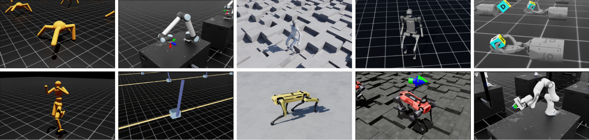

# Available Robots[#](#available-robots "Link to this heading")

Let’s talk about the available robots and environments available to use in NVIDIA Isaac.

We currently have a number of robots ranging from simple Mujoco-style robots like Cartpole, ants, or humanoids, to more complex ones like fixed arms and hands.

Isaac Lab also comes with various partner robots, including the UR10 fixed arm, hand robots like Franka, Allegro, and Shadow, quadrupeds from companies like Boston Dynamics, ANYbotics, and Unitree.

We’ve recently added humanoids and quadcopters like Crazyflie, which is great for research institutes focusing on flying robots.

If you don’t see your specific robot, you can customize your own using the assets within Isaac (for example, a Kuka arm with an Allegro hand), or import your existing URDF or MJCF XML assets to use in the simulated environment.

Tip

Learn More: [Robot Assets](https://docs.isaacsim.omniverse.nvidia.com/latest/assets/usd_assets_robots.html) in Isaac Sim documentation and the Ingesting Robot Assets and Simulating Your Robot in Isaac Sim course.
