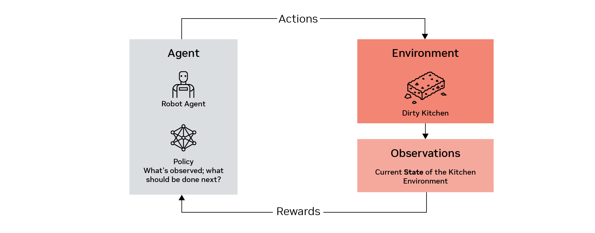
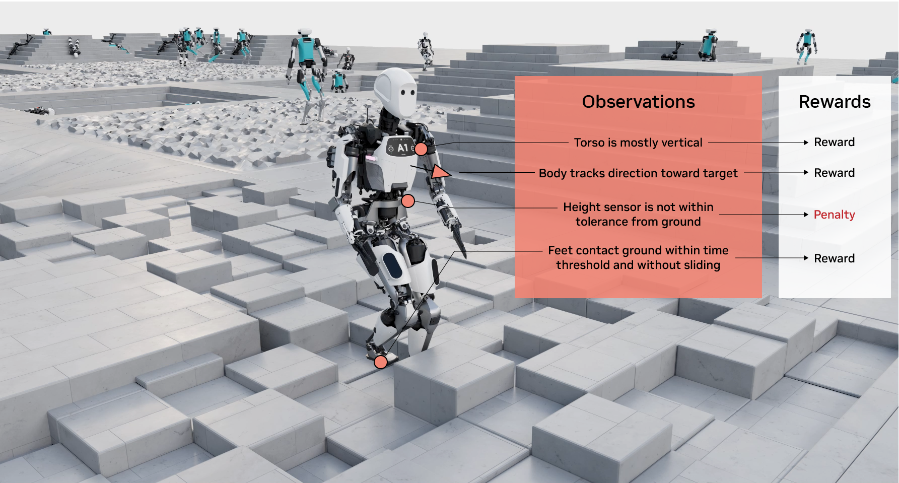
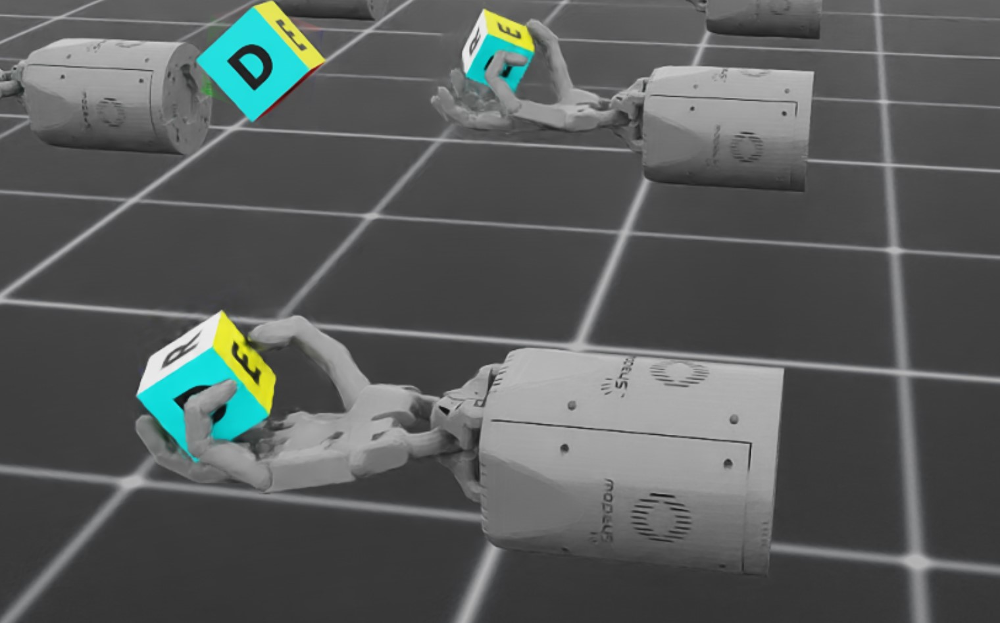

# Reinforcement Learning for Robots[#](#reinforcement-learning-for-robots "Link to this heading")

## What is Reinforcement Learning?[#](#what-is-reinforcement-learning "Link to this heading")

### Learning From Interaction[#](#learning-from-interaction "Link to this heading")

At its core, reinforcement learning (RL) is about **learning from interaction**.

In today’s module our robot won’t be explicitly controlled by an algorithm for balancing a pole, but will learn to do so from interacting with an environment we design.

But what kind of interaction is this? In the context of reinforcement learning, these interactions are between an **agent** and the **environment**.

### Cleaning the Kitchen With RL[#](#cleaning-the-kitchen-with-rl "Link to this heading")

Consider a robot agent trying to scrub dirty dishes. Through the lens of RL, the kitchen, the sponge, and the crumbs of your last meal are all a part of the environment. As the robot agent cleans the dishes it interacts with the environment and it changes over time, hopefully to a state that is clean!

At any given moment, the environment can be described by its current **state**, which in this case might describe where your dishes are and how much washing they still require.

The robot doesn’t have access to this perfect information, and instead only receives **observations** from the environment, determined by its various sensors.

These observations are then processed by the **policy**, which is the part of the agent that maps “what is observed” to “what should be done next”. The output of this processing is **actions,** the specific motions or behaviors performed by the agent to, hopefully, move the environment into the desired end state of a clean kitchen. For instance, moving a robotic arm closer to a dish, or towards a dirty spot.

But the policy must come from somewhere. When did it learn to do this? The *learning* part of reinforcement learning requires another critical piece: the **rewards.** Every time the agent takes an action, the environment also produces rewards: numbers that indicate how “good” or “bad” that particular action was. In this module we’ll define these rewards in Python, within the Isaac Lab framework.

The goal of reinforcement learning is to cleverly evolve the policy in such a way that the reward is maximized as the agent interacts with the environment.

By interacting with our simulation environment time and time again, discovering the actions that yield the reward we describe, training the policy, our robot will learn how to behave in order to maximize that reward using mathematical functions.

Eventually, from training our robot in Isaac Lab, we are left with a neural network describing the policy our robot has learned. This is where the “deep” in deep reinforcement learning comes from, the combination of RL with deep neural networks to handle complex, high-dimensional inputs and tasks. Our work in this module is all about deep reinforcement learning.

From this file, we can input given observations to that file, and receive outputs. We can use these to then run tests in Isaac Sim to see how our policy performs, and eventually prepare to run the policy on a real robot!

#### Why Use Reinforcement Learning?[#](#why-use-reinforcement-learning "Link to this heading")

Traditionally, robots had pre-programmed instructions and limited sensor inputs to perform certain tasks. While this works for simple tasks, this is very hard to generalize and expensive to reprogram​. For example:

- For industrial warehouse robots that pick and sort items: What if the target objects vary in size, shape, friction, or mass?​
- For autonomous vehicles: How do we handle dynamic conditions, with an environment that is unpredictable?
- For humanoid robots: How can we program more complicated articulations like hands, and perform tasks like walking, running, and jumping?

With RL and simulation, we can also train robots even faster than real-time. For example, consider the [Isaac-Velocity-Flat-Spot-v0 task](https://github.com/isaac-sim/IsaacLab/blob/main/source/isaaclab_tasks/isaaclab_tasks/manager_based/locomotion/velocity/config/spot/flat_env_cfg.py) which trains a [Boston Dynamics Spot](https://bostondynamics.com/products/spot/) quadruped to achieve specific speeds and directions while moving on flat terrain (velocity targets). Using the RSL RL library with an NVIDIA RTX A6000 GPU, the task can be trained at approximately **90,000 frames per second**. As a point of reference, a typical video might run at 30-60fps!

Note

Learn more about performance benchmarks for Isaac Lab [here](https://isaac-sim.github.io/IsaacLab/main/source/overview/reinforcement-learning/performance_benchmarks.html).

We use RL in situations where outcomes are partly random and partly under the control of an agent, like our robot.

### Teaching With Rewards[#](#teaching-with-rewards "Link to this heading")

Let’s consider another example for RL. How you might teach a robot to walk, if you could coach it with basic feedback? In simulation we can provide this feedback by stepping forward in time, doing analysis and calculating a reward, stepping again, then repeating.

But how would you define those **rewards** and **observations** for what walking towards a target looks like?

Rewards can also come in several forms, let’s briefly consider a few major categories:

- **Sparse Rewards** - when feedback is rare or significant.

  - Think about the game of chess - which moves should be rewarded? The one that ended the game or the knight capture that happened 3 moves back? The ultimate goal of winning isn’t realized until the end, which is a **sparse** reward.
- **Dense Rewards -** when feedback is frequent and incremental.

  - Think about a robot moving closer to its target.
- **Shaped Rewards** - additional rewards introduced to guide the agent towards desired behavior by injecting some knowledge about the problem domain.

  - Think about chess, again. As we discussed, winning is a sparse reward. A **shaped** reward for this problem may be given for capturing pieces, providing intermediary feedback before the game is over.

One reward would be to simply reward the robot for getting closer to a target (a dense reward). As distance grows smaller, the reward gets bigger. We could measure that using a simple distance formula. Seems simple enough, are we done?

Much like how we might accidentally teach a pet “tricks” we didn’t intend to teach them, we might’ve just taught the robot to *leap* forward and fall over rather than walking. It took advantage of the reward function, but ultimately failed at the goal. That approach needs a bit more thought.

So, we revisit our rewards, and make them more robust. We might define more of the task with rewards and observations like these:

- The torso should be mostly vertical.
- The feet should contact the ground with a certain time threshold to not slide along the ground.
- The overall body tracks a certain heading to walk towards a target.
- Monitor a height sensor from the torso to the ground.
- We penalize the robot for putting the torso too low.

Now with enough training, we could create a basic, successful walking policy! You may also hear walking referred to as a form of “locomotion.”

This is some of the magic of reinforcement learning: **we can define a goal, rather than the explicit steps to accomplish that goal** to teach a robot to do something new.

We’ll come back to this topic of reward engineering and task design. But first, where did this idea of reinforcement learning come from?

### Advances in Reinforcement Learning[#](#advances-in-reinforcement-learning "Link to this heading")

Reinforcement learning isn’t a new idea, in fact the core principles can be traced back further than you might expect. Early fundamentals of RL can be traced back to the 1950s. A lot of the core ideas are inspired by how us humans learn from trial and error.

Note

Learn more by reading this article about the history of [reinforcement learning.](http://incompleteideas.net/book/ebook/node12.html)

However, it wouldn’t be surprising if this feels like a new idea given the rapid changes.

RL has received a wave of attention due to advances in computing power, deep learning, and access to large data sets. This has allowed RL algorithms to solve much more complex problems, going from theoretical curiosity to a practical and highly influential area of modern AI research and applications.

Note

Learn more by watching this video on [Deep Reinforcement Learning: Neural Networks for Learning Control Laws](https://www.youtube.com/watch?v=IUiKAD6cuTA)

### Simulation and Physical AI[#](#simulation-and-physical-ai "Link to this heading")

To explain why simulation is so important for training physical AI with reinforcement learning, let’s consider an alternative.

**What if we tried doing reinforcement learning in the physical world?**

First, we would need a large number of identical robots. Then imagine setting up this space in the physical world, resetting every time perfectly for say, even 100 trials. That’s a lot of work, and it’s hard to get right. And there’s more:

- **How do we get enough trials?** Our example of 100 trials is a small number for RL, we may need hundreds at a minimum to train a robust policy
- **What if something changes**, and you need to reset the training episode? That’s a lot of robots to reset and keep consistent
- **What if robots crash?** Early stages of training can produce unpredictable results that would be dangerous in real life, and a mistake could cost hundreds of thousands of dollars in prototype robot hardware.
- Even if it works, the time and resources would be **incredibly expensive.**
- **What if we want to test a robot that doesn’t physically exist yet?** In simulation, we could iterate on designs and test RL policies freely, all before creating physical prototypes.

*Source: https://spectrum.ieee.org/darpa-robotics-challenge-robots-falling*

This is why **physical AI is born in simulation**, and why the next major evolution of AI will be in the realm of physical AI, when tokens interact with the physical world around us.

In simulation, we can control the environment, and even key physics parameters like gravity and friction! It’s like we have a gym where we can design a space for robots to learn. We may even run the simulator faster than real-time. We can also make a step, do analysis, and repeat, until termination or completion.

Note

The word “Gym” appears several times in this domain, but has different meanings based on the context.

To disambiguate:
**Gym environments:** a standard for [defining RL tasks](https://gymnasium.farama.org/)
**Isaac Gym:** the precursor to Isaac Lab

Tip

For some robotics applications, **completion** is actually a critical safety task. For example if a robot is carrying a hot, heavy object, failing to move it to a safe place could be dangerous.

For an autonomous vehicle, suddenly stopping in some situations could be dangerous. This is why our robots may need to complete a certain amount of simulation training before being deployed to the test field. We can intentionally practice how to handle dangerous situations and evaluate behavior, without creating that dangerous situation in the physical world. Simulation will continue to become a standard practice in robot development and manufacturing in future.

But by controlling the world in simulation, doesn’t that almost seem like cheating at first glance? If we control the world, doesn’t that make things easier?

We can actually use this very control to make a dynamic training environment for our robots. For example, if the robot can juggle a cube with less or more friction, the policy may become better equipped to handle a variety of cubes once working in the real world. We cover more of this process of “sim-to-real” transfer in this [lecture module.](https://learn.nvidia.com/courses/course-detail?course_id=course-v1:DLI+S-OV-28+V1)

The process not only can **change how we program existing robots**, but **inform how we test and commission the latest robots**.

#### What Problems Are Reinforcement Learning Best-Suited For?[#](#what-problems-are-reinforcement-learning-best-suited-for "Link to this heading")

While there isn’t a perfect answer that fits every situation, reinforcement learning can be well-suited to areas where:

- Outcomes are partly random and partly under the control of an agent, such as our robot.
- A problem requires exploration and adaptation to uncertain environments.
- Traditional control methods fail due to complex dynamics or partial observability.
- High-fidelity simulation exists to pretrain policies.

Let’s look at more specific examples. These are actually demos provided as part of the Isaac Lab project, so you can try them yourself later!

#### Specific examples[#](#specific-examples "Link to this heading")

- **Dextrous manipulation of objects**, [such as in-hand reorientation of an object](https://github.com/isaac-sim/IsaacLab/blob/main/source/isaaclab_tasks/isaaclab_tasks/direct/shadow_hand/shadow_hand_env_cfg.py)  
  
- **Locomotion over rough terrain**, [such as a quadruped tracking a velocity command](https://github.com/isaac-sim/IsaacLab/blob/main/source/isaaclab_tasks/isaaclab_tasks/manager_based/locomotion/velocity/config/anymal_d/rough_env_cfg.py)  
  
- **Contact-rich manipulation**, [such as inserting a gear into a geartrain assembly](https://github.com/isaac-sim/IsaacLab/blob/main/source/isaaclab_tasks/isaaclab_tasks/direct/factory/factory_env_cfg.py)  
  

On this page
