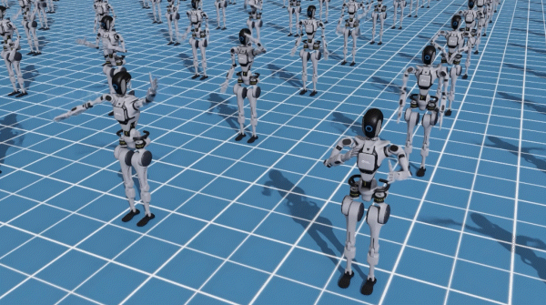
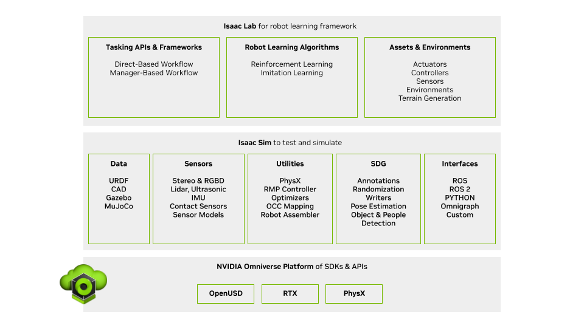
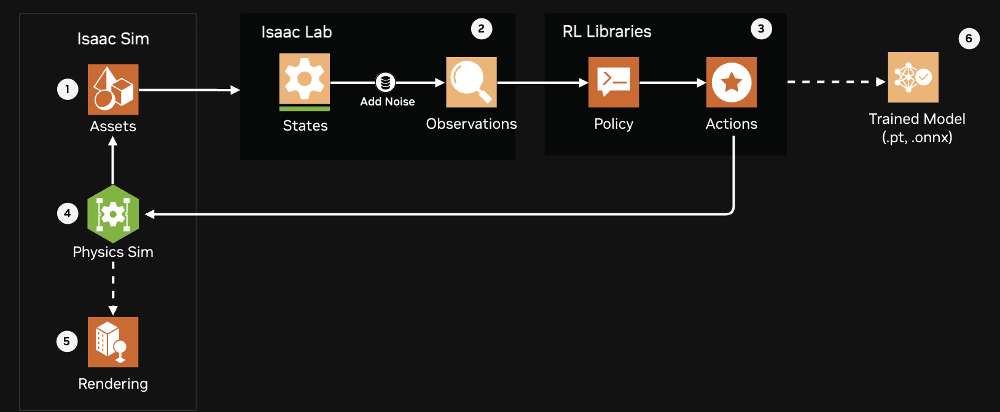

# How Isaac Lab Accelerates Reinforcement Learning[#](#how-isaac-lab-accelerates-reinforcement-learning "Link to this heading")

## Modular and Open-Source[#](#modular-and-open-source "Link to this heading")

Isaac Lab is a unified and modular framework for robot learning that aims to simplify common workflows in robotics research, such as reinforcement learning (RL) and imitation learning (IL).

What makes it modular? Various parts of the configuration can be customized or replaced - for example using different RL libraries, robot or environmental assets, or integrating your own.

This modularity, along with being an open source project, allows us to reuse existing components and algorithms, and to build on top of each other’s work. Doing so not only saves time and effort, but also allows us to focus on the more important aspects of research.

## Training in Parallel[#](#training-in-parallel "Link to this heading")

The key RL paradigm of Isaac Lab is to train with many environments in parallel, inside that simulation. By massively parallelizing the training process with GPU-accelerated workflows, we make reinforcement learning something that can even be applied on consumer hardware for many tasks. What does that look like?

You may have seen images of this, where it looks like an army of robots is walking or doing a task around a shared world. What’s going on here is either training, or a demonstration of the results of training.

We can actually let robots share the environment without affecting each other.[#](#id1 "Link to this image")

## RL Libraries[#](#rl-libraries "Link to this heading")

RL libraries provide the algorithms for learning, in other words how the policy is updated over time during training.

To aid in modularity, Isaac Lab comes pre-integrated with several libraries “wrapped” for use, but also provides the means to [integrate your own library](https://isaac-sim.github.io/IsaacLab/main/source/how-to/add_own_library.html) or a modified version of another library you choose.

Isaac Lab currently comes [pre-integrated with several libraries](https://isaac-sim.github.io/IsaacLab/main/source/overview/reinforcement-learning/rl_frameworks.html), including:

- RSL-RL
- RL-Games
- SKRL
- Stable Baselines

Different libraries include different algorithms, and you can see a [full comparison here](https://isaac-sim.github.io/IsaacLab/main/source/overview/reinforcement-learning/rl_frameworks.html) in the Isaac Lab docs. For today’s module we’ll pick a library and algorithm for you, but know there are other options available to you.

## Isaac Sim + Isaac Lab[#](#isaac-sim-isaac-lab "Link to this heading")

We can think of the stack of these tools as OpenUSD, Omniverse, Isaac Sim, then Isaac Lab. More specifically:
OpenUSD is how we define and interact with the 3D assets and other data in the scene, Omniverse provides simulation tooling, Isaac Sim provides specific tooling around robotics tasks, and Isaac Lab finally provides the reinforcement learning tools to train robots.

In short, **set up your robot** in Isaac Sim, **train it** in Isaac Lab, then evaluate and test back in Isaac Sim.

Isaac Lab is built upon NVIDIA Isaac Sim to leverage the latest simulation capabilities for photorealistic scenes, as well as fast and accurate simulation.

Isaac Lab doesn’t have its own UI independent of Isaac Sim, because it’s a programming framework that lets us *use* the simulator in special ways. If you think of us as designers of worlds and situations, the sim lets us set up those worlds, and Lab lets us further do customization or specific setup for our training.

Examples of how Isaac Lab uses Isaac Sim:

- Instantiate a configured number of environments for training

  - Think of these as micro scenes, within an overall stage
- Give a robot a random asset from a collection to grasp for every training episode.

  - A training episode is a single trial in which a robot interacts with a simulated environment—starting from an initial state, taking actions based on its policy, receiving observations and rewards, and continuing until it reaches a termination condition (like falling over or exceeding time limits), after which the environment resets and a new episode begins
- Vary friction of an asset during training
- Stop the simulation if something happens
- Run the simulation at a different speed
- Increase or decrease gravity

## Data Flow Between Isaac Sim and Isaac Lab[#](#data-flow-between-isaac-sim-and-isaac-lab "Link to this heading")

Isaac Sim handles three key components: **assets**, **physics simulation**, and **rendering**. It’s where you set up your assets - any kind of assets you want for your simulation. It also serves as the physics simulation environment and generates physics states and the visual output of the environment.

Meanwhile, Isaac Lab is the robot learning framework, that uses Python files to handle the state of your simulation. It manages that learning pipeline through states (captures the raw data from the simulator), noise addition (applies randomization and disturbances for sim-to-real transfer), and observations (processes the noisy states into usable observations).

## Watching the Training Process (Or Not)[#](#watching-the-training-process-or-not "Link to this heading")

To train, we design the task, and run it in simulation. Within this simulation, because we have control over the world, we can stop and evaluate before stepping to the next one.

During training, we can skip the familiar viewport of Isaac Sim in favor of dedicating more computational resources to training. We call this “headless” mode and it’s as easy to use as passing a flag to Isaac Lab.

**Example:** train my task called “MyRobotTask-v0 with 4096 environments, in headless mode  
`python scripts/skrl/train.py --task MyRobotTask-v0 --num_envs 4096 --headless`

Using the Viewport

If you did want to view the simulation during training, remove the `--headless` flag.

**Example:** `python scripts/skrl/train.py --task MyRobotTask-v0 --num_envs 4096`

If you’re using the Isaac Launchable project or any streaming application of Isaac Lab on a private or local network, add the `--livestream 2` flag:

**Example:** `python scripts/skrl/train.py --task MyRobotTask-v0 --num_envs 4096 --livestream 2`

For more information on these environment variables and how to use them, see the [Isaac Lab documentation](https://isaac-sim.github.io/IsaacLab/main/source/overview/livestreaming.html).

Note

The number 4096 isn’t magic, it’s just a large number to show many robots trained in parallel. It’s also a power of 2, which programmers have an affinity for.

You may find it’s better to record videos during training, watch live, or use headless mode for maximum performance, depending on your process.

Once the training is done, we can watch the results in simulation or review logging data. Let’s take a look at both log, and video examples.

Below is a composited, sped-up video showing the training process over time alongside log data for learning rate and policy loss.

*This composite video shows Tensorboard output alongside a training session. This has been significantly sped up (1300%) and edited for brevity and demonstration purposes.*

## Using the Training[#](#using-the-training "Link to this heading")

Our ultimate goal in physical AI is to use this training data to power real robots. How does that work?

Once we have a policy that performs consistently well, we can export this file and use it in Isaac Sim for further testing and validation, or prepare for a sim-to-real transfer. This is a sophisticated, fascinating topic which we’re mostly glossing over here.

Note

Read more about sim-to-real transfer in this [course](https://learn.nvidia.com/courses/course-detail?course_id=course-v1:DLI+S-OV-28+V1), and these two blog posts: [Closing the Sim-to-Real Gap: Training Spot Quadruped Locomotion](https://developer.nvidia.com/blog/closing-the-sim-to-real-gap-training-spot-quadruped-locomotion-with-nvidia-isaac-lab/) and [Bridging the Sim-to-Real Gap for Industrial Robotic Assembly Applications](https://developer.nvidia.com/blog/bridging-the-sim-to-real-gap-for-industrial-robotic-assembly-applications-using-nvidia-isaac-lab/)

On this page
