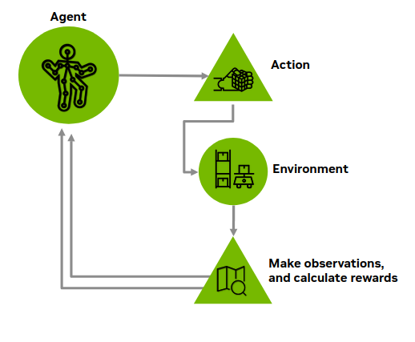
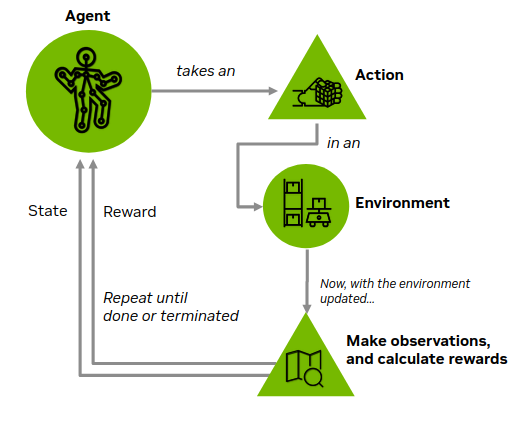
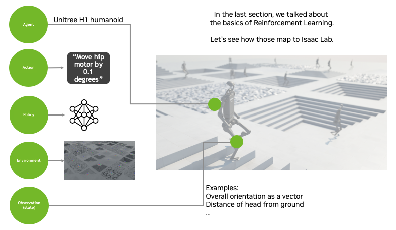

# Task Design and the Markov Decision Process[#](#task-design-and-the-markov-decision-process "Link to this heading")

Now we’re getting into the real heart of how we train physical AI with Isaac Lab: designing a task and rewards, using the Markov Decision Process (MDP) framework. The major components from that framework will map directly to sections of our code!

## Markov Decision Process[#](#markov-decision-process "Link to this heading")

Markov Decision Process (MDP) is used for modeling decision-making, where an agent learns to make decisions by interacting with an environment, where the environment is partially controlled by the agent.

At a high level: an **agent** takes actions in an **environment**, the environment is described by **states**, after each **action** the agent receives a **reward**, and the goal is to train a **policy** that maximizes rewards.

The agent is our robot, the environment might be a table and some props around the robot. The actions might be moving joints of a robot or closing a gripper. The observations might be angles or velocities or components in the scene. Observations can be thought of as partial observations of the full state of the environment.

Different components of the MDP framework will be defined by the user for the agent to perform the given task. Essentially, these components will directly map to sections of our Isaac Lab code.

Note

Wait, but where do **observations** come from when we deploy this policy onto a real, physical robot?

On physical robots, our observation data may come from **sensors** such as positional encoders, distance sensors, IMUs (inertial measurement units), load cells, cameras, or other devices depending on the task.

In the simulation, we even have access to “privileged data”, for example we can take measurements that would be difficult or nearly impossible to make in the real world. This is invaluable for evaluating our training against a ground truth.

## Defining a Task With MDP in Isaac Lab[#](#defining-a-task-with-mdp-in-isaac-lab "Link to this heading")

Let’s look more closely at how these concepts are implemented in Isaac Lab. Configuring these will be our first step in training.

- An **agent** asset, in our case an existing USD (Universal Scene Description) asset of a particular mechanism or robot.
- An **environment**, either as a USD asset, or generated assets such as procedural terrain, to place in our simulation.

Tip

Understanding [OpenUSD](https://www.nvidia.com/en-us/omniverse/usd/)’s fundamentals will superpower your robotics and 3D workflow journey. Isaac Sim, and Omniverse are built on OpenUSD to implement features that empower collaboration, non-destructive editing, and more.

Visit our [Learn OpenUSD Learning Path](https://docs.nvidia.com/learn-openusd/latest/index.html) for more training.

And to define some functions that determine:

- At every simulation step, how do we calculate a **reward**?
- How do we calculate a **done** condition?
- How do we **reset** a simulation?

Keep this framework in mind, as we now introduce how these conceptual ideas map to Isaac Sim and Isaac Lab.

Let’s start up a project!

On this page
