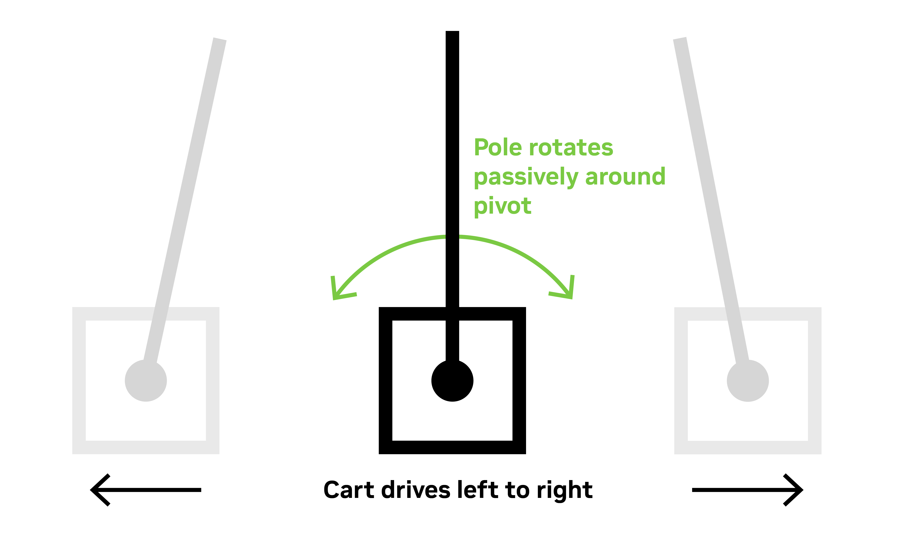

# Training the Cartpole[#](#training-the-cartpole "Link to this heading")

Let’s start by going through the process with an example provided by Isaac Lab’s project template.

We’ll analyze, train, and evaluate this example to get ourselves familiar with the process. Then in the next module, we’ll do a more custom, involved training project.

## The Cartpole Problem[#](#the-cartpole-problem "Link to this heading")

Today’s task is to solve a problem known as the “cartpole.” This is a classic control theory example, where a “cart” moves back and forth to effectively balance a pole to stand straight up.

If you’ve ever tried to balance a pen vertically on your hand by moving it side-to-side, that’s the basic idea - but constrained to one axis of motion. See the video below for an example of what you’ll be doing today!

*A fleet of cartpoles balancing in simulation. This is an example of the policy we will train in this lesson.*

### Consider the following[#](#consider-the-following "Link to this heading")

- How you might control this *without* reinforcement learning?
- What kind of algorithm might you use for it?
- How would you update it to work with different weights of poles, different friction of carts, different powered motors?

On this page
