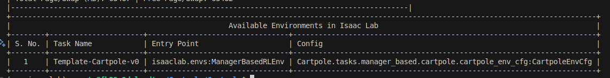

# Get Started In Isaac Lab[#](#get-started-in-isaac-lab "Link to this heading")

## Install Isaac Lab[#](#install-isaac-lab "Link to this heading")

If you already have Isaac Lab installed, you can skip this step.

**If you’re just getting started, we recommend our [Brev Launchable](https://brev.nvidia.com/launchable/deploy/now?launchableID=env-35JP2ywERLgqtD0b0MIeK1HnF46)**

[](https://brev.nvidia.com/launchable/deploy/now?launchableID=env-35JP2ywERLgqtD0b0MIeK1HnF46)

Important

The current Isaac Launchable uses Isaac Lab 3.0, a newer version than was tested with this course.

The course will be updated to use the latest version of Isaac Lab in the future, but in the meantime it may be incompatible.

If you don’t have a GPU compatible with Isaac Lab, or want to leverage cloud resources, you can also use NVIDIA Brev to pay for compute by the hour. The dockerfile can also be run locally, if you have local GPU resources and drivers. Visit the [README and project repo here](https://github.com/isaac-sim/isaac-launchable) to learn more.

**To install with local GPU resources - Workstation Install:**

If you haven’t installed Isaac Lab already, you can [follow these instructions to get started](https://isaac-sim.github.io/IsaacLab/main/source/setup/installation/index.html).  
Check here for the most recent [system requirements](https://docs.isaacsim.omniverse.nvidia.com/latest/installation/requirements.html#system-requirements).

*Video describing the Linux installation process*

If you have questions about GPU drivers on Linux, check the specs in the guide above and read this [troubleshooting guide](https://docs.omniverse.nvidia.com/dev-guide/latest/linux-troubleshooting.html).

## Create and Install a New External Project[#](#create-and-install-a-new-external-project "Link to this heading")

As we saw in the installation process, Isaac Lab is provided through a GitHub repo. By default, the template comes with the cartpole example. Let’s make a fresh project.

1. Open a new **terminal**.
2. **Activate** your Python virtual environment. If you already have it activated from installing Isaac Lab, or you’re using our Brev Launchable, you can skip this step.

   - If using **conda**:

     ```
     conda activate env\_isaaclab
     ```
   - If using **venv**:  
     **Linux:**

     ```
     source env\_isaaclab/bin/activate
     ```

     **Windows**:

     ```
     python3.10 -m venv env\_isaaclab
     ```
3. Navigate to the Isaac Lab folder

   - For example,

   ```
   cd ~/IsaacLab
   ```
4. Run the Isaac Lab script with the –new argument to create the template project:  
   **Linux**:

   ```
   ./isaaclab.sh --new
   ```

   **Windows**:

   ```
   .\isaaclab.bat --new
   ```
5. The template generator will ask you a few questions. In this command-line menu, use arrows to move and the spacebar to select an option, then press enter.

   - Task type:  
     **External** to create the project outside the Isaac Lab repo
   - Project Path: set to  
     **/home/{your user name}/Cartpole**  
     You can set this to a different location if you like, just remember where it is for later.
   - Project name:  
     **Cartpole**
   - Isaac Lab workflow:  
     **Manager-based**

Note

Use arrows to move selection up/down, space to select.

Direct-based workflow will structure the code differently.
It’s a different way to formulate tasks in Isaac Lab that has its own benefits and tradeoffs. [Read more here.](https://isaac-sim.github.io/IsaacLab/main/source/overview/core-concepts/task_workflows.html)

- RL library:  
  **skrl**
- RL algorithms for skrl:  
  **PPO** (Proximal Policy Optimization)

6. To **install your external project**, which essentially registers it with Isaac Lab, run the following from within the project folder for the Cartpole project. If you’re not sure where this directory is, see the output of the previous command.

Tip

Opening the external project folder in your IDE (code editing program) is a convenient way to have your terminal open to the correct location. Otherwise, make sure to navigate into the project directory using the command below, changing the second parameter if your project is somewhere else.

```
python -m pip install -e source/Cartpole
```

7. To confirm our project was installed, run this command to **list all installed environments**.

```
python scripts/list\_envs.py
```

Seeing our project listed in the output means it is installed and ready to go!



8. If you haven’t already, open the project folder in your IDE by going to **File > Open Folder** and choosing the project directory we used above. For example, `~/Cartpole/Cartpole`

On this page
