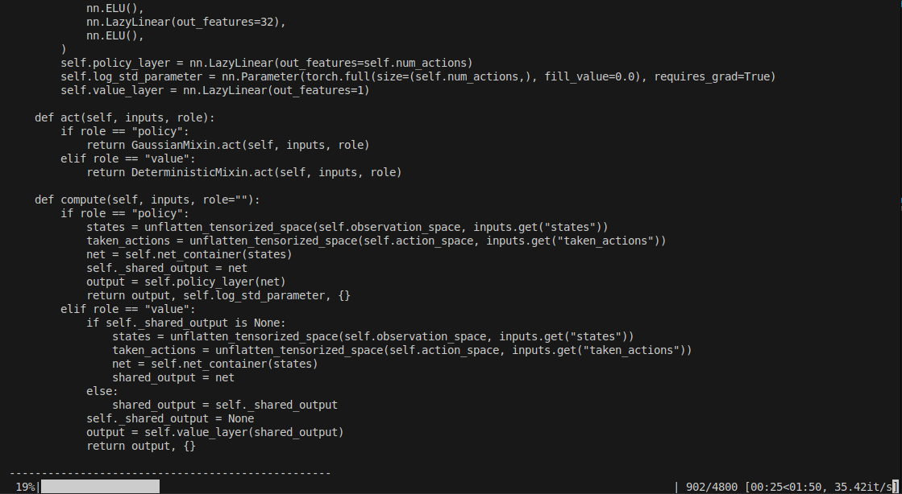

# Running the Training[#](#running-the-training "Link to this heading")

Before we take a deeper look at the code, let’s go ahead and run our training for the cartpole. Get ready to see RL at work!

In the same command prompt we’ve been using, or with in a new one where the environment is active (conda or venv), run this command:

```
python scripts/skrl/train.py --task=Template-Cartpole-v0
```

Tip

If your computer is having trouble running this command, re-run this command with the `--num_envs` argument to explicitly set how many parallel environments will be used. For example, `python scripts/skrl/train.py --task=Template-Cartpole-v0 --num_envs=1000`. By default, this task is configured to run 4096 environments.

This runs the training script for the SKRL reinforcement learning library, using the task we just generated a project for: `Template-Cartpole-v0`

Once the training is complete, Isaac Sim will automatically close itself. This is normal.

Let’s see how our training did!

# Watching The Training[#](#watching-the-training "Link to this heading")

Remember, reinforcement learning means **learning from interaction**. At first, we see the carts moving fast and not doing a good job of balancing the pole at all.

As training progresses, and the cartpole interacts with the environment (albeit a simple one), they will get better and our policy improves. Take some time to zoom out and look at just how many robots are being run at the same time!

*This is a timelapse of the training in process, sped up by 500% for demonstration purposes.*



## Training progress bar in the terminal[#](#training-progress-bar-in-the-terminal "Link to this heading")

Tip

To see all the cartpoles at once, navigate within the Isaac Sim viewport:

**Movement**: Hold the right mouse button and use the WASD keys to move the camera forward, backward, left, and right in the viewport.

Hold the right mouse button and use the Q and E keys to move the camera up and down.

**Rotation**: Hold the right mouse button and drag to rotate the camera view.

**Zoom**: Use the mouse wheel alone or hold alt and the right mouse button to zoom in and out of the scene.

**Panning**: Hold the middle mouse button and drag to pan the camera view horizontally and vertically.

Congratulations! You’ve trained your first robot with Isaac Lab! More accurately, you just trained a fleet of **4096 robots in parallel**, generating a policy that performs balancing for the cartpole.

On this page
