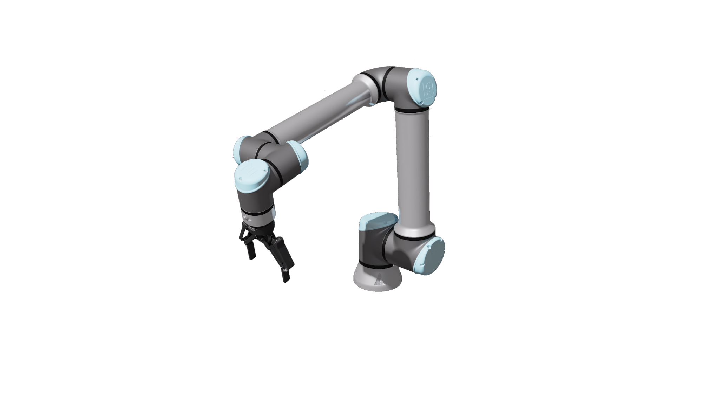
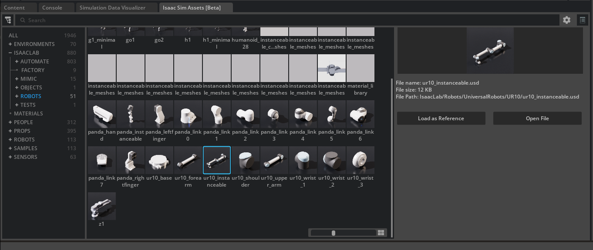
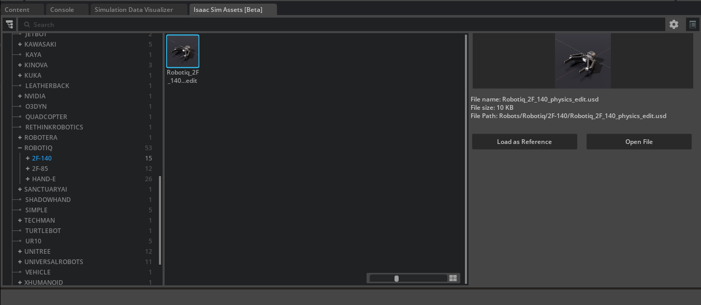
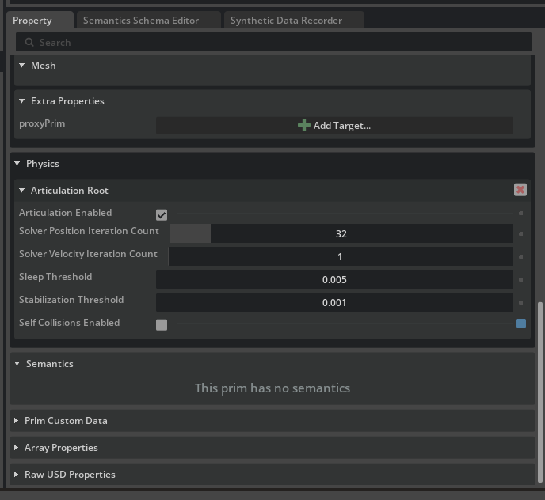
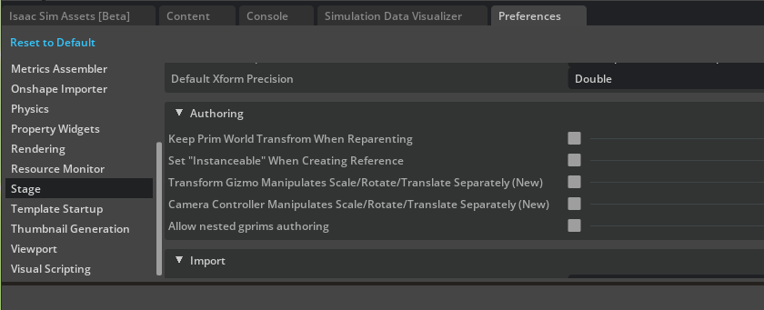

# Isaac Lab Setup[#](#isaac-lab-setup "Link to this heading")

## Overview[#](#overview "Link to this heading")

First let’s set up an **external template** project, and briefly cover the ways you can work with an installation of Isaac Lab. You can pick which option works best for you, depending on the hardware available to you.

## Installing Isaac Lab[#](#installing-isaac-lab "Link to this heading")

If you already have Isaac Lab installed, you can skip this step.

**If you’re just getting started, we recommend our [Brev Launchable](https://brev.nvidia.com/launchable/deploy/now?launchableID=env-35JP2ywERLgqtD0b0MIeK1HnF46)**

[](https://brev.nvidia.com/launchable/deploy/now?launchableID=env-35JP2ywERLgqtD0b0MIeK1HnF46)

Important

The current Isaac Launchable uses Isaac Lab 3.0, a newer version than was tested with this course.

The course will be updated to use the latest version of Isaac Lab in the future, but in the meantime it may be incompatible.

If you don’t have a GPU compatible with Isaac Lab, or want to leverage cloud resources, you can also use NVIDIA Brev to pay for compute by the hour. The dockerfile can also be run locally, if you have local GPU resources and drivers. Visit the [README and project repo here](https://github.com/isaac-sim/isaac-launchable) to learn more.

**To install with local GPU resources - Workstation Install:**

If you haven’t installed Isaac Lab already, you can [follow these instructions to get started](https://isaac-sim.github.io/IsaacLab/main/source/setup/installation/index.html).  
Check here for the most recent [system requirements](https://docs.isaacsim.omniverse.nvidia.com/latest/installation/requirements.html#system-requirements).

*Video describing the Linux installation process*

If you have questions about GPU drivers on Linux, check the specs in the guide above and read this [troubleshooting guide](https://docs.omniverse.nvidia.com/dev-guide/latest/linux-troubleshooting.html).

---

Now that our installation is ready, let’s start creating the Isaac Lab task for our UR10 robot.

## Configuring the UR10 Robot and Gripper Model[#](#configuring-the-ur10-robot-and-gripper-model "Link to this heading")

### Our task[#](#our-task "Link to this heading")

For today’s module, imagine you’ve been asked to train a particular robot configuration: a **UR10 robot**, with a **Robotiq 2F-140 gripper.** The policy we’re training will make this robot’s current pose match a commanded goal pose.


*This is the Universal Robots UR10 robot With a Robotiq 2F-140 gripper attached, in Isaac Sim.*

We’ll begin by configuring a USD file of our custom robot configuration in Isaac Sim, then create a Python configuration class for this robot using the Isaac Lab framework.

[OpenUSD](https://www.nvidia.com/en-us/omniverse/usd/) provides many powerful features for robotics and simulation applications, some of which we’ll use today. For example, using **references** of existing robot models will allow us to combine the existing gripper and robot models, non-destructively.

Tip

Understanding OpenUSD’s fundamentals, such as references, payloads, and strength ordering, will superpower your robotics and 3D workflow journey. Isaac Sim, and Omniverse are built on OpenUSD to implement features that empower collaboration, non-destructive editing, and more.

Visit our [Learn OpenUSD Learning Path](https://docs.nvidia.com/learn-openusd/latest/index.html) here for more training.

As we go through this process, remember:
Isaac Sim is the *simulator* that Isaac Lab is built on. We set up our robot in **Sim**, then we train it with **Lab**, then we can go back to **Sim** for further validation.

Tip

If you’re only interested in the Isaac Lab material for this module, you can use a [premade asset](https://developer.nvidia.com/downloads/Omniverse/learning/Courses/GettingStartedWithIsaacLab/UR-with-gripper.zip) and skip this unit. However, this module is useful for demonstrating how to prepare custom assets.

## Add Robot USD as Reference[#](#add-robot-usd-as-reference "Link to this heading")

1. Open a new **terminal**.
2. Navigate to the **Isaac Lab** folder.
3. Launch **Isaac Sim** by running the following command:

   **Linux**:

   ```
   ./isaaclab.sh --sim
   ```

   **Windows**:

   ```
   .\isaaclab.bat --sim
   ```

Note

You can easily launch Isaac Sim from your Isaac Lab environment using this command above, but if you have it installed as a standalone binary, you can launch it there too.

4. Navigate to *Edit > Preferences* and find the **Stage** option in the left of the panel.
5. Under *Import*, set the Drag & Drop USD Method to reference. This will let us add USD assets to our stage as references instead of payloads.
6. Next, go back to the *Content* browser and navigate to `/Isaac/IsaacLab/Robots/UniversalRobots/UR10/`.
7. Select `ur10_instanceable.usd` and drag it into the *Stage* panel. This will add it as a reference in the current stage.
   

## Add Gripper USD as Reference[#](#add-gripper-usd-as-reference "Link to this heading")

Let’s repeat this process for the Robotiq 2F-140 gripper.

1. In the left side of the *Content* browser, navigate to `/Isaac/Robots/Robotiq/2F-140/`.
2. Select `Robotiq_SF_140_physics_edit.usd` and drag it into your *Stage* panel, just as we did before.
   

## Remove extra articulation root[#](#remove-extra-articulation-root "Link to this heading")

1. In the *Stage* panel, find and select `Robotiq_2F_140_physics_edit`.
2. Now in the *Property* editor, find the **Physics Articulation Root** and click the red `X` icon to remove it. We only want a single articulation for the robot.



Next, we need to combine these two. There are several ways to do this, we’ll show you a simple, manual way to attach them. We will place the gripper at the correct location in space, then join it physically to the robot with a Fixed Joint.

## Connect the Gripper to the Robot[#](#connect-the-gripper-to-the-robot "Link to this heading")

### Placing the gripper at the end of the robot[#](#placing-the-gripper-at-the-end-of-the-robot "Link to this heading")

1. Go to **Edit > Preferences**
2. Under *Stage > Authoring*, find **Keep World Transform When Reparenting**, and disable it  
   

Note

If you’re using Isaac Sim 5.0, your settings may have a dropdown instead. Set **Keep World Transform When Reparenting** to **Ask**.

3. In the *Stage* panel, drag the gripper prim under `ur10_instanceable/ee_link` to parent the gripper to the end of the robot.

   *In Isaac Sim 5.0, select **Keep Prim Transform** when prompted.*

Now the gripper is located at the end of the robot! For organization, we’ll reorganize the stage, but first let’s reset our preferences setting.

We’ll change this setting temporarily to reparent the end effector to the end of the robot, also known as the “end effector” link. It’s a bit of a trick that saves us some work here.

4. Go to **Edit > Preferences**.
5. Under *Stage*, find **Keep World Transform When Reparenting** and re-enable it.
6. Drag the gripper Xform `Robotiq_2F_140_physics_edit` back onto `World`.

   *In Isaac Sim 5.0, your settings should still be set to **Ask**. Select **Inherit Parent Transform** when prompted.*

#### On Parenting[#](#on-parenting "Link to this heading")

Prims in a USD stage are placed into a hierarchy, and we call placing a prim “under” another one to be the process of parenting. By default, parenting a prim in applications developed on Omniverse like Isaac Sim maintains the original prim’s world transform. In other words, it doesn’t move after being reparented.

Great, now our USD file is legible and the gripper is placed correctly!

But while the gripper is **positionally** at the end of the robot, it is not attached in a physics sense. If we hit play, the gripper will simply fall into the abyss. Try this, and then press play to reset it.

### Making a physics connection[#](#making-a-physics-connection "Link to this heading")

To *physically* connect the gripper, we need to also join it to the robot’s articulation, or series of joints, using physics.

1. Press the + sign next to the robot and gripper Xforms to expand them.
2. Select the **ee\_link** prim of the robot.
3. Control-select the **robotiq\_base\_link** of the gripper.
4. **Right click** on either of them, and choose **Create > Physics > Joint > Fixed Joint**.

Note

Selecting in this order creates a joint from the end of the robot *to* the gripper, vs the other way around. You can change the order after joint creation if needed, this just saves a step.

5. **Save** the USD file as `UR-with-gripper.usd`

   *If using the Brev Launchable, we recommend saving in `/workspace/`.*
6. Press the **Play** button on the left panel of Isaac Sim. Notice how the gripper no longer falls into the abyss!

Now we’re ready to head into an Isaac Lab project, and configure this robot for training.

Tip

This is just one way to connect the gripper to the robot. To learn how to use the Robot Assembler, check out the [Isaac Sim docs.](https://docs.isaacsim.omniverse.nvidia.com/latest/robot_setup_tutorials/tutorial_import_assemble_manipulator.html#option-2-connect-the-ur10e-with-the-robotiq-2f-140-gripper-using-the-robot-assembler)

Tip

If you had any trouble preparing this asset, you’re welcome to use this [premade asset](https://developer.nvidia.com/downloads/Omniverse/learning/Courses/GettingStartedWithIsaacLab/UR-with-gripper.zip)!

On this page
