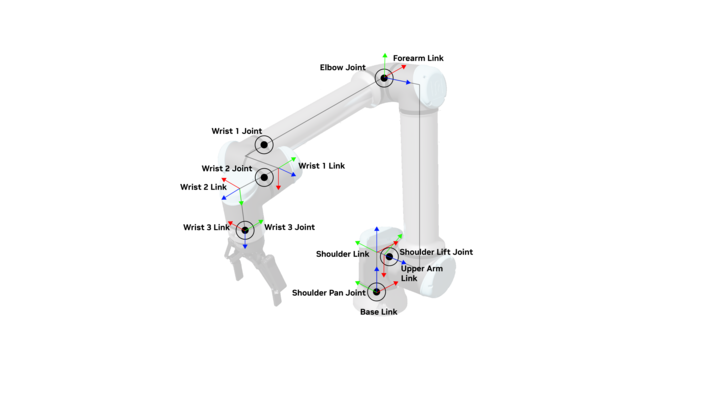

# Robot Configuration in Isaac Lab[#](#robot-configuration-in-isaac-lab "Link to this heading")

## Overview[#](#overview "Link to this heading")

There are a few ways to develop robot training tasks with Isaac Lab. Today we’ll be using the **template** option, which is recommended for external, standalone projects.

## What other ways are there to develop for Isaac Lab?[#](#what-other-ways-are-there-to-develop-for-isaac-lab "Link to this heading")

You can also “fork” the entire Isaac Lab repo and work inside of it. This is also how you might develop a new feature, [contribute back to the codebase](https://isaac-sim.github.io/IsaacLab/main/source/refs/contributing.html), or add to the documentation. However this approach can make your project less visible, and can complicate updates to new versions of Isaac Lab. This is because it’s “inside” the inner workings of the Isaac Lab repo.

This is why a command-line tool exists, which we use in the next section, to help you generate a template of a project. It has either an internal task, or an external project - which is what we will use today for simplicity. Our repo will just contain the code for our project!

## Creating an Isaac Lab Project[#](#creating-an-isaac-lab-project "Link to this heading")

Let’s create a fresh project for this module.

### Using the external project template[#](#using-the-external-project-template "Link to this heading")

1. Open a new **terminal**.
2. Navigate to the **Isaac Lab folder.**

   - For example:

   ```
   cd ~/IsaacLab
   ```
3. Activate your **environment**. If you already have it activated from installing Isaac Lab, or you’re using our Brev Launchable, you can skip this step.

   - If using **conda**:

     ```
     conda activate env\_isaaclab
     ```
   - If using **venv**:  
     **Linux:**

     ```
     source env\_isaaclab/bin/activate`
     ```

     **Windows**:

     ```
     python3.10 -m venv env\_isaaclab
     ```
4. Run the **Isaac Lab script** with the `--new` argument to create the template project:  
   **Linux**:

   ```
   ./isaaclab.sh --new
   ```

   **Windows**:

   ```
   .\isaaclab.bat --new
   ```
5. The template generator will ask you a few questions. In this command-line menu, use arrows to move and the spacebar to select an option, then press enter to choose the option.

   - Task type: select **External.**
   - Project path: set this where you’d like, just make note of the folder.
   - Project name: give the project a name such as **Reach**
   - Isaac Lab Workflow: choose the **Manager-based | single-agent** workflow.
   - RL library: choose `skrl` for the reinforcement learning library.
   - RL algorithms: choose `PPO`, an abbreviation for [Proximal Policy Optimization](https://spinningup.openai.com/en/latest/algorithms/ppo.html).

### Install the project[#](#install-the-project "Link to this heading")

1. Change directory into the new project folder:
   **Linux:**

   ```
   cd ~/Reach
   ```

   **Windows:**

   ```
   dir {directory of project}
   ```
2. Install your external project by running the following command. This installs the package in “editable” mode, which is useful during development. Notice our project name being used at the end of the command.

```
python -m pip install -e source/Reach
```

2. To confirm the project was installed, run this command to list installed environments.

   - `python scripts/list_envs.py`
   - Confirm that our project is listed:
     

Great! At this point we have both a robot USD file ready, and a project for our training code. Now we begin bringing the two together, by implementing configuration and logic for our training in the Isaac Lab framework.

Tip

If you had trouble preparing the asset, you can use the finished one in the assets provided with this module.

## Configure the Robot in Isaac Lab[#](#configure-the-robot-in-isaac-lab "Link to this heading")

### Articulation configuration[#](#articulation-configuration "Link to this heading")

Now inside our project, we’ll create an accompanying configuration for our robot in Isaac Lab using the class `ArticulationCfg`, meaning [**Articulation Configuration**](https://isaac-sim.github.io/IsaacLab/main/source/api/lab/isaaclab.assets.html#isaaclab.assets.ArticulationCfg).

An [articulation](https://docs.omniverse.nvidia.com/extensions/latest/ext_physics/articulations.html) is a hierarchical structure of rigid bodies connected by joints, such as the revolute joints that form the UR10 robot.



#### Visualizing the joints and links of the UR10[#](#visualizing-the-joints-and-links-of-the-ur10 "Link to this heading")

Let’s create the configuration, add it to our scene, and preview it to confirm it’s set up correctly for training.

Note

You might be wondering why we would need to configure the robot in both Isaac Sim and Isaac Lab?

There are several reasons you might do this. For one, we may need a table or props to train our robot, but we wouldn’t want to save these assets into the USD file of our core robot.

```
We may also want to experiment with different articulation properties, or simulate different kinds of actuators during training. Isaac Lab offers these features without overriding the provided USD.
```

### Creating the configuration[#](#creating-the-configuration "Link to this heading")

We’ll create this configuration in a separate file so it could be reused for many different training tasks - same robot, different uses. This kind of modularity is a key feature of Isaac Lab!

1. Inside the project folder, create a **new Python file** under `Reach/source/Reach/Reach/tasks/manager_based/reach`called **ur\_gripper.py.**

   - This is the file that will hold an [Articulation Configuration](https://isaac-sim.github.io/IsaacLab/main/source/api/lab/isaaclab.assets.html#isaaclab.assets.ArticulationCfg) that we can use in this training task, and also reuse in future training projects. This is another example of modularity inside Isaac Lab.
2. Copy and paste the following code:

```
1
2# Copyright (c) 2022-2025, The Isaac Lab Project Developers (https://github.com/isaac-sim/IsaacLab/blob/main/CONTRIBUTORS.md).
3# All rights reserved.
4#
5# SPDX-License-Identifier: BSD-3-Clause
6
7"""Configuration for the Universal Robots.
8Reference: https://github.com/ros-industrial/universal\_robot
9"""
10
11import isaaclab.sim as sim\_utils
12from isaaclab.actuators import ImplicitActuatorCfg
13from isaaclab.assets.articulation import ArticulationCfg
14
15UR\_GRIPPER\_CFG = ArticulationCfg(
16
17# Where is the USD file for this robot?
18spawn=sim\_utils.UsdFileCfg(
19 usd\_path=f"/home/ubuntu/Reach/UR-with-gripper.usd",
20 activate\_contact\_sensors=False,
21 rigid\_props=sim\_utils.RigidBodyPropertiesCfg(
22 rigid\_body\_enabled=True,
23 max\_linear\_velocity=1000.0,
24 max\_angular\_velocity=1000.0,
25 max\_depenetration\_velocity=5.0,
26 ),
27 articulation\_props=sim\_utils.ArticulationRootPropertiesCfg(
28 enabled\_self\_collisions=True,
29 solver\_position\_iteration\_count=8,
30 solver\_velocity\_iteration\_count=0
31 ),
32 ),
33# What is its initial position of the robot, and its joints?
34 init\_state=ArticulationCfg.InitialStateCfg(
35 joint\_pos={
36 "shoulder\_pan\_joint": 0.0,
37 "shoulder\_lift\_joint": -1.712,
38 "elbow\_joint": 1.712,
39 "wrist\_1\_joint": 0.0,
40 "wrist\_2\_joint": 0.0,
41 "wrist\_3\_joint": 0.0,
42 },
43 ),
44# What parts of the robot move, and how stiff / damped are they?
45 actuators={
46 "arm": ImplicitActuatorCfg(
47 joint\_names\_expr=[".\*"],
48 effort\_limit=87.0,
49 stiffness=800.0,
50 damping=40.0,
51 ),
52 "gripper": ImplicitActuatorCfg(
53 joint\_names\_expr=["finger\_joint"],
54 stiffness=280,
55 damping=28
56 ),
57 }
58)
59
```

Important

Make sure to change the **usd\_path** argument to indicate where the robot USD file was saved from our earlier lesson.

This is a lot of code, so let’s break it down starting at a high-level. We’re specifying:

- **Where is the USD file for this robot?**
- **What is its initial position of the robot, and its joints?** What positions should the joints be at by default, and where is the robot in space?
- **What parts of the robot move, and how stiff and damped are they?**

  - We’re using *implicit* actuators, which are idealized actuators. For a sim-to-real transfer, we’d need to think more carefully about how we represent the motors of this robot.
  - There are many ways to specify this. We’re leveraging some regular expressions to essentially say “get any joint starting with this given text, then assign it these parameters”
  - This is helpful in that we don’t have to tightly bind to the robot’s hierarchy.

### Determining stiffness and damping[#](#determining-stiffness-and-damping "Link to this heading")

How would you determine proper stiffness and damping values as were given above, if you didn’t have them already? In short, you might either calculate these values for a custom robot, or discover the values empirically, depending on your use case.

While we won’t cover detailed tuning in this module, let’s briefly discuss the basics. These implicit actuators use a PD or “proportional-derivative” controller, where the “proportional” part corresponds to the stiffness, and the “derivative” part corresponds to damping.

Higher stiffness values means the actuator will more aggressively try to get to the target position. But if the stiffness is too high, the actuator will oscillate and have trouble settling at the target. If the damping is too high, the joint will have trouble reaching its target position quickly.

Try out this [browser-based](https://www.matthewpeterkelly.com/tutorials/pdControl/index.html) visualization to get a quick intuition for how this works. We encourage you to experiment with these in Isaac Sim, too!

Learn more about joint tuning in Isaac Sim [here](https://docs.isaacsim.omniverse.nvidia.com/4.5.0/robot_setup/joint_tuning.html).

Great work, now let’s dive into the configuration of managers for the Markov Decision Process!

Note

If you’ve used Isaac Sim before, you might be wondering why we’re using special configuration classes here to define lights, and a ground plane. Couldn’t we just define those in the USD file?

We could, and the goal isn’t to duplicate any work done in preparing the USD file, but simply to allow custom configuration for training here, specific to our training task.

```
For example, we may add a custom terrain for a robot to walk on, or special randomized lighting for training a perception task. Isaac Lab lets us make that configuration without adding extra lights to our robot USD.
```

## Testing the Robot Configuration[#](#testing-the-robot-configuration "Link to this heading")

The first class in this Python file is our scene configuration. Remember that the template project comes with the “Cartpole” example we saw in the last module, let’s update the configuration.

### Import the robot configuration[#](#import-the-robot-configuration "Link to this heading")

1. Open the file `source/Reach/Reach/tasks/manager_based/reach/reach_env_cfg.py`
2. Import the new robot configuration. Add this import statement in place of the one referencing `CARTPOLE_CFG`:

```
1from .ur\_gripper import UR\_GRIPPER\_CFG
```

3. Update the **ReachSceneCfg** class. We will keep the ground plane and dome light, but change the robot. Confirm the ReachSceneCfg class so it looks like the one below. Note how we’re referencing the new **UR\_GRIPPER\_CFG**.

```
1@configclass
2class ReachSceneCfg(InteractiveSceneCfg):
3 """Configuration for a scene."""
4
5 # world
6 ground = AssetBaseCfg(
7 prim\_path="/World/ground",
8 spawn=sim\_utils.GroundPlaneCfg(),
9 init\_state=AssetBaseCfg.InitialStateCfg(pos=(0.0, 0.0, -1.05)),
10 )
11
12 # robot
13 robot = UR\_GRIPPER\_CFG.replace(prim\_path="{ENV\_REGEX\_NS}/Robot")
14
15 # lights
16 dome\_light = AssetBaseCfg(
17 prim\_path="/World/DomeLight",
18 spawn=sim\_utils.DomeLightCfg(color=(0.9, 0.9, 0.9), intensity=5000.0),
19 )
20
21 table = AssetBaseCfg(
22 prim\_path="{ENV\_REGEX\_NS}/Table",
23 spawn=sim\_utils.UsdFileCfg(
24 usd\_path=f"{ISAAC\_NUCLEUS\_DIR}/Props/Mounts/SeattleLabTable/table\_instanceable.usd",
25 ),
26 init\_state=AssetBaseCfg.InitialStateCfg(pos=(0.55, 0.0, 0.0), rot=(0.70711, 0.0, 0.0, 0.70711)),
27 )
28
29 # plane
30 plane = AssetBaseCfg(
31 prim\_path="/World/GroundPlane",
32 init\_state=AssetBaseCfg.InitialStateCfg(pos=[0, 0, -1.05]),
33 spawn=GroundPlaneCfg(),
34 )
```

#### Consider the Following[#](#consider-the-following "Link to this heading")

If you were instead writing a task where the robot’s goal was to pick up a cube, what other assets might you add to the scene? Isaac Lab also has more tools for controlling how the scene is generated and randomized to assist with training. How might you use this randomization during training?

On this page
