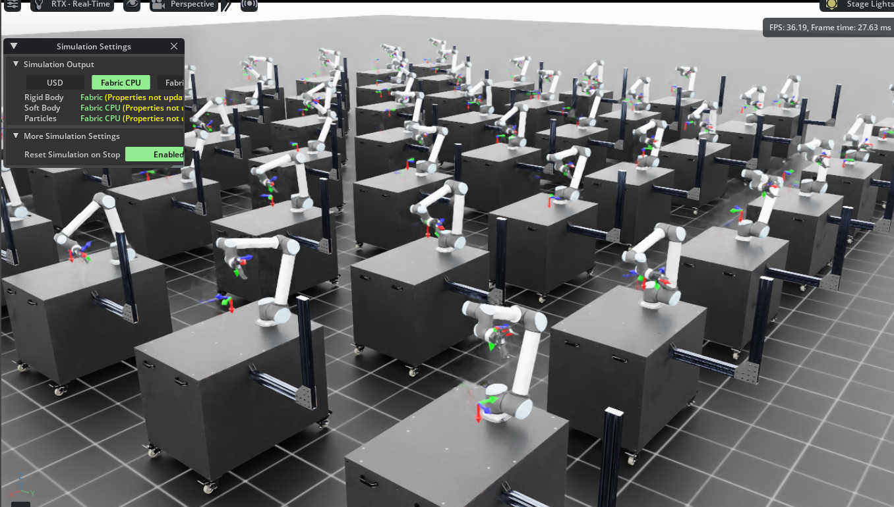

# Train Your Second Robot in Isaac Lab[#](#train-your-second-robot-in-isaac-lab "Link to this heading")

Welcome to the module, *Train Your Second Robot in Isaac Lab*!

In this module you’ll build on what we learned in the first module where we analyzed the cartpole example, and finally train our own robot, from configuration in Isaac Sim to policy training in Isaac Lab. Let’s dive in!

## What we’ll do in this module[#](#what-well-do-in-this-module "Link to this heading")

Today we’ll use a UR10 robot - a six-axis manipulator - to perform a reach task, which is where the policy’s goal is to make the end of the robot match a goal pose.

This exercise will give you a sense of RL training at work, while keeping our scope down to a simpler task that is quicker to train and simpler to read in code.

*This module’s goal: as the target pose changes - denoted by the hovering coordinate frame widget, the robot tries to reach the target. The robots move to align their coordinate frame with the one floating in the air (goal pose).*

If you haven’t trained with reinforcement learning before, we hope this will be an exciting and motivating module to show you a hint of what’s possible with this approach to robot learning. Let’s dive in!

Tip

This module will cover an introductory exercise, but we also encourage you to complete the bonus challenges at the end to increase your skills.

On this page
