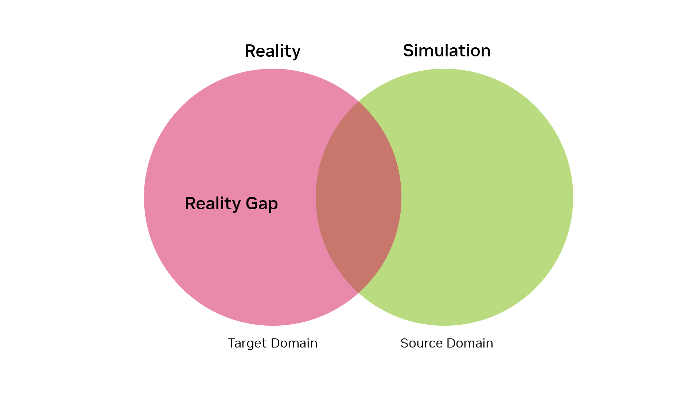
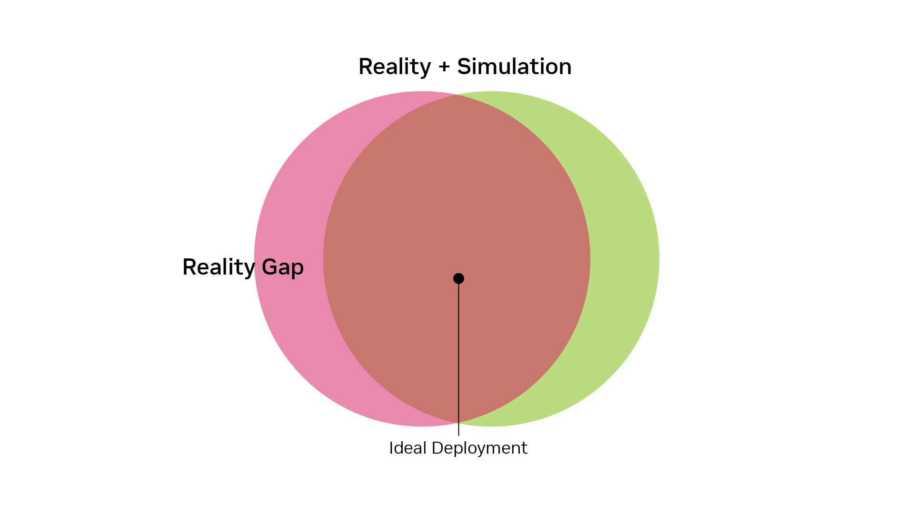
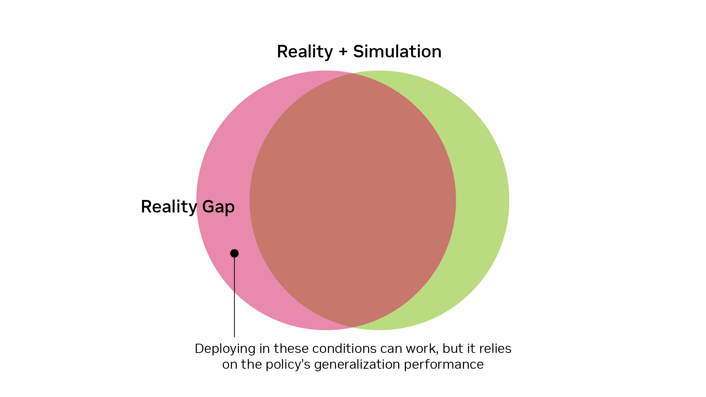

# Visualizing the Reality Gap[#](#visualizing-the-reality-gap "Link to this heading")

As noted before, when performing a sim-to-real transfer, we train our policy in the source domain and then deploy the network in the target domain. For the sake of simplicity, we will represent these domains as circles, although keep in mind that in reality, these are complex high-dimensional spaces. The simulation circle and the reality circle overlap partially, but never completely. The area where they don’t overlap represents the reality gap.

Our goal in sim-to-real is to bridge the reality gap, that is, modify the source domain to make the green circle overlap with the red one as much as possible.

## Deployment Considerations[#](#deployment-considerations "Link to this heading")

When deploying a robot, it will operate at a specific point within these domains. Ideally, we want this point to fall within the overlap of the simulation and reality circles. This ensures that the robot’s policy has been trained on conditions similar to those it will encounter in the real world.

However, sometimes deployment might occur outside the simulation circle and in the reality circle. This doesn’t mean that the policy won’t work in real life. In such cases, we rely on the policy’s ability to generalize. While this can work, it’s generally preferable to deploy in conditions that the policy has encountered during training.

---

To facilitate successful sim-to-real transfer, we employ various methods to expand and shift the simulation domain closer to reality. This process of “bridging the reality gap” is crucial for developing robust robotic policies that can effectively transition from simulation to the real world.
In the next section, we’ll explore specific techniques used to address the reality gap and improve the success rate of sim-to-real transfers.

Before we dive into the specific techniques, it’s important to understand the main categories of approaches used to bridge the reality gap in sim-to-real transfer:

- **Simulation Enhancement**: These techniques focus on adjusting the fidelity of simulations to better-match real-world conditions. This includes methods like domain randomization and point cloud perturbations.
- **Real-World Data Integration**: These methods incorporate real-world data into simulations to make them more accurate, such as actuator modeling or world models.
- **Policy Robustness**: These methods aim to create policies that are more resilient to differences between simulation and reality. This includes techniques like regularization and leveraging privileged information.

Let’s get started with discussing the first category, simulation enhancement, in the next module.

On this page
